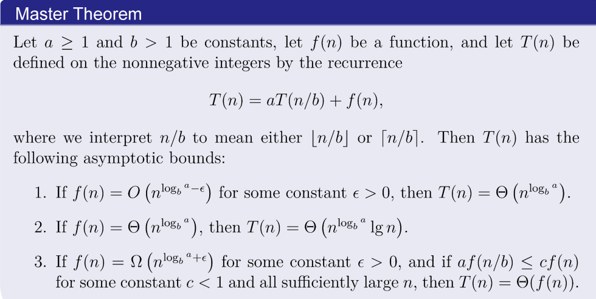
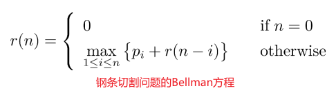
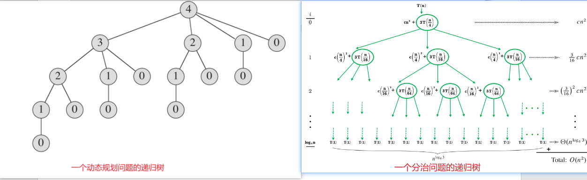

---
title:分治、动态规划、贪心算法的比较。
---

最近学习了这三种算法的思想，发现这三者之间有相似也有不同，总结一篇博客。

## 1 三种算法的联系

分治、动态规划、贪心算法都是把一个大的问题给分解成子问题，通过解决子问题来最终解决原问题的。具体的来说：

- 分治：主要分为三个步骤递归的解决问题。
  
  - divide：将问题划分为一些子问题，形式相同，规模更小
  
  - conquer：递归的求解子问题，当子问题足够小进入基本情况(base case)，停止递归，返回到上一层递归。
  
  - combine：返回递归调用的过程，逐步将子问题的解组合成原问题的解
    
    分治问题的核心是写出递归式！通过递归式我们可以写出代码并且利用主定理计算时间复杂度。
    
    $$
    T(n)=\begin{cases}
T(1)& \text{x=0}\\
aT(n/b)+f(n)& \text{x>0}
\end{cases}
    $$
    
    递归式的含义是将主问题分解成a个子问题，每个子问题的规模是原来的1/b。
  
  - 主定理：(Master Methods)
    
    
    
    $主定理主要比较的是f(n)与n^{log_b^a}的渐进大小，即f(n)=n^2<n^3$

- 动态规划：与分治相似，都是通过组合子问题来求解原问题。解决的问题需要有**最优子结构**的性质。核心思想是写出Bellman方程（状态转移方程），利用填表查表解决重叠子问题的情况。具体实现时分为top-down与bottom-top两种方案。
  
  
  
  - 自顶向下：按照自然的递归的思想，解决原问题就先解决子问题，一点点向下到base case
  - 自底向上：分析完原理后纯粹的填表，利用子问题的解计算出更高一级的子问题。

- 贪心：其核心为选择一个合适的贪心选择性质（贪心规则），通过做出子问题的局部最优选择来构造全局最优解。因为有子问题的局部最优解，所以贪心算法解决的问题也必须有**最优子结构性质**

## 2 三种算法的区别

动态规划算法与分治算法最大的区别在于：**动态规划算法在递归中会反复求解相同的子问题，而不是一直产生新的子问题——重叠子问题**，而分治算法在递归的每一步都在产生全新的子问题。对于重叠子问题，我们采用填表查表的方式来减少重复计算的时间，这就是动态规划的填表查表思想。

贪心算法与动态规划算法求解的问题都需要有**最优子结构**，而贪心算法的限制更严格，只在某些问题上可以使用贪心策略，得出最优解后更是需要**严格的证明**(反证，数学归纳)。

## 3 经典分治问题举例
