# Web数据管理

本知识点的汇总多参考了这位同学的博客，它总结的非常详细，有兴趣的同学可以看看它的总结：[web数据管理: 山东大学web数据管理的笔记 (gitee.com)](https://gitee.com/stardust5322/web-data-management)

> 第一章：Web数据管理的概念不用记，第一章看一下和后面有没有重叠的内容。
> 第二章：1-5
> 编程题的考查形式：或许会考察一些爬虫的模块名，注意例子中的开源工具 或者某部起到的作用，
> 不记APP名。
> 第三章：1-2部分，5了解
> 第四章：网站反扒措施，爬虫反反爬
> 第五章：1.3 2 3 4（设计具体包装器不考）
> 第六章：1 (24仔细、35)，仔细看目录
> 第七章：1重要，知道几种文件的结构，数据库不考，2不考，3考
> 第八章：所有重点，第七部分了解工具
> 第九章：模型如何复习：定义/参数/环境/算法，隐马尔可夫动态规划算法描述不考，5知道名字
> 第十章：什么情况下用数据结构什么情况下用信息检索？（数据量大。响应速度有差别），信息检
> 索本质，搜索引擎不考
> 第十一章：2、3、4重点：形式化表示不考虑，3.2不考，
> 第十二章：2不考，其他重点，布尔模型的特点与向量空间模型的概念全在这章。什么是TF/IDF，有
> 啥作用，Gensim。TF/IDF变种的三个部分，BM25修正，公式不用记
> 第十三章：PageRank算法作用，其依赖，变种，理论基础，三个理论，代数算法不要求掌握，
> textrank不考，hits了解
> 第十四章：多模态概念不了解，掌握交叉媒体中的TBIR CBIR，理论与关键，物体检测/语义分割不
> 考，特征记28，颜色转换公式不记，四种颜色特征，描述MPEG

## 一 导论

### 1.3.1 web数据挖掘

- 通过机器学习发现web上的信息结构和模式
- 进行数据抽取
- 网路爬虫

### 1.3.2 web数据组织

- 根据web信息的特点，找出合适的web信息组织模式
- 半结构化模式：XML、JSON、CSV
- 信息检索数据结：非关系型数据库、倒排表
- 数据库

### 1.3.3 web上的信息集成

- 将诸多数据源中的信息构成一个可用整体

### 1.3.4 web查询

- 能根据丰富的语义信息在有效数据组织模式下找出准确的信息
- **IR**
- **搜索引擎**
  - **文本搜索**
  - **图片搜索**

### 1.3.5 web信息发布

- 如何将web上的数据按用户需求自动发给目标用户
  - **用户画像**
  - **信息推荐**

### 1.4 web数据管理基础

- **数据获得**
- **数据预处理**
- **数据变换**
- **数据挖掘与机器学习**
- **知识发现**

## 二 爬虫

### 2.1 爬虫定义

一种自动获取网页内容的程序，是搜索引擎的重要组成部分。通俗的讲，也就是通过HTML源码解析来获得想要的内容

### 2.2 爬取过程

1. 选择一个或多个初始网页(seed page)的URL

2. 通过网络请求获取HTML文档

3. 解析HTML文档，从中提取链接到其他文档（URL），查看该URL是否已经解析过，否则将提取的URL放在队列中。

4. 取出队列头部的URL继续这个过程直至队列为空

在请求的HTML被解析的过程中，要将不同格式的URL正则化：

> E.g., http://en.wikipedia.org/wiki/Main_Page has a relative link to /wiki/Wikipedia:General_disclaimer 
> which is the same as the absolute URL http://en.wikipedia.org/wiki/Wikipedia:General_disclaimer

**URL判重**：由于搜索引擎在爬取时要访问大量的网页，因此在查找网址是否访问过及标记网址已经访问时为了提高查找和访问效率通常建立一个**散列**，其中存放访问过每一个网址。为了减少这个散列表所占用的空间, 通常在其中存放网址经过散列函数（如MD5、SHA-1等）计算出的对应的固定长度的散列值，这样便可以在平均情况下O(1)的时间内查找和更新占用O(n)空间的网址列表（n为已访问的网址数目）。

### 2.3 爬虫具有的功能

- **礼貌性**：Web服务器有显式或隐式的策略控制爬虫的访问
  
  - **隐式礼貌**：不过于频繁访问同一个网站
  - **显式礼貌**：只爬取站长允许爬的部分，代表是**robots.txt**，它位于网站目录中，指定了一些对爬虫爬取的要求，这并不是一些强制的要求，但是礼貌的爬虫应当遵守robots.txt

- **鲁棒性**：能从采集器陷阱中跳出，能处理Web服务器的其他恶意行为

- **性能和效率**：充分利用不同的系统资源，优先抓取有用的网页，对于两种搜索策略BFS与DFS：理论上，两者能够在大致的时间里完成所有的整个静态网页的爬取工作：
  
  * BFS优势：在于优先爬下首页，而首页往往比较重要
  
  * DFS优势：在时间网络爬虫的分布式系统中避免对同一个网页握手次数太多。但DFS 要限定爬取的深度
  
  实际应用的网络爬虫不是对网页次序的简单BFS或者BFS，而是一个相对复杂的下载优先级排序的方法，管理这个系统的叫做“调度系统”(Scheduler)，会有一个Priority Queue。BFS成分更加多一些。

- **分布式**：能在多台机器上分布式运行。
  
  分布式的问题：哈希表判重，在一台下载服务器上建立和维护一张哈希表并不是难事，分布式的情况下每台下载服务器在开始下载前和完成下载后都要维护这表哈希表，这个存储哈希表的通信就成为爬虫系统的瓶颈。
  
  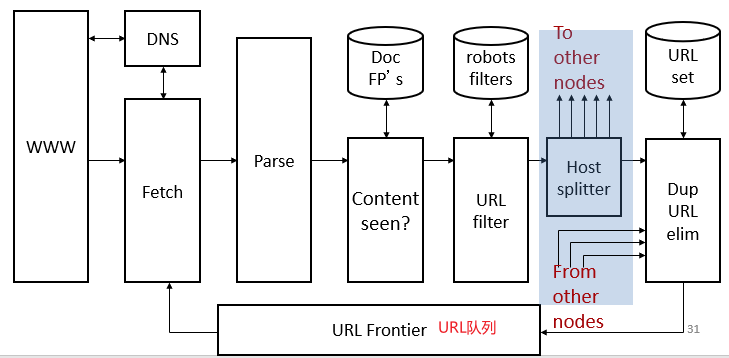
  
  可扩展性：添加更多机器，采集效率也要随之提高

- **新鲜度**：能对已经爬取过的网页进行更新。
  
  HTTP头部的Last-modified与Expires不可靠。估计之前访问过的页面在此期间发生变化的概率，按此概率估计的优先级
  
  > 随机选择270个站点，132个.com站点，78个.edu站点，30个.net站点和30个.gov站点
  > 
  > 下载72000个页面，40%的.com每天变化，.net和.org变化适中，.edu和.gov变化最为缓慢
  > 
  > 需要为更新较快的页面提高刷新率
  > 
  > 含有那些突增的搜索关键字的网站会得到较快的更新频率。 Google就会优先对与这个主题有关的网站进行更新

- **功能可扩展性** 支持多方面功能扩展，比如处理新数据格式、新抓取协议等。

### 2.4 爬虫分类

* 基于整个Web的信息采集(Universal Web Crawling)
  
  传统的采集方式（作为门户搜索引擎和大型的Web服务提供商的数据收集部分，例如百度google）：是指从一些种子URL扩充到整个Web的信息采集。
  
  **Nutch** 是是建立在Lucene核心之上的、开源、Java实现的搜索引擎。它提供了我们运行自己的搜索引擎所需的全部工具。包括爬虫crawler和查询searcher。crawler主要用于从网络上抓取网页并为这些网页建立索引。
  
  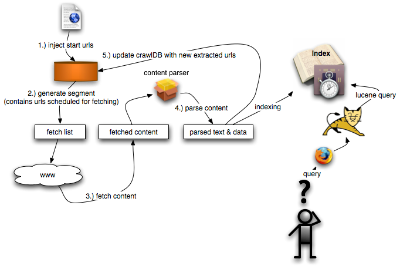

* 增量式Web信息采集 (Incremental Web Crawling )

* 基于主题的Web信息采集(Focused Web Crawling )

* 基于用户个性化的Web信息采集(Customized Web Crawling )

## 三 网页分析技术

HTML页面是半非结构化，对于HTML文档，有两种看待方式:一种是将文档看作字符流——正则表达式；一种是将文档看作树结构——基于DOM。

### 3.1 正则表达式

Regular Expression，对字符串操作的一种逻辑公式，用普通字符和一些定义好的元字符组合成一个规则字符串，表达对字符串的一种过滤逻辑，常用于字符串处理，表单验证等场合。

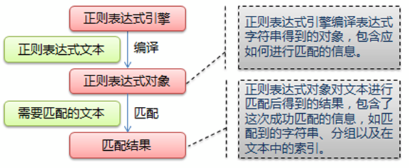

- Java
  - Pattern类、Match类（java.util.regex since1.4）
  - HTMLParser库 （since 1.6）
- Microsoft .Net Frameword
  - Regex对象
- Python
  - re模块

#### 3.1.1 基础语法：

- `^`：它后面的字符必须是匹配字符串的开始部分字符
- `$`：它前面的字符必须是匹配字符串的结尾部分字符
- `.`：匹配换行符以外的任意一个字符
- `[(若干字符)]`：匹配(若干字符)中的任意一个字符
- `[^(若干字符)]`：匹配除了(若干字符)以外的任意一个字符
- `[0-9]`：匹配任意一个数字字符
- `+`：重复匹配它的前一个字符1次或更多次
- `*`：重复匹配它的前一个字符0次或更多次
- `?`：匹配它的前一个字符0次或1次

实例1：从字符串 str 中提取数字部分的内容(匹配一次)

```javascript
var str = "abc123def";
var patt1 = /[0-9]+/; 
document.write(str.match(patt1));//123
//[0-9]+匹配多个数字， 
//[0-9] 匹配单个数字，+ 匹配一个或者多个。
```

实例2：匹配以数字开头，并以 abc 结尾的字符串。

```javascript
var str = "123abc"; 
var patt1 = /^[0-9]+abc$/;     
document.write(str.match(patt1));//123abc
//^ 为匹配输入字符串的开始位置。
//abc$匹配字母 abc 并以 abc 结尾，$ 为匹配输入字符串的结束位置。
```

**re模块**：re.compile(Reg):RegObj方法，将正则表达式模式编译为正则表达式对象，

使用正则表达式匹配：RegObj.match()/.search()/...

```python
import re

pattern = re.compile(r‘\d+’)   # 查找多个数字
result1 = pattern.findall('runoob 123 google 456')
result2 = pattern.findall('run88oob123google456', 0, 10)
print(result1)
print(result2)
```

#### 3.1.2 基于正则表达式的信息提取

1. 在获取数据前应尽量去除无用部分。匹配出标签块后将其替换为空字符串

2. 提取网页内的链接：
   
   首先从网页源代码中提取出链接块，之后从提取出的链接块中提取出地址属性，并将其返回。返回的链接将交给爬取调度程序筛选爬取。
   
   提取链接块和地址属性：`<(?:a|area)\s+([^>]+)(?=(?:>|/))`
   
   匹配链接块中的地址属性：`href\\s*=\\s*(?:\"([^\"]*)\"|\'([^\']*)\'|([^\'\">\\s]+))`

3. 提取网页标题：使用正则表达式`<title[^>]*>(.*?)</title>`匹配网页源代码中标题块

4. 提取网页内的文本：
   
   使用`<[^>/][^>]*/>`匹配一个封闭的内部不嵌套任何内容的标签
   
   使用`</?[^>]*>`匹配一个标签的开始部分或者结束部分
   
   具体的提取步骤：
   
   * 去除HTML代码中所有封闭标签；
   
   * 将代码使用第二个表达式分割为一组文本；
   
   * 将这组文本中的每个文本按换行符和大量空白分割为更多的文本。
   
   * 最后得到的这组文本即为网页内的文本部分。

#### 3.1.3 正则表达式特点

* 正则表达式匹配速度快，

* 但表达能力较弱，只具有正规文法的表示能力。

* 在对网页内容的信噪比要求不高的情况下可以使用基于正则表达式匹配的爬取程序

### 3.2 基于HTML

#### 3.2.1 文档对象模型

DOM将一个XML文档转换成一个对象集合，然后可以任意处理该对象模型。“随机访问”协议：可以在任何时间访问数据的任何一部分，然后修改、删除或插入新数据。

DOM将HTML视为树状结构的元素，所有元素以及他们的文字和属性可通过DOM树来操作与访问。

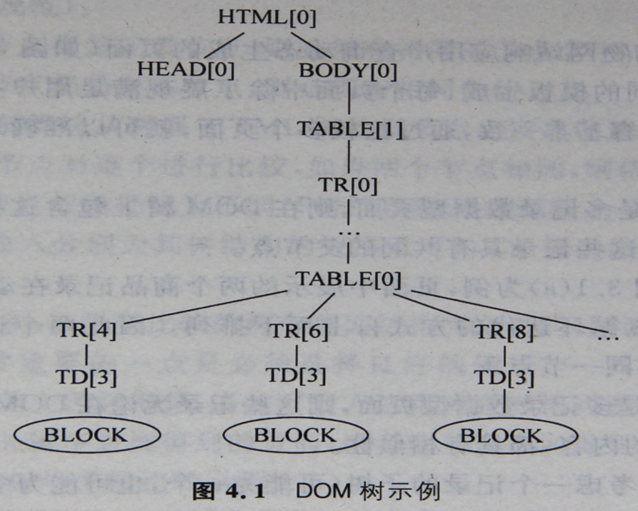

#### 3.2.2 DOM树方法特点

提取HTML DOM树提取在解析HTML时速度较慢，但其表达能力相当于上下文无关文法。

在网页自动分类等需要进行网页去噪处理的情况时使用基于HTML DOM树的爬取程序。

#### 3.2.3 HTML解析器

HTML解析器的工作：将html标识解析为树。

jsoup 是一款 Java 的HTML解析器

* ```java
  File input = new File("/tmp/input.html");
  Document doc = Jsoup.parse(input, "UTF-8", "/example.com/");
  Element content = doc.getElementById("content");
  Elements links = content.getElementsByTag("a");
  for (Element link : links) 
  {
      String linkHref = link.attr("href");
      String linkText = link.text();
  }
  ```

* C/C++：htmlcxx等

* C#：Winista.Htmlparser.Net等

* JAVA：HTMLParser, jsoup等

* Python：lxml等

### 3.3 Beautiful Soup

python的一个第三方，从HTML或XML文件中提取数据的Python库。一个简单的爬取网页的例子：

```python
import urllib.request
from bs4 import BeautifulSoup

url = "http://www.baidu.com"
response = urllib.request.urlopen(url)

soup=BeautifulSoup(response,'html.parser')
print(soup.prettify())

for link in soup.find_all('a'):
    print(link.get('href'))
    print(link.text)
```

> 中文操作系统默认ansi编码，生成的txt文件默认为ansi编码
> 
> unicode是国际通用编码
> 
> utf-8编码是unicode编码在网络之间（主要是网页）传输时的一种“变通”和“桥梁”编码。utf-8在网络之间传输时可以节约数据量。
> 
> * 网站开发者“扩展”了utf-8编码的使用范围
> 
> * word文档和一些国际通用的文档仍然使用unicode编码而不使用utf-8编码

### 3.4 python爬虫框架 Scrapy

快速、高层次的屏幕抓取和web抓取框架，用于抓取web站点并从页面中提取结构化的数据。

Scrapy吸引人的地方在于它是一个框架， 只需要根据需求，编写爬取逻辑，并完善存储方式和中间处理就额可以运行的框架。

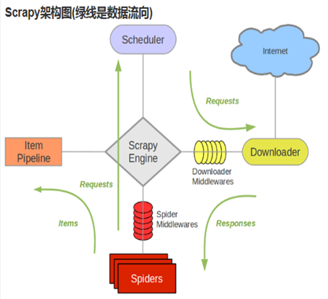

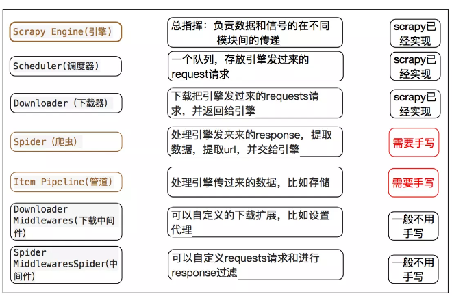

* ScrapyEngine(引擎)：负责Spider、ItemPipeline、Downloader、Scheduler中间的通讯，信号、数据传递等。

* Scheduler(调度器)
  
  负责接收引擎发送过来的Request请求，并按照一定的方式进行整理排列、入队。当引擎需要时，便把这些请求交还给引擎，优先队列,   去除重复的网址。

* Downloader（下载器）：下载Scrapy Engine(引擎)发送的所有Requests请求，将其获取到的Responses（响应）交还给Scrapy Engine，再由引擎交给Spider来处理。建立在twisted这个高效的异步模型上的
- Spider（爬虫）：负责处理所有Responses（网站的响应）。从中分析提取数据，获取Item字段需要的数据，并将需要访问的URL提交给引擎，再次进入Scheduler(调度器)。

- ItemPipeline(管道)：管道负责处理从Spider中获取到的Item，是进行后期的处理的地方。
* DownloaderMiddlewares（下载中间件）：可以自定义扩展下载功能的组件，下载的方式、下载数据的选取、存储等功能。

* SpiderMiddlewares（爬虫中间件）：一个可以自定义扩展，进入Spider的Responses，从Spider出去的Requests，和操作引擎通信或是和Spider通信的“桥梁功能组件”

### 3.5 元搜索引擎

元搜索引擎又称多搜索引擎，通过一个统一的用户界面帮助用户在多个搜索引擎中选择和利用合适的（甚至是同时利用若干个）搜索引擎来实现检索操作，是对分布于网络的多种检索工具的全局控制机制。

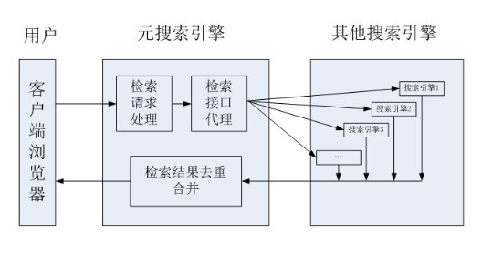

## 四 爬虫与网站的博弈

### 4.1 Robot协议

Robots.txt 在网站虚拟根目录的一个文本文件，它指定了爬虫机器人可访问的范围。

urllib 是一个收集了多个涉及 URL 的模块的包：

* [urllib.request](https://docs.python.org/zh-cn/3/library/urllib.request.html) 打开和读取 URL

* [urllib.robotparser](https://docs.python.org/zh-cn/3/library/urllib.robotparser.html) 用于解析 robots.txt 文件

### 4.2 User-Agent

是Http协议中的一部分，HTTP头域的组成部分，在每次浏览器 HTTP 请求时发送到服务器，向网站提供访问者信息：

* 所使用的浏览器类型、浏览器语言、浏览器插件

* 操作系统及版本、

* CPU 类型、

* 浏览器渲染引擎

UA作用：

* 网站可以**显示不同的排版从而为用户提供更好的体验或者进行信息统计**

* 网站分析用户的User-agent，根据大全**过滤**未知的或者指定的

**反反爬**：篡改自己的User-agent，伪装浏览器（python中的`fake_useragent`），例子：

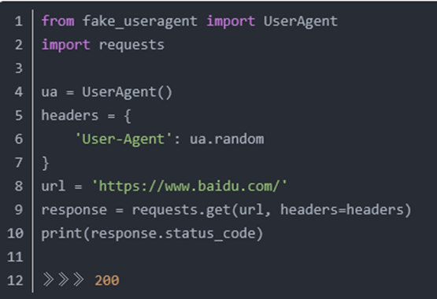

### 4.3 IP屏蔽

封禁访问频繁的IP或限制某些IP访问

**反反爬**：

* 连接代理服务器（网络信息的中转站），写了个IP代理池。
  
  * 正向代理：代理客户端获取数据。正向代理是为了保护客户端防止被追究责任。
  
  * 反向代理：代理服务器提供数据。反向代理是为了保护服务器或负责负载均衡
  
  ```python
  //设置代理地址，
  proxy = {"http" : "127.0.0.1"}
  //创建ProxyHandler，
  proxy_handler = request.ProxyHandler(proxy)
  //创建opener，
  opener = request.build_opener(proxy_handler)
  //安装opener，
  request.install_opener(opener)
  //打开网页，
  req = request.urlopen(url)
  ```

* 多IP并行

* 增大爬取时间间隔

### 4.4 用户登录

有些网站会在需要时要求用户登录才能继续访问，以避免爬虫机器人的访问。既可能是在一开始就需要，也可能是在觉察到IP访问异常时中途要求。

**反反爬**：分析登陆过程的方法

* 发送post请求：登陆操作可以被视为一个提交表单数据的POST或GET请求，我们可以使用库中的API构建一个请求来完成登陆操作。

* 分析post过程中隐藏的变量名

* 分析 Cookie：
  
  Cookie是一个小文本文件，最开始服务器在HTTP响应头中发送给用户浏览器，以维持客户端与服务器端的状态，Cookie保存在客户端的一个目录中。
  
  它会伴随着用户的请求在服务器和浏览器之间来回传递，cookie记录的内容中，往往是有我们用户登录相关的信息的（比如用户ID、密码、浏览过的网页、停留的时间等信息）

* 携带Cookie访问已登陆网站
  
  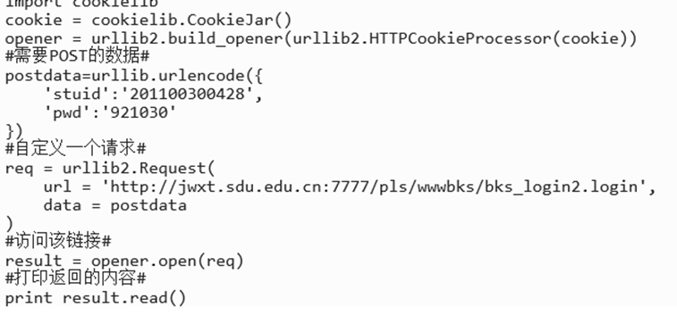

### 4.5 模拟浏览器进行交互

我们使用请求来进行登录，可能会无法直接执行一些JavaScript代码，我们需要更高级的模拟行为。现在很多网站都使用AJAX动态加载网页，如果直接请求的话是获得不了数据的.

**反反爬**：我们使用工具彻底模拟用户操作浏览器的正常行为，这样就更难以被分辨了，动态加载问题也不复存在。

selenium：

- selenium本来是一个web自动化测试工具，用来测试网站的。但是其有着彻底模仿用户操作的特性（比如模拟点击操作），故可以用于让爬虫模拟浏览器交互
- selenium本身没有浏览器内核，需要加载一个浏览器内核使用
- selenium仍然可以获取cookies

### 4.6 验证码

- 显示一张包含内容的图片，然后让用户根据内容进行输入，最典型的就是写数字，还有做图片滑动的验证码，拿图片出题等等。

**反反爬**：

1. 获取图片
   
   selenium可以进行屏幕截图，结合我们在DOM锁定验证码的位置，就可以截下验证码

2. 图片处理
   
   使用一些库进行图片处理，例如将彩色图转换为黑白图
   
   PIL库是python的一个图像处理库，但只支持到python 2.7，其派生分支Pillow现在已经比PIL更好了

3. OCR
   
   光学字符识别OCR，将图像中的文字转换为文本格式，以破解输入数字或文字的验证码
   
   Tesseract是谷歌OCR开源项目的一个模块，可以将图片中的文字转化为文本，而且使用简单

4. extra step3
   
   如果遇到图片滑动验证码，往往可以在网页上找到显示出完整图片的方法，使用灰度图对比找到缺口位置后模拟用户拖动即可

### 4.7 懒加载

按需加载，延时加载，即当对象需要用到的时候再去加载。

**原理**：图片的加载是依赖于src路径，src的值默认是正在加载中的GIF图，而真正的图片路径是保存在暂存器中。

当需要这个图片加载显示时，如何判断图片是否在可是区域？

* 我们可以利用元素的偏移高度，对比设备宽度加上滚动条高度来判断该元素是否处于可视区域中

* 鼠标滚动

把路径赋值给src，这样就能实现按需加载，也就是懒加载。

**反反爬**：data-* 属性用于存储页面或应用程序的私有自定义数据。在一个图片标签中：

```html

```

src不是需要爬取的图片，寻找替代src属性的例如：data-属性，src2属性，original属性数值。

## 五 数据抽取与包装器

### 5.1 Web数据抽取

Web 数据抽取是指从页面中将用户感兴趣的数据利用程序自动抽取到本地的过程。为了能够保证抽取的准确性，必须要能够识别页面模板。

**定义(页面模板)** 页面模板T= < C，L，S>

- **C**：一些共同的页面内容，包含导航、版权声明、固定页面修饰等不变的内容
- **L**：严格定义的格式，包含页面数据的格式规范
- **S**：既定的页面数据模式，是能够从页面数据中观察出的模式

**定义 ( Web数据抽取)** ：给定页面集合W={wi}，它通过页面模板T生成，包含数据D={di}，即W={wi| wi =T(di))，Web数据抽取问题则可以定义为通过一定的技术手段，从W中**逆向**推导出T，还原数据D。

抽取方式：

* 手工爬虫

* 机器学习爬虫：训练集  T   测试集

解决该问题的关键在于逆向推导页面模板，即找到大量页面中的共同部分、格式约定和页面数据模式。

### 5.2 Web数据抽取方法

**包装器(Wrapper)抽取**是一种软件过程，使用已经定义好的信息抽取规则，将网络中web页面的信息数据抽取出来，转换为用特定格式描述的信息

- 一个包装器一般针对某一种数据源中的一类页面

web数据抽取，根据自动化程度分为：

- **人工抽取**：人工分析页面模板，再针对具体问题生成具体包装器
  - 容易采纳，可以较好地取得满意的结果，对于小规模的即时抽取很好用
  - 不适合大规模的持续性数据抽取
- **半自动抽取**：由计算机应用页面模板抽取数据生成具体包装器但是页面模板的分析仍然需要人工参与。
  - 设计一个描述页面模板的概念模型和一套用来描述抽取意图的规则语言，用户通过一定的辅助工具利用该概念模型分析页面推导出页面模板，并使用规则语言表明其抽取意图。
  - 即使仍有人工部分，也能大大降低工作量
- **自动抽取**：自动抽取工作中，页面模板的分析通过序列匹配、树匹配或者利用可视化信息完成，并且直接给出抽取结果。
  - 仅仅需要很少的人工参与(例如检查结果进行校准) 或者完全不需要人工参与

### 5.3 Web数据抽取评价标准

对某个测试参考集,对应的相关数据集合为R。假设用某个检索策略进行处理后，得到一个结果集合A。令`Ra`表示R与A的交集。          

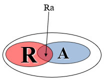

* 召回率(Recall)：也称为**查全率**，指抽取到的正确结果与要抽取页面的全部结果的比。即`R=|Ra| / |R|`

* 准确率(Precision)：也称为**查准率**，指抽取到的正确结果与抽取到的全部结果的比。即`P=|Ra| / |A|`

有些用户希望返回的结果全一点，他有时间挑选；有些用户希望返回结果准一点，他不需要结果很全就能完成任务。例如垃圾邮件过滤：宁愿漏掉一些垃圾邮件，但是尽量少将正常邮件判定成垃圾邮件（查准率）。

* F-measure：将两个指标融成一个指标，使用调和平均数计算F值。
  
  $$
  F-measure = \frac{2*P*R}{P+R}
  $$

* $F_{\beta}$：允许用户指出他更关心查准率或查全率，表示召回率的重要程度是查准率的β(>=0)倍。β>1更重视召回率， β<1更重视查准率。β=1 称为F1，F1分数，是分类与信息检索中最常用的指标之一：
  
  $$
  F_{\beta}=(1+\beta)^2*\frac{P*R}{\beta^2*P+R}
  $$

* 抽取自动化程度：这项标准用来衡量用户在抽取过程中的参与程度，分为手工、半自动和全自动三类。

* 适应性：指在页面的内容和结构发生较小变化的情况下，该抽取方法或工具具有自适应能力，仍然能够继续正常工作。

* 修正率：手工调整使得准确率和召回率达到100%的Web数据库数量。

### 5.4 包装器

**包装器**：是针对某一类特定的网页，**计算机可以理解并执行的程序或抽取规则**，其任务就是负责将HTML格式的数据抽取并转化为结构化的格式。（模板T的表示形式），包装器在半自动化抽取系统中需要通过和用户交互生成。

核心：抽取规则。基于HTML文档格式从HTML文档中抽取相关信息 根据对HTML文档看待方式的不同，可分为：

* **将文档看作字符流**，基于分界符(或界标符)的规则：
  
  基于分界符（HTML标签、特征字符串、标点符号）的规则将HTML文档看作字符流，给出数据项的起始和结束分界符，将其中的数据抽取出来。

* **将文档看作树结构**，所抽取的数据存储在树节点中，基于树路径的规则：
  
  首先根据HTML标签将文档分析成树结构，如DOM树，然后通过规则中的路径在树中搜索相应的节点

包装器与爬虫软件的不同：相比包装器，爬虫属于手工方法。

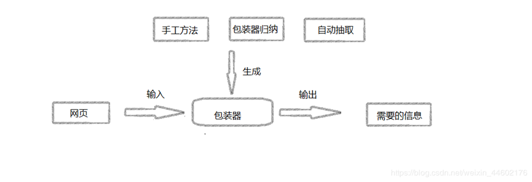

**包装器归纳(wrapper induction)**：使用机器学习的方法产生抽取规则，基于有监督学习的：

* 从标注好的训练样例集合中学习数据抽取规则，

* 用于从其他相同标记或相同网页模板抽取目标数据

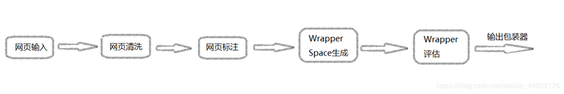

## 六 包装器页面抽取方法

### 6.1 网页的分类

按照页面内数据组织形式的不同，分为：

* 单记录页面(详情页Authority)：页面中只嵌入了唯一的记录，每页关注一个特定的对象，同时也含有其他相关和非相关信息

* 多记录页面(列表页Hub)：页面中嵌入了数量不等、由相同模板生成的记录，**记录之间按照单列或多列布局整齐排列**。同结构的记录在页面内重复排列出现，列表在页内的特定位置

按照页面承载内容的不同，分为：

* 数据型页面：页面中嵌入了一个或多个结构化数据记录，如：产品价格页

* 文档型页面：页面中嵌入了半结构化文档内容或文档标题，如：新闻网站，展示大量文本

以上两两结合共有四种类型

- 多记录数据型页面
- 单记录数据型页面
- 单记录文档型页面
- 多记录文档型页面

### 6.2 多记录数据型页面


相同模板的多个网页，不同之处主要在于数据，数据记录在DOM树上通常在同一层，且具有共同的父节点，记录在DOM树上的结构和内容都具有相似性

数据记录抽取：

1. 确定数据区域：通过比较多个Web页面的树结构得到例子页面中所有的不同节点

2. 计算数据记录的边界：
   
   - **语义块** 语义块是内容满足模式定义的，HTML的一个片段
   
   - **最小语义块** 一个语义块可能会包含若干子语义块，而不能被进一步被划分的语义块称为最小语义块 最小语义块是包装器中的最基本抽取单位 
     
     * 包含码项(模式中定义必选的且只能出现一次的项) ;
     
     * 非码项的出现情况必须符合模式中的约束(出现次数的限制) ;
     
     * 是HTML文档中的一棵子树或有共同父节点的相邻的多棵子树
   
   - **发现语义块所在的层次**
     
     - **一句话总结：如果你发现DOM树上某一层的子树数量突然超过的你的阈值，那大概率就是这里了！**
     - **规则1：关键字频率规则**-页面由关键词K查询得到
     - **规则2：共同路径原则**-将从当前节点到叶子节点的路径组划分为更细的m个子路径组，如果m大于某个阈值M，则认为正好匹配（即分支足够多，因为我们认为大量的记录往往处于同一层）
     - 那么我们基于这个，就可以从根结点不断下移寻找，如果发现某一层的子树很多就是了（大概是这意思）
   
   - **语义块边界计算**
     
     - 我们已经找到了记录所在的层次
     - **规则3：HTML标签序列相似性规则**-如果只将标签作为字符串看待，那各个记录之间的标签字符串应当有高相似性
     - **规则4：模板项分布规则**-模板项是一些在各个记录中都出现、必然具有相同的值、且至多出现一次的数据项，如果我们读取到了第二个模板项，就代表已经开始另一个记录了
     - **规则5：关键字分布规则**-如果两个包含关键字的节点具有相同的路径，则认为两个节点分布于不同的记录中

3. 数据项抽取：将语义块中各个结点的数据进行合理提取，找到各个结点中相同的属性，生成格式化的数据项

### 6.3 单记录数据型页抽取方法

- **增量式抽取**
  
  - 从多个连续页面中抽取同结构的记录
  - 以增量方式推导网页模板：逐个输入网页，不断推导模板

- **部分树对齐算法** 假设两棵页面树，它们的子节点虽然不同，但是我们可以通过两棵树的共有节点和私有节点的位置关系进行推断，推导出那些私有节点的插入位置，进行合并：
  
  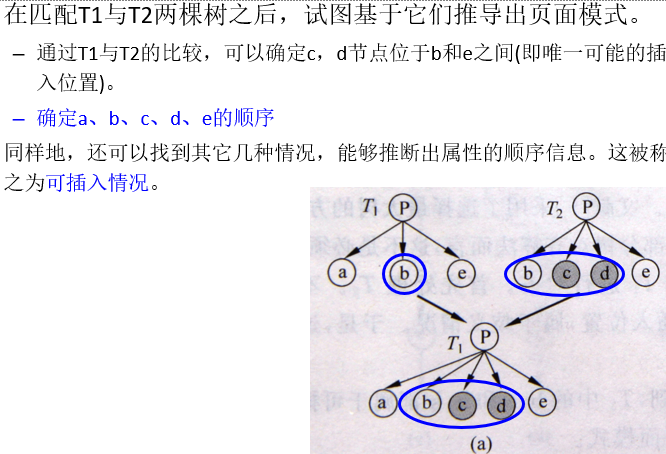
  
  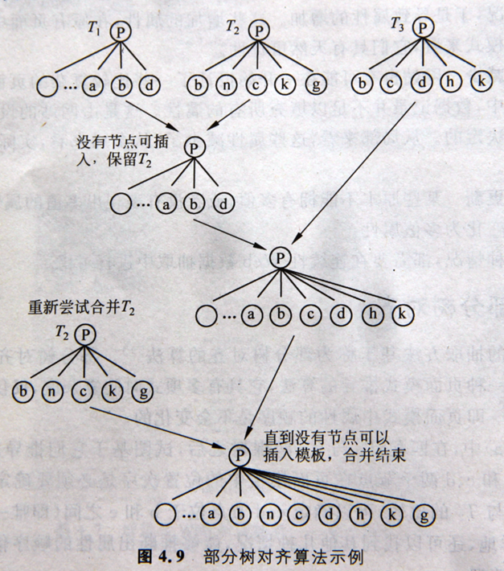

### 6.4 单文档型页面抽取方法

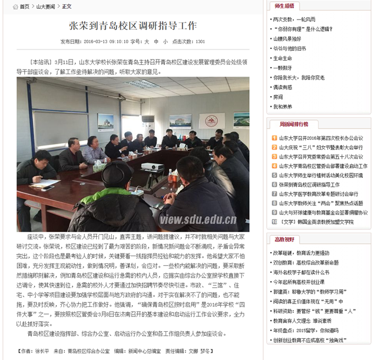

#### 6.4.1 结合视觉信息的抽取方法

- 正文一般占用页面中最大的文本数据块，且该性质在不同网站普遍存在

- **正文数据块识别**
  
  - **计算**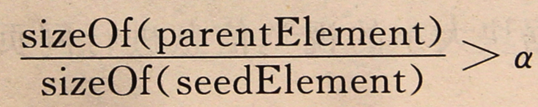
    
    其中parentElement是seedElement的父亲节点，sizeOf指的是以该结点为根结点的子树的文本块大小（也就是说sizeOf(parentElement)是sizeOf(seedElement)加上parentElement的文本块得到的），如果该比值超过阈值α，则文本块向上扩大，seedElement上提，直到比值小于α

- 直观来看，就是我们从树的底部不断将上层的结点纳入考虑，要是某一次带来的内容增长率不够高，就说明我们已经占领了正文文本块

- 这种方法不好处理短正文，或包含大量评论的页面。前者正文长度短，不符合我们的假设；后者评论区文本块可能会超过正文文本块大小，被误认为正文

#### 6.4.2 抽取路径学习

- 将正文的抽取路径保存，之后按照基于视觉信息的抽取抽取出的路径与数据库比对，一致时就没问题，不一致就需要进行选择

#### 6.4.3 改进的自适应数据抽取方法

- 实质是前两者的自动选择，基于贝叶斯最优决策的方法

- 所用的特征包括： 
  
  FR1:正文内容通常位于标题之下;
  
  FR2:与标题的距离越近，其为正文的可能性也越大;
  
  FR3:正文部分所占用的数据块通常较大;
  
  FR4: 正文中包含的链接密度通常比较低;
  
  FR5:正文通常会经过页面的中轴线;
  
  FR6:正文的字体大小通常比标题字体要小，而较网页中其他部分的字体要大;
  
  FR7:文本区域的宽度通常不会发生变化。
  
  最终决策公式为
  
  ### 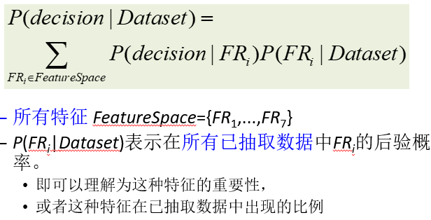

### 6.5 多记录文档型页面抽取方法

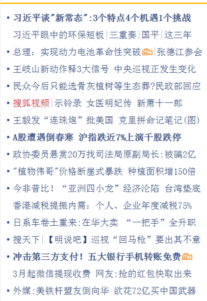

多记录文档型页面中的记录其实是一组文档的标题链接，指向对应的单记录文档页面

由于每个记录都是简单的标题链接，对多记录文档型页面的抽取主要是为了获得这一组标题链接。

使用基于序列匹配与树匹配的混合抽取方法

- 使用序列匹配进行模式发现
- 使用树匹配进行模式选择

## 七 Web数据存储与应用

Web上爬取的数据

- **非结构化数据**
  - 大块文字
  - 纯文本
  - 图片
- **结构化数据**
  - 二元化数据
  - 有限的离散数据
  - 连续数据

爬虫数据存储：结构化文件与数据库。

### 7.1 结构化文件

- **CSV**：逗号间隔文本文件
- **JSON**：JavaScript对象表示法，即字典键值对格式{'name':'value'}，比XML更小
- **XML**：可扩展标记语言，结构类似于HMTL
- **EXCEL**：二进制文件
- **pickle文件**：python的二进制序列化格式

### 7.2 非结构化数据处理

- **文本数据**
  - SQL查询
  - NLP分析：分词、预处理、向量描述，得到文本特征
- **文本特征**
  - IR（信息检索）：IR模型、倒排表、搜索引擎
  - 文本处理：文本分类、文本聚类、情感分析
  - NLP：命名实体识别、关系抽取，得到知识体系
- **图像数据**---->**图像特征**---->**图像识别**
- 文本+图片特征---->跨模态检索

## 八 词项词典

如何建立词项词典

### 8.1 文档解析

Parsing a document。

* 文档包含哪些格式？
  
  * pdf/word/excel/html et
  
  * Apache POI是[Apache](https://www.baidu.com/s?wd=Apache%E8%BD%AF%E4%BB%B6%E5%9F%BA%E9%87%91%E4%BC%9A&tn=24004469_oem_dg&rsv_dl=gh_pl_sl_csd)[软件基金会](https://www.baidu.com/s?wd=Apache%E8%BD%AF%E4%BB%B6%E5%9F%BA%E9%87%91%E4%BC%9A&tn=24004469_oem_dg&rsv_dl=gh_pl_sl_csd)的开放源码函式库 [http://poi.apache.org/](http://poi.apache.org/)，POI提供API给Java程序对Microsoft Office格式档案读和写的功能。

* 文档包含语言？

* 文档使用何种编码方式？
  
  * ANSI：charset="gb2312"
  
  * UNICODE
  
  * UTF-8、UTF-16、UTF-32

### 8.2 词条化

**词条化**：将给定的字符序列拆分成一系列子序列的过程，其中每一个子序列称之为一个“词条”Token。

- **英文**
  - 天生使用空格分词
  - 多个单词可能组成固定短语
  - 英文句号与点的问题
- 其他语言十分混乱

### 8.3 词项归一化

词项(Terms)**归一化**：将文档和查询中的词条“归一化”成一致的形式，例如：将USA和U.S.A进行匹配。

归一化的结果：在IR系统的词项词典中，形成多个近似词项的一个等价类。

策略：

* 一般策略：将所有字母转换为小写
  
  绝大多数情况下，用户在构造查询时都忽略首字母的大写，一些专有名词除外。

* 词项归一化的策略：建立同义词扩展表
  
  * 为每个查询维护一张包含多个词的查询扩展词表：查询同义词
  
  * 在建立索引建构时就对词进行扩展：建立相同词义的索引，对于包含automobile的文档，我们同时也使用car来索引

### 8.4 词干还原

通常指去除单词两端词缀的启发式过程，还原词根：automate(s),automatic, automation -> automat。

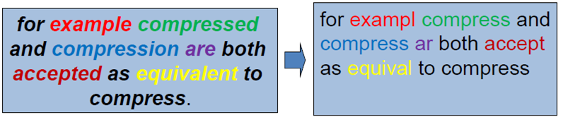

英文词干还原算法：Porter算法

中文叠词还原就可以视为词干还原。

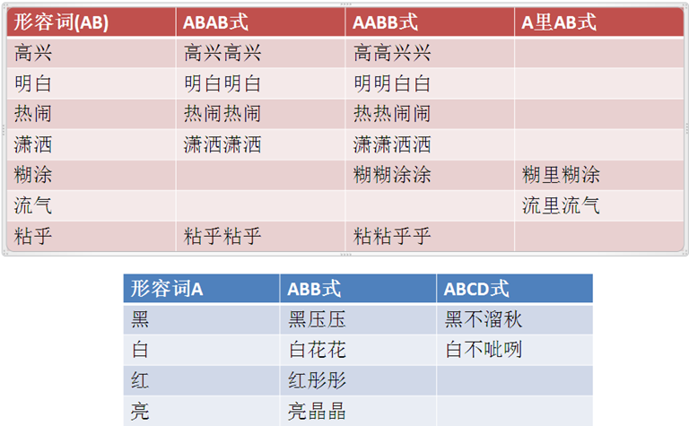

词干还原能够提高召回率，但是会降低准确率。

### 8.5 词形归并

利用词汇表和词形分析来减少屈折变化的形式，将其转变为基本形式。可以减少词项词典中的词项数量。例子：

* am,are, is -> be

* car,cars, car's, cars' -> car

词干还原(Stemming)和词形归并(Lemmatization)的区别：

* Stemming通常指很**粗略**的去除单词两端词缀的启发式过程，Lemmatization指利用**词汇表和词形**分析来去除屈折词缀，从而返回词的原形或词典中的词的过程

* 词干还原在一般情况下会将多个**派生**(automate(s),automatic, automation)相关词合并在一起，而词形归并通常只将同一词元的不同形式(am,are, is)进行合并。

### 8.6 停用词

停用词：去除应用太广泛的词作为候选的索引

- **优点** 削减词项个数，缩小搜索范围，提高效率
- **缺点** 有时停用词是有意义的 典型例子是：“to be or not to be”
- 策略：构造或收集停用词表（语法剔除、利用词频）

### 8.7 开源NLP工具

- **NLTL**：最常使用的python NLP库，具有几乎所有NLP任务的工具。但不支持中文
- **Spacy**：NTLK的对手
- **Stanford** NLP：支持中文

## 九 中文分词

### 9.1 分词

针对不同的语言，采取不同策略的词条化方法

* 英法等欧洲语系语言：以词为单位，词和词之间靠空格隔开，

* 中日韩等亚洲语系语言：以字为单位，句子中所有的字连起来才能描述一个意思。

**中文分词(Chinese Word Segmentation)**：指的是将一个汉字序列切分成一个一个单独的词。分词就是将连续的字序列按照一定的规范重新组合成词序列的过程。属于自然语言处理(NLP)技术范畴

### 9.2 分词算法

#### 9.2.1 基于理解的分词方法

通过让计算机模拟人对句子的理解，达到识别词的效果(NLP，语义分析，句法分析)

#### 9.2.2 基于字符串匹配的分词方法

按照一定策略将待分析的汉字串与一个“词典”中的词条进行匹配，如果匹配成功，那么该汉字串就是一个词。遇到不认识的字串就分割成单字词。

- **策略**
  
  - **按扫描方向**：
    
    * 正向匹配：从第一个待切分字符开始，从左向右，取m个字符作为匹配字段（m为词典中的最长词条长度）查找词典，如果没找到就去掉最后一个字重复以上过程
    
    * 逆向匹配：与正向最大匹配类似，不过是从最后一个待切分字开始，从右向左取m个字符，不行就缩减
    
    * 双向最大匹配：将正向最大匹配法得到的分词结果和逆向最大匹配法的到的结果进行比较，把所有可能的最大词都分出来。
    
    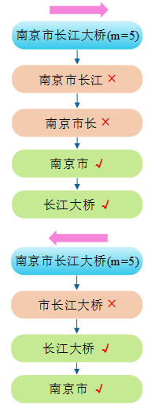
  
  - **按扫描长度**：最大匹配和最小匹配
  
  - 最少切分（使每一句中切出的词数最小）

优点：

* 程序简单易行，开发周期短

* 仅需很少的语言资源（词表），不需要任何词法、句法、语义资源。

* 可以自定义词库，增加新词

缺点：

* 词语脱表

* 歧义消解能力差；

* 切分正确率不高，一般在95%左右。

#### 9.2.3 基于统计的分词方法

基于一个假设：如果相连的字在不同的文本中出现的次数越多，就证明这相连的字很可能就是一个词。

策略：统计字与字的组合的频率，当组合频度高于某一个临界值时，我们便可认为此字组可能构成一个词语。

基于统计/机器学习的方法：

- N-gram
- 隐马尔可夫模型HMM
- 条件随机场模型CRF
- 深度神经网络

**优点**

- 准确率高
- 不需要分词词典
- 平衡地看待词表词和未登录词

**缺点**

- 经常会抽出一些共现频度高但其实不是一个词的字组（“我的”、“之一”）
- 对常用词识别精度差、开销大
- 复杂度高、计算代价大

### 9.3 统计语言模型

语言模型(language model)：根据语言客观事实而进行的语言抽象数学建模。

#### 9.3.1 用数学的方法描述规律

1. S 可以表示某一个由一连串特定顺序排练的词(ω1，ω2，...，ωn)而组成的一个有意义的句子。

2. **S在文本中出现的可能性**：即S的概率P(S)，P(S)=P(ω1，ω2，...，ωn)

3. 利用条件概率的公式：S 的概率P(S)等于每一个词出现的概率相乘P(S)=P(ω1)•P(ω2|ω1)•P(ω3|ω1,ω2)•••P(ωn|ω1，ω2，...，ωn-1)

#### 9.3.2 应用

* 文本生成、机器翻译：语言模型就是用来判断一个句子的合理性的置信度，利用语言模型判断哪个更像合理的句子

* 拼写纠错：P(about fifteen minutes from) > P(about fifteen minuets from)

* 语音识别：P(I saw a van) > P(eyes awe of an)

* 音字转换：P(你现在干什么|nixianzaiganshenme)–> P(你西安在干什么|nixianzaiganshenme)

* 分词：可以有几种分词方法，假定有以下三种：
  
  A1,A2, A3, ..., Ak,
  
  B1,B2, B3, ..., Bm
  
  C1,C2, C3, ..., Cn
  
  计算P(A1,A2, A3, ..., A，k)，P(B1,B2, B3, ..., Bm )和P(C1,C2, C3, ..., Cn )找到概率最大的情况。
  
  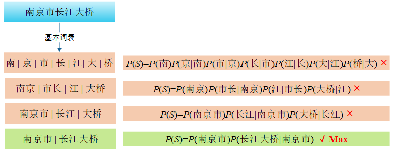

#### 9.3.3 统计语言模型的工程诀窍

统计语言模型存在两个问题：

* 要求的概率太多了，因为ω1，ω2，...，ωn的组合实在太多了（词表数的n次方）

* 由于语料的数量有限，数据中可能不存在ω1，ω2，...，ωn的组合，导致求得的条件概率为0。

**n-gram语言模型**：

* N-1阶马尔可夫假设：假定文本中的每个词ωi和前面的N-1个词有关，而与更前面的词无关

* 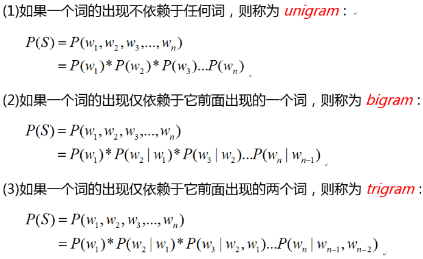

* 如何选择依赖词的个数，即n
  
  * 更大的n：对下一个词出现的约束信息更多，具有更大的辨别力；理论上，n越大越好，但N元模型的空间复杂度，时间复杂度即$O(|V|^N)$
  
  * 更小的n：在训练语料库中出现的次数更多，具有更可靠的统计信息，具有更高的可靠性。
  
  经验上，trigram用的最多，尽管如此，原则上，能用bigram解决，绝不使用trigram。

#### 9.3.4 使用的语言模型和开源模块

- **开源模块**
  - SRILM
  - IRSTLM
  - MITLM
  - BerkeleyLM
- **语言模型**
  - N-gram
  - 最大熵模型MaxEnt
  - 最大熵马尔科夫模型MEMM
  - 条件随机域模型CRF

### 9.4 基于HMM的中文分词方法

隐马尔可夫模型(Hidden Markov Model，HMM)

#### 9.4.1 马尔可夫过程

是指数学中具有马尔可夫性质的离散事件[随机过程](http://baike.baidu.com/view/18964.htm)。

* 在马尔可夫链的每一步，系统根据概率分布，可以从一个状态变到另一个状态，也可以保持当前状态。

* 通常说的状态仅与上一个状态有关，即在给定当前知识或信息的情况下，过去（即当前以前的历史状态）对于预测将来（即当前以后的未来状态）是无关的

#### 9.4.2 HMM统计模型

隐马尔可夫模型是关于时序的概率模型，用来描述一个含有隐含未知参数的马尔可夫过程。

隐马尔可夫模型中，我们能观测到一个表象，同时其背后有一个不能观测的隐藏状态，两者构成了两条马尔科夫链。能被观察到的链称为**观测随机序列**(observation sequence)，不能观测的称为**状态随机序列**(state sequence)。两者的每个状态一一对应，每个位置都可以视为一个时刻。以下面为例：

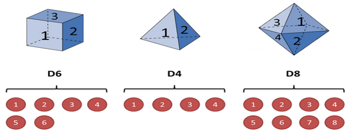

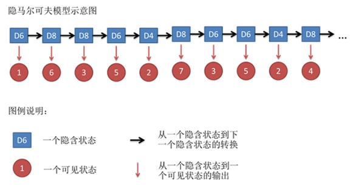

* 隐含状态之间存在**转换概率（transition probability）**：统计状态随机序列，D6的下一个状态是D4，D6，D8的概率都是1/3。

* 隐含状态和可见状态之间存在**发射概率（emission probability）**：六面骰（D6）产生1的输出概率是1/6。

**HMM的组成**

- 初始概率分布
- 状态转移概率分布：状态必须为有限个
- 观测概率分布：观察值必须为有限个
- Q：所有可能状态的集合
- V：所有可能观测的集合
- I：长度为T的状态序列
- O：对应的观测序列

所以HMM是一个五元组

- Q：状态值集合StatusSet
- V：观察值集合ObservedSet
- A：状态转移概率矩阵TransProbMatrix
- B：发射概率矩阵EmitProbMatrix
- π：初始状态分布向量（初始时刻处于各个状态的概率）InitStatus

在忽略Q和V的前提下，我们得到λ = (A,B,π)，这就是我们的模型了，根据π和A我们可以做出一条状态链，再通过B计算出状态链对应的观察链。

#### 9.4.3 HMM模型的三个基本问题

- **概率计算问题**
  
  - 给定λ = (A,B,π)，观测序列O=(o1,o2……)
  - 计算P(O|λ)，此过程相当于使用模型计算观测值的发生概率

- **学习问题**
  
  - 给定观测序列O=(o1,o2……)
  - 计算λ = (A,B,π)，使P(O|λ)最大，此过程相当于从观测样本计算获得最合理的模型

- **预测问题**
  
  - 给定λ = (A,B,π)，观测序列O=(o1,o2……)
  - 计算使P(I|O)最大的状态序列I=(i1,i2……)，此过程相当于使用模型推测观测信息背后隐藏的信息

**HMM应用**

- 股票预测
- 模式识别（例如人脸识别）
- 语音识别
- 分词

#### 9.4.4 HMM分词

预测问题，也称为解码问题

- 以输入的句子为观察值集合V，如“南京市长江大桥”

- 字的状态值集合为可取值为(B,M, E, S): {B:begin 词开始, M:middle 词中部, E:end 词结尾, S:single 单字}。B后面只可能接(Mor E)，不可能接(B
  or S)。而M后面也只可能接(Mor E)，不可能接(B,S)。得到状态转移概率矩阵：
  
  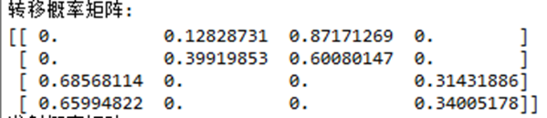

- 使用Viterbi算法计算使P(I|V)最大的状态序列I=(i1,i2……)，输出的分词结果为每个字的状态值的集合Q，如BMEBEBE，一对B与E就是一个词

具体算法过程参考PPT

### 9.5 常见开源分词软件或模块

- StandardAnalyzer
- IKAnalyzer：轻量级中文分词工具包，基于Java
- ICTCLAS：分词软件
- Ansj：开源Java中文分词器
- Jieba：python的中文分词
- HanLP：汉语处理包
- SnowNLP

## 十 信息检索

**IR**：实质上是融合了文本及多媒体检索、数据挖掘、机器学习和自然语言处理的综合学科

**数据量大、非结构化、对查询速度有要求的场景**下使用信息检索，而不是数据结构或数据库

**信息检索的本质：**

1. 给定一个查询Q
2. 从文档集合C中，
3. 计算所有文档D与Q的相关度(词条 共现，知识图谱，距离公式)
4. 排序

搜索是特殊的信息检索，信息检索的操作本质文档与文档的相关度计算，查询被视为了文档。

文档D可以是结构的、非结构的，可以是文本、图像、视频。

相关度与相似度不同，信息检索中的相关度是一个函数R = f(Q,D,C)，相关度往往带有主观概念，不是非黑即白的距离。

## 十一 布尔模型与倒排索引

### 11.1 信息索引模型

**信息检索模型（IR model）**：依照用户查询，对文档集合进行相关排序的一组前提假设和算法。IR模型可形式地表示为一个四元组`<D, Q, F, R(qi,dj)>`

- D是一个文档合集
- Q是一个查询合计，用户任务的表达（关键词，布尔表达式）
- R(q~~i~~,d~~j~~)是一个排序函数，为查询q~~i~~和文档d~~j~~的相关度赋予一个排序值
- F是一个框架，语义构建文档、查询和它们之间关系的模型

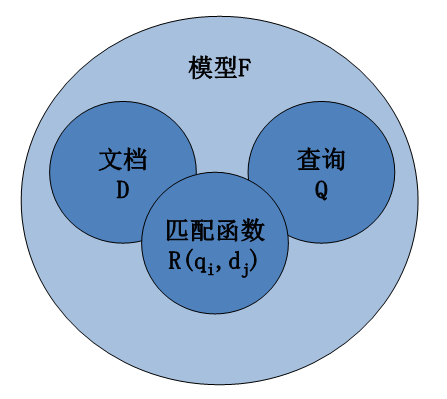

基于内容的信息检索模型分类,不同类的信息检索模型的理论依据不同

- **集合论模型**：**布尔模型**、模糊集合模型、扩展布尔模型
- **代数模型**：**向量空间模型**、广义向量空间、潜在语义标引模型、神经网络模型
- **概率模型**：**经典概率论模型**、推理网络模型、置信网络模型
- **深度学习模型**

其中最经典的是**布尔模型**、**向量空间模型**、**经典概率模型**

### 11.2 布尔检索模型

一种简单的检索模型，建立在经典的集合论和布尔代数的基础上。

> 布尔代数中的布尔变量：
> 
> * 只有“真”、“假”取值的变量
> 
> * 计算机中常常用1表示“真”true，0表示“假”false
> 
> 布尔表达式：多个布尔变量之间通过布尔操作组成的表达式，如：A AND (B OR C) AND NOT D
> 
> * 蕴含：两个布尔表达式P、Q，如果P为true，那么Q为true，则称P蕴含Q，记为PàQ
> 
> 布尔操作(关系)
> 
> * 与(AND)：(A AND B) = true iff A=true and B=true
> 
> * 或(OR) ：(A OR B) = true iff A=true OR B=true
> 
> * 非(NOT) ：(NOT A) = true iff A=false

布尔检索模型使用**词袋模型**：对于一个文本，忽略其词序和语法，句法，将其仅仅看做是一个词集合

基本规则：

* 每个索引词在一篇文档中只有两种状态：出现或不出现，对应权值为 0或1。

* 文档表示：每篇文档是索引词（0或1）的集合

* 查询表示：查询式(Queries)被表示为关键词的布尔组合，用“与、或、非”连接起来

* 相关度计算：一个文档当且仅当它能够满足布尔查询式时，才将其检索出来

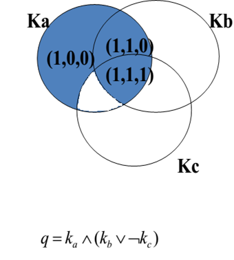

**布尔减缩模型**的实现

- 不能进行线性搜索来获取关键词的状态，太慢了
- 使用非线性扫描方式，比如实现建立索引
- 我们可以建立 文档-词项 的二维矩阵，但是这个矩阵大概率庞大且稀疏，于是就需要**倒排索引**

> 《莎士比亚全集》这本大部头的书中：哪些剧本包含Brutus和Caesar但是不包含Calpurnia科涅莉亚·秦纳
> 
> 线性扫描的方式：先找出所有包含Brutus和Caesar的剧本，然后再将包含Calpurnia的剧本排除——太慢
> 
> 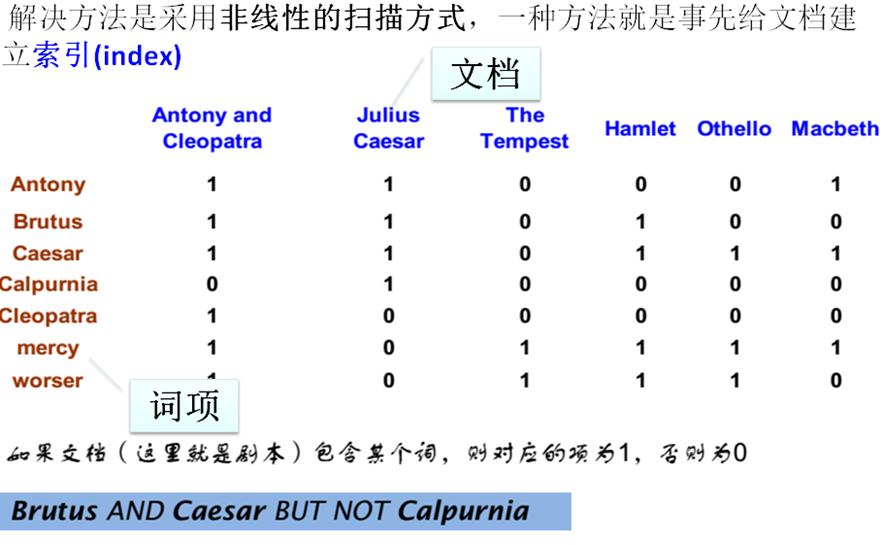
> 
> 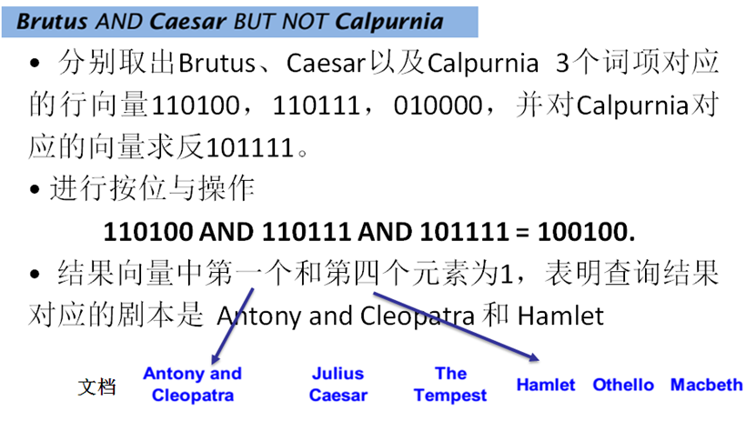

### 11.3 倒排索引

所谓“倒排”，“正排”是指由文档指向词项，“倒排”就是指以词项作为索引指向文档。

倒排索引=词项 + 倒排记录：

* 词项词典：对于每一个词项，存储所有包含这个词项的文档的一个列表。

* 倒排记录表：一个文档用一个序列号docID来表示。

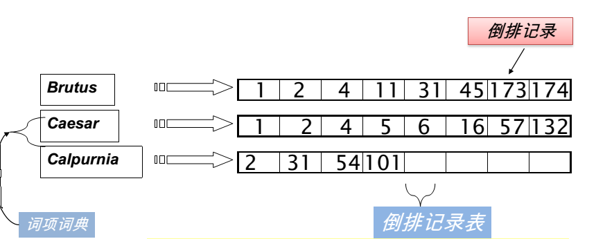

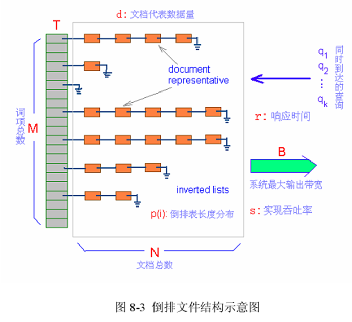

查询：

* AND：找出两个词项的倒排记录表，由于倒排表已经排好序，所以只需要扫描一次，在线性时间内就可以求得表的交集

* OR：合并两个词项的倒排记录表

### 11.4 开源搜索引擎

- Lucence：免费Java信息检索程序库，但它不是一个完整的全文检索引擎，而是一个全文检索引擎的架构
- Solr：基于 Lucene [Java](http://lib.csdn.net/base/17) 的搜索服务器，它易于安装和配置，而且附带了一个基于HTTP 的管理界面
- ElasticSearch：基于[Lucene](http://www.oschina.net/p/lucene)构建的开源，分布式，RESTful搜索引擎
- Nutch：它是构建于Lucene基础上的完整的Web搜索引擎系统

## 十二 向量空间模型

> 基于内容的信息检索模型分类 不同类的信息检索模型的理论依据不同
> 
> - **集合论模型**：**布尔模型**、模糊集合模型、扩展布尔模型
> - **代数模型**：**向量空间模型**、广义向量空间、潜在语义标引模型、神经网络模型
> - **概率模型**：**经典概率论模型**、推理网络模型、置信网络模型
> - 深度学习模型

### 12.1 布尔检索模型的特点

- **优点**：查询简单，容易理解
- **缺点**
  - 信息需求的表达能力不足，不能输出部分匹配情况
  - 无权重设计，**无法排序**
  - 用户必须要会用布尔表达式
  - 检索结果往往太多或太少

在**排序**检索模型中，系统根据文档document与查询query的相关性排序返回文档集合中的文档，而不是简单地返回所有满足query描述的文档集合。排序依赖于“查询-文档对”进行评分

### 12.3 词项频率

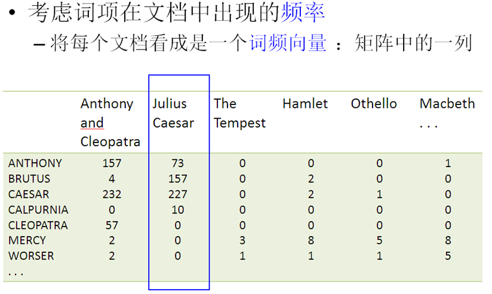

**词项频率：计算词项t在文档d中出现的次数，记为tf(t,d)**

如何利用tf计算`query-document`评分？相关度并不正比与词频(某个词项在A文档中出现十次，即tf = 10，在B文档中tf = 1，那么A比B更相关，但是相关度不会相差10倍)，所以直接用这个值不太合适。可以使用对数，这样可以抑制参数的作用（因为对数的增长速度低于线性）

文档-词项匹配得分是所有同时出现在查询q和文档d中的词项的词频的对数之和，tf=0表示没有公共词项，1+lg(tf)也为0：

$$
Score(q,d)=\sum_{t\in q\bigcap d}(1+\lg tf_{t,d})
$$

### 12.4 tf-idf权重计算

除词项频率tf之外，我们还想利用词项在整个文档集中的频率进行权重和评分计算，罕见词项比常见词所蕴含的信息更多：

* 对罕见词项赋予——高权重

* 对常见词项赋予——低权重

* 停用词——零权重

> 对只有一个查询词的query，idf对排序结果没有影响，对于含有两个以上查询词的query，idf才会影响排序结果，比如Query为“arachnocentric line”，idf会提高“arachnocentric”（蜘蛛学）的相对权重，同时降低“line”的相对权重。

**df(Document frequency) 文档频率**：文档集合出现词项的文档数目，$df_t$表示文档集合出现词项t的文档数（<=N文档总数）

**idf (inverse document frequency)逆文档频**：$idf_t=\lg(N/df_t)$

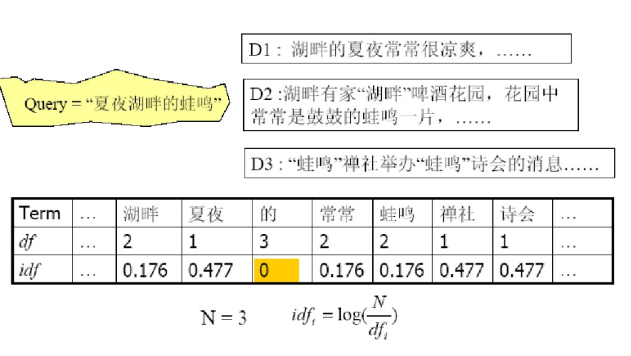

**tf-idf**：是信息检索中最著名的权重计算方法，用于评估一个词项对于一个文件集（语料库）中某一个文档的重要程度，也叫做tf ×idf，词项t的tf-idf 由它的tf和idf组合而成：

$$
W_{t,d}=(1+\lg tf_{t,d}) \times \lg(N/df_t)（改善后，未改善为tf*idf）
$$

* tf-idf值随着词项在单个文档中出现次数(tf)增加而增大，表示字词的重要性随着它在文件中出现的次数成正比增加

* tf-idf值随着词项在文档集中数目(df)增加而减小，表示字词的重要性随着它在语料库中出现的频率成反比下降

### 12.5 向量空间模型

学习布尔检索模型时用到过**词项-文档二值关联矩阵**：

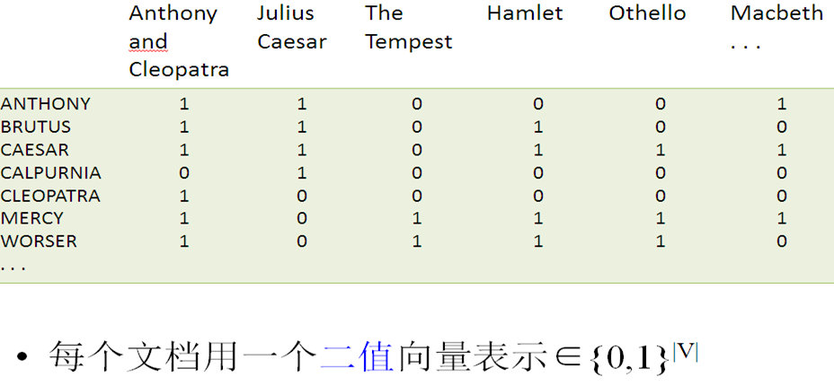

根据tf的定义构建**词项-文档词频关联矩阵**


在利用tf-idf公式计算出**tf-idf矩阵**

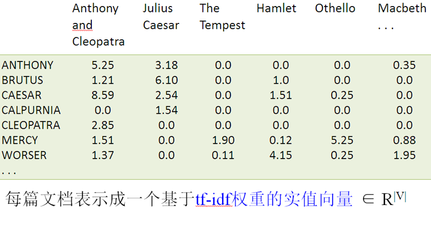

**向量空间模型**——|V|维实向量空间

* V是词项(term)集合，|V|表示词项个数，空间的每一维都对应一个词项

* 每篇文档表示成一个基于**tf-idf**权重的实值向量∈R(V)

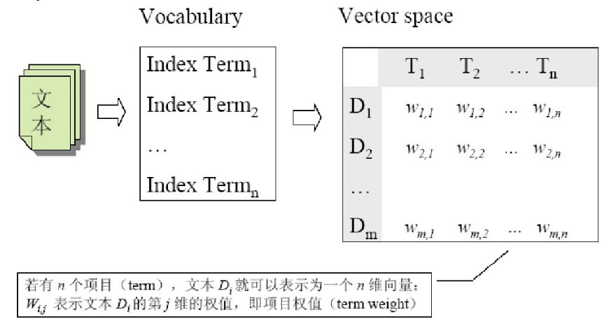

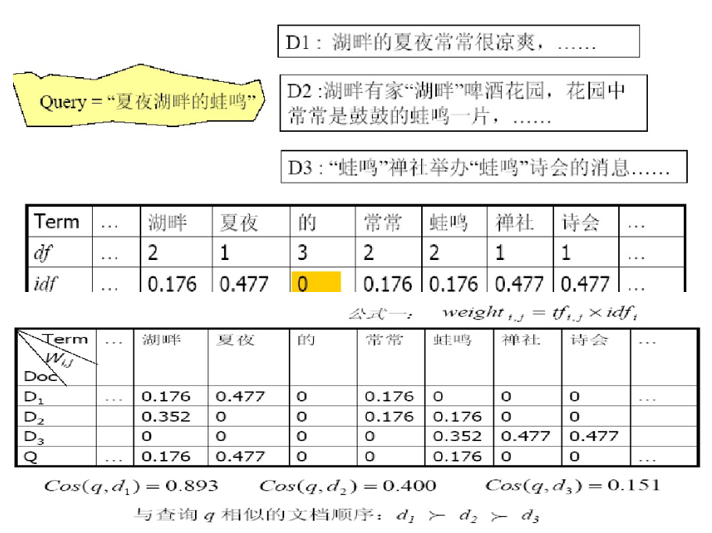

总结：

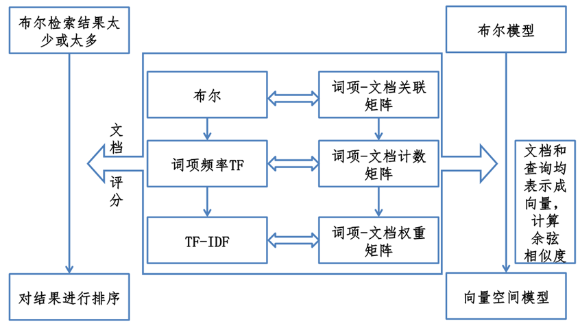

相比于布尔模型要求的准确匹配，向量空间模型采用了“部分匹配”的检索策略（即：出现部分索引词也可以出现在检索结果中）。

优点:

* 帮助改善了检索结果。

* 部分匹配的文档也可以被检索到。

* 可以基于向量cos的值进行排序，提供给用户。

缺点:

* 这种方法假设词项是相互独立的，但实际可能不是这样，如**同义词、近义词**等往往被认为是不相关的词

* 维度非常高：特别是互联网搜索引擎，空间可能达到千万维或更高

* 向量空间非常稀疏：对每个向量来说大部分都是0

### 12.6 向量空间模型的价值

VSM模型的价值：将无结构化文本表示为向量

* jieba分词系统中的TF-IDF抽取关键词
  
  ```python
  import jieba
  from gensim import corpora, models, similarities
  
  wordstest_model = ["我去玉龙雪山并且喜欢玉龙雪山玉龙雪山","我在玉龙雪山并且喜欢玉龙雪山","我在九寨沟"]
  test_model = [[word for word in jieba.cut(words)] for words in wordstest_model]
  dictionary = corpora.Dictionary(test_model,prune_at=2000000)
  corpus_model= [dictionary.doc2bow(test) for test in test_model]
  tfidf_model = models.TfidfModel(corpus_model)
  corpus_tfidf = tfidf_model[corpus_model]
  
  # 计算相似度
  index = similarities.MatrixSimilarity(corpus_tfidf)
   #把所有评论做成索引
  sims = index[test_tfidf] 
   #利用索引计算每一条评论和商品描述之间的相似度
  print sims# [ 0.07639694  0.2473283   0.94496047]
  ```

* Gensim：
  
  开源的第三方Python工具包
  
  用于从原始的非结构化的文本中，无监督地学习到文本隐层的主题向量表达
  
  提供了诸如相似度计算，信息检索等一些常用任务的API接口，包含了很多非监督学习算法
  
  ```python
  from gensim.models.tfidfmodel import TfidfModel
  from gensim import corpora  
  texts = [['这是', '一个', '文本'], ['这是', '第二个', '文本'], ['这是', '又一个', '文本'], ['这是', '最后', '一个', '文本’]]
  dictionary = corpora.Dictionary(texts)
  corpus = [dictionary.doc2bow(text) for text in texts]
  tf_idf_model = TfidfModel(corpus, normalize=False)
  word_tf_tdf = list(tf_idf_model[corpus])
  print('词典:', dictionary.token2id)
  print('词频:', corpus)
  print('词的tf-idf值:', word_tf_tdf)    
  
  # result
  # 词典: {'一个': 0, '文本': 1, '这是': 2, '第二个': 3, '又一个': 4, '最后': 5}
  # 词频: [[(0, 1), (1, 1), (2, 1)], [(1, 1), (2, 1), (3, 1)], [(1, 1), (2, 1), (4, 1)], [(0, 1), (1, 1), (2, 1), (5, 1)]]
  # 词的tf-idf值: [[(0, 1.0)], [(3, 2.0)], [(4, 2.0)], [(0, 1.0), (5, 2.0)]]
  ```

### 12.7 TF-IDF的变种

#### 12.7.1 ATC

ATC引入了所有文档中的词语的最大频率

wij  =  (0.5  +  [0.5*freq(i,j)/ max(freq(l,j)]) *  log(N/ni)，–max_f是词语在所有文档中的最大频率。

使用了欧几里德距离作为文档长度归一化考虑

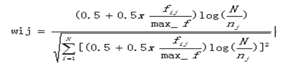

#### 12.7.2 Okapi BM25

传统的TF值理论上是可以无限大的。而BM25与之不同，它在TF计算方法中增加了一个常量k，用来限制TF值的增长极限

BM25的TF Score会被限制在0~k+1之间。

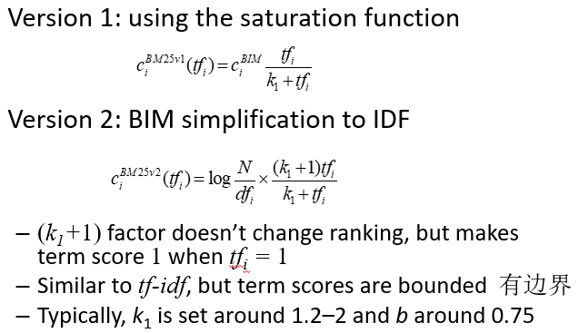

Version3加入了文档长度的限制：

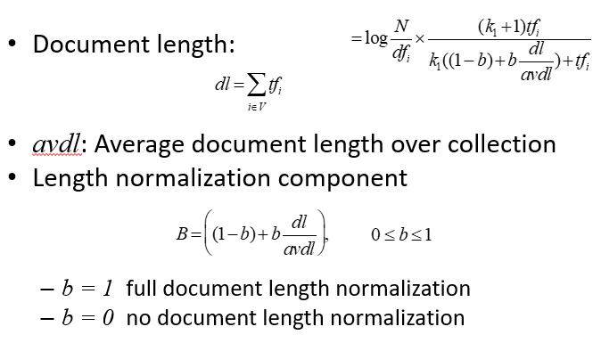

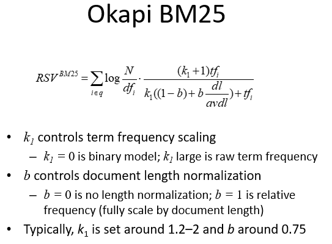

BM25公式的三个部分是query中每个单词t与文档d之间的相关性、单词t与query之间的相似性 、每个单词的权重idf。

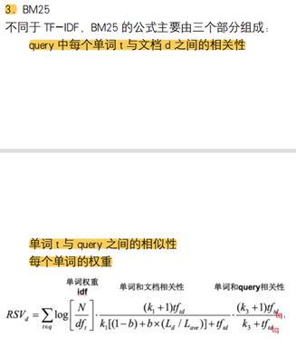

#### 12.7.3 LTU

Okapi和LTU考虑了文档长度

文档长度越长，相对来说，词语的频率也越高，需要对于长文档给出一定的惩罚。

但它们采用了不同的方式来处理词语的频率：

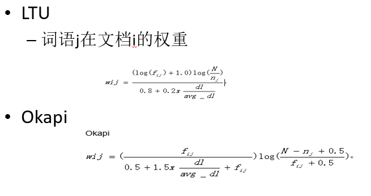

## 十三 Web连接分析

Web数据

* 内容数据：文本、图片、结构化数据

* 链接数据

* 日志数据

### 13.1 链接分析

信息检索希望排序靠前的文档既是**相关**的又是**权威**的

* 相关性通过余弦相似度得分来判断

* 权威性是与Query无关的文档本身的属性决定的，网站权威性大部分是由外部链接来衡量。高质量的外部链接越多，网站或网页本身的权威性就越高。另外，域名注册历史，网站的稳定性，隐私权政策等一些细节，也会影响网站的权威性。

将整个静态Web看成是静态HTML网页通过超链接互相连接而成的有向图，其中每个网页是图的顶点，而每个超链接则代表一个有向边。顶点和有向边集合称为Web图

常用的链接分析算法有：

* Pagerank算法：强调链接数量与质量整体关系

* HITS算法：强调权威页与枢纽页的相互增强关系（相关性）

* Hilltop：算法强调链接与链接之间相关性与质量度，由Pagerank算法和HITS算法融合

* LALSA算法：强调优质链接可进行间接性权重传递

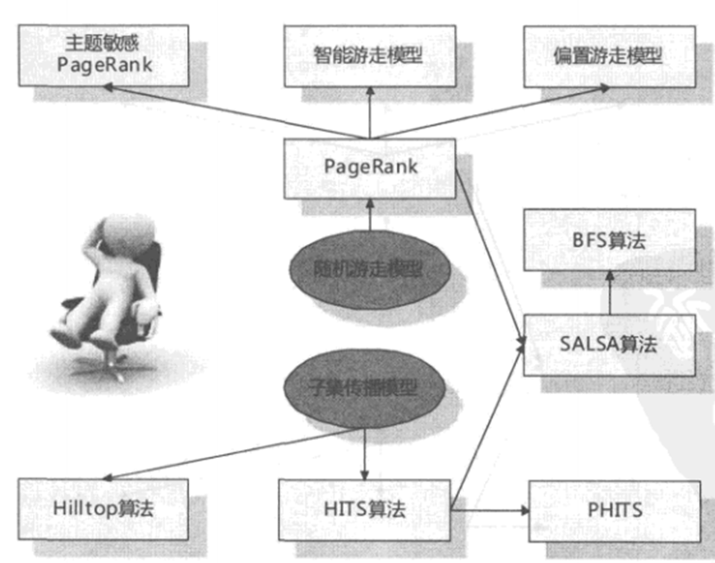

### 13.2 PageRank

**链接分析排序算法(PageRank)**：利用网页之间的超级链接，用于衡量特定网页相对于搜索引擎索引中的其他网页而言的重要程度的算法

对每个网页给出一个正实数，表示网页的重要程度，PageRank值越高，网页就越重要，在互联网搜索的排序中可能就被排在前面。PageRank算法是有向图的链接分析（link analysis）的代表性算法，一旦网络的拓扑（连接关系）确定，PageRank值就确定，属于图数据上的无监督学习方法。

#### 13.2.1 PageRank算法基本思想

**随机游走**(Random Walk，缩写为 RW)，是一种数学统计模型，它是一连串的轨迹所组成，其中每一次都是随机的。能用来表示不规则的变动形式，

随机游走的形式有：

* 马尔可夫链或马可夫过程

* 醉汉走路（drunkard’s walk）

网页浏览行为的随机游走模型，是一阶马尔可夫链：

1. 从一个随机的页面开始

2. 每一步从当前页**等概率**地选择一个链接，

3. 进入链接所在页面

> 为什么网页随机游走模型是马尔可夫链？
> 
> 随机游走者每经一个单位时间转移一个状态，如果当前时刻在第j个结点（状态），那么下一个时刻在第i个结点（状态）的概率是$m_{i,j}$。这一概率只依赖于当前的状态，与过去无关，具有马尔可夫性。

PageRank的基本思想是：

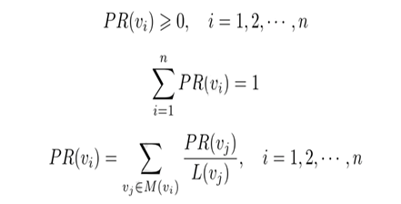

* M(vi)表示指向结点vi的结点集合

* L(vj)表示结点vj连出的有向边的个数

用线性代数表示：

* 矩阵M为随机矩阵，代表所有节点通向其他节点的概率：
  
  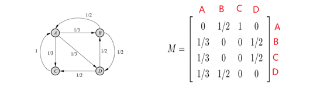

* 随机游走在某个时刻t访问各个结点的概率分布就是马尔可夫链在时刻t的状态分布，可以用一个n维列向量 Rt 表示，那么在时刻t+1访问各个结点的概率分布$R_{t+1}$满足：$R_{t+1}=MR_{t}$
  
  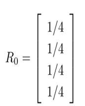
  
  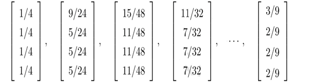

* 极限$MR=R$存在，称极限向量R表示马尔可夫链的平稳分布
  
  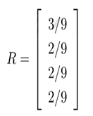

#### 13.2.2 PageRank算法的一般形式

一般的有向图未必满足强连通且非周期性的条件。此时PageRank的基本定义不适用。

> 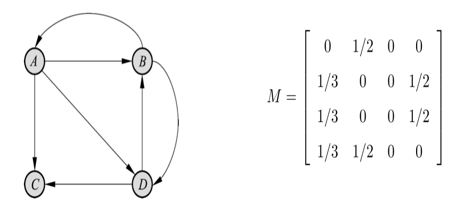
> 
> 这时M不是一个随机矩阵，因为随机矩阵要求每一列的元素之和是1，这里第3列的和是0，不是1，如果仍然计算在各个时刻的各个结点的概率分布，就会得到如下结果：
> 
> 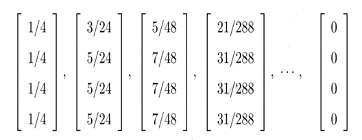

PageRank一般定义的想法是在基本定义的基础上导入**平滑项**：假设考虑另一个完全随机游走的模型，其转移矩阵的元素全部为1/n，也就是说从任意一个结点到任意一个结点的转移概率都是1/n，原转移矩阵与新转移矩阵的线性组合又构成一个新的转移矩阵，在其上可以定义一个新的马尔可夫链。

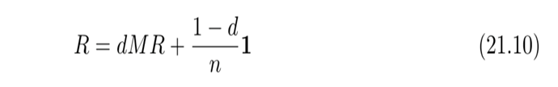

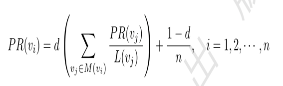

- 解释来说就是：将pagerank值的变动分为了两个部分，有d的概率是基于转移矩阵进行跳转，有1-d的概率是基于完全等概率随机访问的
- 这个方法能保证结果一定收敛到一个非全0的结果，但是不能保证结果向量R的总和为1（如果想保证这一点，可以为没有出链接的结点添加一个自连接的边）
- d接近1代表我们倾向于转移矩阵，接近0代表我们倾向于随机访问

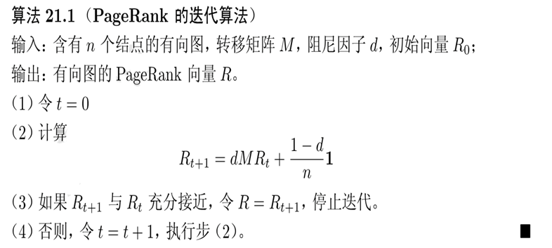

### 13.4 HITS算法

超链导向的主题搜索Hyperlink-Induced Topic Search (HITS)。

网页分类：

* 权威Authoritive页 A
  
  * 一个网页被多次引用，则它可能是很重要的；
  
  * 一个网页的重要性被平均的传递到它所引用的网页。
  
  * 一个网页虽然没有被多次引用，但是被重要的网页引用，则它也可能是很重要的；

* 列表Hub页 H
  
  * 它本身可能并不重要，或者说没有几个网页指向它
  
  * 但是它提供了指向就某个主题而言最为重要的站点的链接集合，比如一个课程主页上的推荐参考文献列表

好的Hub会指向很多高权威的Authoritive，好的Authoritive会被很多好的Hub指向，两者迭代网页也因此具有了两个值：

- **权威值（Authority Scores）**：该值越高，越代表其内容本身质量高，受认可，是我们要搜索的内容所在
- **枢纽值（Hub Scores）**：该值越高，越代表其慧眼识珠，它本身没有内容，但是它指向的页面质量都很

最终，在可能与搜索主题相关的网页集合中，内容好、总被引用的网页会有高权威值，引导好、总指向好网页的网页会有高枢纽值。

**算法具体步骤**：

1. **确定基本集**：首先要给出一个查询值，取出所有包含查询词的页面，称为根集合，然后再向根集合中不断添加
   
   - 指向根集合中页面的页面
   - 被根集合中页面指向的页面
   
   最终获得了一个集合，称之为基本集
   
   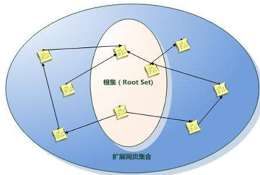

2. **初始化**：对于基本集中的每一个页面x，初始化所有的x, h(x)->1; a(x)->1

3. **迭代计算**：
   
   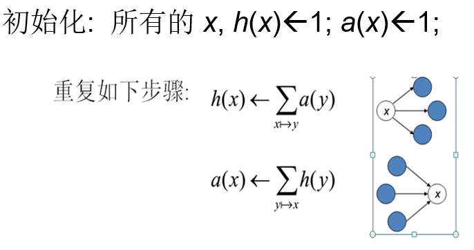
   
   - 先让全部页面的**枢纽值等于**他指向的页面**权威值之和**
   - 然后再让全部页面的**权威值等于**指向他的页面**枢纽值之和**
   
   （即先更新hub值再更新权威值） 直至两种值收敛，若要防止两种值无限放大，可以在每一次迭代之后将所有结点的两种值等比例缩小

## 十四 Web图片数据

* Text-based Image Retrieval(TBIR)
  
  查询词：文本

* Content-based image retrieval(CBIR)：用户输入一张图片，以查找具有相同或相似内容的其他图片
  
  CBIR 的关键技术：图像特征提取和匹配。

### 14.2 图片特征

由低到高：

- 低层
  - **特征语义**
- 对象级
  - **对象语义**
  - **空间关系语义**
- 语义级
  - **场景语义**
  - **行为语义**
  - **情感语义**

（其实可以发现，低层是数据就可以直接描述的，对象级是对静态物体和它们之间的关系进行描述，语义级则是场景、行为、情感这种整体的、主观的概念） 记住这张图的特征就行 

### 14.3 颜色空间

- **RGB空间** 三个分量代表红绿蓝三种原色光，每个颜色对应一个值（0~255），全为0为黑，全为255位白，所有颜色都可以一次混合而成
- **HSV**
  - HSI：三个分量代表色调（Hue）、饱和度（Saturation）、亮度（Intensity），所有颜色都可以以此表示
  - HSV：亮度表示为value
- HSI、HSV、RGB都是可以彼此转化的

### 14.4 颜色特征表示

* **颜色直方图**：描述不同色彩在整幅图像中所占的比例，将其绘制为直方图
  
  适于描述那些难以进行自动分割的图像，无法描述颜色在图片中的空间信息
  
  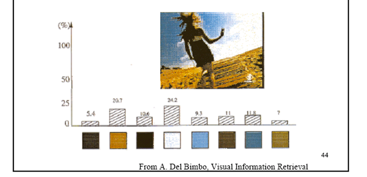

* **颜色相关图**：用颜色对相对于距离的分布来描述信息，它反映了像素对的空间相关性，以及局部像素分布和总体像素分布的相关性。

* **颜色矩**：在颜色直方图的基础上计算出每个颜色的矩估计，颜色信息主要分布于低阶矩中
  
  * 一阶矩(均值,mean)
  
  * 二阶矩(方差,viarance)
  
  * 三阶矩(斜度,skewness)
    
    比如：对于RGB来说，可以计算三个不同值的均值、方差等统计量，来代表这个图片，一般是前期工作时使用，剔除区别明显的图片

* MPEG-7 Dominant Color descriptor 
  
  * Dominant Color：主导颜色
  
  * 描述处于某个不规则区域的处于支配地位的颜色，一个区域的颜色信息可以由支配地位的颜色代表 
