# 1 引言

大量相互独立但彼此连接的计算机共同完成计算任务。这些系统称为**计算机网络（computer networks）**。如何设计并组织这些网络就是本书的主题。

1. 计算机网络(computer networks)
   表示一组通过技术相互连接起来的自主计算机集合。
2. 分布式系统（distributed system）
   分布式系统是建立在网络之上的软件系统，有高度的内聚性和透明性。
   内聚性：每一个数据库分布节点高度自治，有本地数据库管理系统
   透明性：每个数据库分布节点对用户应用来说是透明的，用户感觉不到数据是分布的Internet 是最著名的计算机网络，万维网是最著名的分布式系统，万维网（软件）运行于 Internet（硬件）上
3. 虚拟专用网络(VPN,virtual private networks)
   一种可以将不同地点的单个网络联结成一个扩展网络的技术。
4. P2P 与 CS(client-server)
   CS：由高性能计算机服务器和普通计算机客户机组成，服务器负责存储数据并处理客户请求，而客户机可远程访问服务器
   P2P：对等模型（又称工作组），各台计算机具有相同功能，一台计算机可作为服务器设定共享资源供网络中其他计算机使用，又可作为工作站。没有专用的服务器或工作站。

## 1.1 网络硬件

关于计算机网络，没有一种被普遍接受的分类方法，但是有两个维度非常重要：传输技术和网络尺度。

### 1.1.1 传输技术

目前普遍使用的传输技术有两种，分别是**广播式链路**和**点到点链路**。

**点到点（point-to-point）链路**将一对单独的机器连接起来。在一个由点到点链路组成的网络中，为了从源端到达接收方，短消息必须首先访问一个或多个中间机器，这种短消息在某些情况下称为**数据包或包（packet）**。通常在网络中有可能存在多条不同长度的路由， 因此，找到一条好的路由对点-点网络非常重要。点-点传输只有一个发送方和一个接收方， 有时候也称为**单播（unicasting）**

广播系统往往还提供将一个数据包发送给所有目标机器的可能性，只要在地址字段中使用一个特殊的编码。如果被传输的数据包带有这样的地址编码，那么网络中的每一台机器都将会接收该包并对其进行处理。这种传输模式称为广播（boradcasting）。有些广播系统还支持给一组机器发送数据包的模式，这种传输模式称为**组播（multicasting）**。

### 1.1.2 网络尺度

下图根据大致的物理尺度区分了多处理器系统。


#### 1.2.1 个域网

**个域网（PAN，Personal Area Network）**允许设备围绕着一个人进行通信。一个常见的例子是计算机通过无线网络与其外围设备连接。几乎每一台计算机都有显示器、键盘、鼠 标和打印机等外设。这种无线网络就是**蓝牙（bluetooth）。**

PAN 也可以采用其他短程通信技术来搭建，比如智能卡和图书馆书籍上的 RFID。


#### 1.2.2 局域网

局域网是一种私有网络，一般在一 座建筑物内或建筑物附近，比如家庭、办公室或工厂。

在大多数情况下，每台计算机与安装在天花板上的一个设备通信，如 图 1-8（a）所示。这个设备，称为接入点（AP，Access Point）、无线路由器（wireless router） 或者基站（base station），它主要负责中继无线计算机之间的数据包，还负责中继无线计算机和 Internet 之间的数据包。

无线局域网的一个标准称为 IEEE 802.11，俗称为 WiFi，已经被非常广泛地使用。它在 任何地方可以从 11 Mbps 到几百个 Mbps 的速率运行（我们在本书中将沿用传统的线路测量 速率：1 Mbps（兆比特/秒）等于 1000 000 比特/秒；1 Gbps（吉比特/秒）等于 1 000 000 000 比特/秒。我们将在第 4 章讨论 IEEE 802.11。


许多有线局域网的拓扑结构是以点到点链路为基础的。俗称**以太网（Ethernet）**的 IEEE  802.3 是迄今为止最常见的一种有线局域网。图 1-8（b）显示了一个交换式以太网（switched Ethernet）的拓扑例子。每台计算机按照以太网协议规定的方式运行，通过一条点到点链路 连接到一个盒子，这个盒子称为交换机（switch）。这就是交换式以太网名字的由来。一个 交换机有多个端口（port），每个端口连接一台计算机。交换机的工作是中继与之连接的计 算机之间的数据包，根据每个数据包中的地址来确定这个数据包要发送给哪台计算机。

#### 1.2.3 城域网

**城域网（MAN，Metropolitan Area Network）**的范围可覆盖一个城市。最有名的城域网 例子是许多城市都有的有线电视网。

当 Internet 开始吸引大量观众时，有线电视网络经营商也开始意识到，只需要对原有 的系统稍做改动，就可以利用原来尚未使用的频谱来提供双向的 Internet 服务。从这时候 起，有线电视系统就从分发电视节目这单一模式演变为一个城域网。近似地，一个 MAN 看起来很像图 1-9 中所示的系统。在图 1-9 中，我们可以看到，电视信号和 Internet 流量都 先被送到一个集中式线缆前端（cable headend），然后再分发到居民的家中。我们在第 2 章 将再回到这个主题的细节上来。


有线电视不是唯一的城域网，虽然它是一种局域网。最近发展的高速无线 Internet 接 入催生了另一种城域网，并且已经被标准化为 IEEE 802.16，这就是所谓的 WiMAX。

#### 1.2.4 广域网

**广域网（WAN，Wide Area Network）**的范围很大，它能跨越很大的地理区域，通常是 一个国家、地区或者一个大陆。

* 有线广域网：
  
     图 1-10 所示的是一个公司的广域网，它连接了该公司设在墨尔本、珀斯和布里斯班三 个城市的办事处。每个办事处都有专门运行用户（即应用）程序的计算机。我们将按照传统的说法把这些机器称为主机（host），然后把连接这些主机的网络其余部分称为**通信子网 （communication subnet）**，或简称为子网（subnet）。子网的工作是把信息从一个主机携带到另一个主机，就像电话系统把说话者的话（实际上是声音）传递给接听者一样。
  
  
  
    在大多数广域网中，子网由两个不同组成部分：传输线路和交换元素。**传输线路 （transmission line）**负责在机器之间移动比特。它们可以是铜线、光纤，或甚至无线链路。 大多数公司没有铺设自己的传输线路，因此，它们从电信公司租赁传输线路。**交换元素 （switching element）**或简称为交换机（switch）是专用的计算机，负责连接两条或两条以上 的传输线路。当数据到达一条入境线路时，交换元素必须选择一条出境线路把数据转发出去。这些负责交换的计算机在过去有各种不同的名称，现在最常用的名称是路由器（router）

* 虚拟专用网络
  
    公司并不租赁专用的传输线路， 而是把自己的办事处直接连接到 Internet。在这种方式下，办事处之间可以通过虚拟链路相 互连接，而这些虚拟链路使用了底层 Internet 的容量。这样的安排如图 1-11 所示，称为**虚拟专用网络（VPN，Virtual Private Network）**。相比租赁专线，VPN 具有虚拟化的一贯优势， 它提供了重用某种资源（Internet 连接）的灵活性。
  
  

* ISP网络：
  
    子网由不同的公司负责运营。子网经营者称为网络服务提供商（network service provider），公司办事处是它的客户。这种结构如图 1-12 所示。其他 客户只要能够支付费用并且它能提供客户所需的服务，子网运营商就把这些客户也连接进 来。如果客户只能给连接在同一个网络内的其他客户发送数据包，那么这将是一个令人失 望的网络服务，因此子网运营商还与 Internet 的其他网络相连。这样的子网运营商称为 Internet 服务提供商（ISP，Internet Service Provider），相应的子网称为 ISP 网络（ISP  network）。连接到 ISP 的客户就能享受 Internet 服务。

#### 1.2.5 互联网

一组相互连接的网络称为互联网络（internetwork）或**互联网（internet）**。这些术语一般具有通用意义，而全球范围的**因特网（Internet）**则通常用首字母大写来表示（这是一个特殊的互联网络）。

子网、网络和互联网络经常发生混淆。术语“子网”通常在广域网的上下文中才有意 义，**它指网络运营商所拥有的一组路由器和通信线路**。

一个子网和它的主机结合在一起就形成了一个网络。然而，“网络”（network）这个词的使用往往具有比较松散的含义。一个子网可以是一个网络，如图 1-12 所示的那种“ISP 网络”。一个互联网络也可以是一个如图 1-10 所示的广域网。我们将遵循类似的做法，如 果要将网络与其他安排区分开来，我们将坚持网络最初的定义，**即由一种单一技术相互连接在一起的计算机集合。**

我们知道，当不同的网络相互连接在一起 时就形成了互联网。另外，两个经验原则很有用。

* 第一，如果不同的组织出资构建了网络的不同部分，并且各自维持 自己出资构建的那部分网络的运营，那么我们就说这是一个互联网络，而不是单个网络；
* 第二，如果网络的不同部分采用了不同的底层技术（例如，广播技术与点到点链路、以及 有线与无线），那么我们就说这是一个互联网络。

如何连接两个不同的网络。将两个或多个网络连接起来并提供必要转换的机器，**其硬件和软件方面的总称是网关（gateway）。**

## 1.2 网络软件

### 1.2.1 协议层次结构

绝大多数网络都组织成一个**层次栈（a stack of layer）或分级栈（a stack of level）**每一层的目的是向上一层提供特定的 服务，而把如何实现这些服务的细节对上一层加以屏蔽。从某种意义上讲，每一层都是一 种虚拟机，它向上一层提供特定的服务。 

一台机器上的第 n 层与另一台机器上的第 n 层进行对话，该对话中使用的规则和约定 统称为第 n 层协议。基本上，所谓**协议（protocol）是指通信双方就如何进行通信的一种约定。**


实际上，数据并不是从一台机器的第 n 层直接传递到另一台机器的第 n 层。相反，**每一层都将数据和控制信息传递给它的下一层，这样一直传递到最低层**。第 1 层下面是物理 介质（physical medium），通过它进行实际的通信。在图 1-13 中，虚线表示虚拟通信，实 线表示物理通信。

在每一对相邻层次之间的是**接口（interface）**。**接口定义了下层向上层提供哪些原语操作和服务。**

层和协议的集合称为网络体系结构（network architecture）。一个特定的系统所使用的一组协议，即每一层一个协议，称为协议栈（protocol stack）。网络体系结构、协议栈以及协议本身是本书的主要内容。

> 考虑一个更加技术性的例子：如何向图 1-15 中 5 层网络的最顶层提供通信。假设 在第 5 层上运行的一个应用进程产生了一条消息 M，并且将它传递给第 4 层以便传给对等 进程；第 4 层在消息的前面加上一个头（header），用来标识该消息，并且把结果传给第 3 层；该头包含了一些控制信息，例如地址，主要被目标机器的第 4 层用来递交消息。某些 层次所用的控制信息还可以包含消息序号（以防下层不保留消息顺序）、消息大小、时间等。
> 
> 
> 
> 在许多网络中，对于第 4 层上传递的消息大小没有任何限制，但是几乎所有第 3 层协 议对此总会强加一个限制。因此，第 3 层必须把入境消息分割成较小的单元，即数据包或 包（packet），并且在每个数据包前面加上第 3 层的头。在这个例子中，M 被分割成两部分： M1 和 M2，这两部分内容是被单独传输的

### 1.2.2 层级设计问题

**错误控制**：

* **检错（error detection）**：从接收到的信息中发现错误所用的一种机制是检错编码；然后重新传输接收到的不正确信息，直到它被正确接收为止。
* **纠错 （error correction）**：更强大的编码不仅能检错，还能纠错 （error correction），即从最初收到的可能不正确的比特中恢复正确的消息。

这两种机制的工作都需要在被传的信息中添加**冗余信息**。这些冗余信息被较低层次用来保障数据包在个别链路上的正确传输，也可被较高层次用来检测接收到的数据包是否包含了正确的内容

**流量控制**：在每一层都会发生的一个分配问题是，如何保持快速发送方不会用数据把慢速接收方淹没。这个问题的解决经常使用了从接收方到发送方的反馈机制。这个主题就是**流量控制 （flow control）**。有的时候还会出现网络超载问题，因为太多的计算机要发送太多的流量， 而网络又没有能力传递所有的数据包。这样的网络超载称为**拥塞（congestion）**。一种策略是当发生拥塞时，每台计算机都减少其对网络的带宽需求。这种策略可用于所有层次。

### 1.2.2 面向连接服务与无限服务

**面向连接的服务（connection-oriented service）**：为了使用面向连接的网络服务，服务用户首先**必须建立一个连接**，然后使用该连接传输数据，最后释放该连接。在绝大多数情况下，数据位保持原来的顺序，所以数据位都会按照发送的顺序到达。典型的面向连接服务就是文件传输。要求所有数据位都能正确到达接收方。

与面向连接服务相对应的是**无连接服务（conncetionless service）**，这是按照邮政系统建模的。每个报文（信件）都携带了完整的目标地址，每个报文都由系统中的中间节点路由，而且路由独立于后续报文。报文（message）在不同的上下文中有不同的称呼；数据包/包 （packet）是网络层的报文。

* 如果中间节点只能在收到报文的全部内容之后再将该报文发送 给下一个节点，那么我们就称这种处理方式为存储-转发交换（store-and-forward switching）。 
* 另一种处理方式是在报文还没有被全部接收完毕之前就向下一个节点传输，这 种处理方式称为直通式交换（cut-through switching）。

**可靠服务指的是网络具有纠错、检错、应答机制，能保证数据正确的，可靠的传送到目的地。**

* 不可靠（意味着没有被确认）的无连接服务通常称为数据报服务（datagram service），网络尽可能正确、可靠地传送，而不能保证数据正确，一般不会给发送方反馈任何确认消息。

* 有确认的数据报服务（acknowledged datagram service）有无需建立连接就可发送一个报文的便利性，当发送方收到回执时可绝对相信这封信已经被送到对方手中，肯定没有在投递的途中丢失。手机上的文本消息就是一个实例。

* 另外一种服务是请求-应答服务（request-reply service）。在这种服务中，发送方传输一个包含了某个请求的数据报；接受方以一个包含了请求结果的应答数据报作为反馈。 请求-应答服务通常用在客户机-服务器模型中：客户机发出一个请求，然后服务器对此做出响应。


### 1.2.3 服务原语

一个服务由一组原语说明，原语可以理解为操作的表示，原语告诉服务要执行某个动作，这些服务原语通常是一些系统调用。


### 1.2.4 服务与协议

服务是指某一层向它上一层提供的一组原语(操作)，服务定义了该层准备代表其用户执行哪些操作。但它不涉及如何实现这些操作。

协议是一组规则，规定了同层上对等实体之间所交换的数据包或报文的格式和含义。


## 1.3 参考模型

主要分为以下两种模型，OSI多了表示层与会话层，后者被广泛运用。


TCP/IP模型及其包含的协议：


* 链路层：
  
  所有这些要求导致本参考模型选择了数据包交换网络，它以一个可运行在不同网络之上的无连接网络层为基础。模型中的最低层是链路层（link layer），该层描述了链路必须完成什么功能才能满足无连接的互联网络层的需求，比如串行线和经典以太网链路。这不是真正意义上的一个层，而是主机与传输线路之间的一个接口。TCP/IP 模型的早期文档很少提到这点。

* 互联网层：
  
  该层的任务是允许主机将数据包注入到任何网络，并且让这些数据包独立地到达接收方（接收方可能在不同的网络上）。甚至数据包的到达顺序与它 们被发送的顺序不同，在这种情况下，如果需要按序递交数据，那么重新排列这些数据包 的任务由高层来负责完成。
  
  互联网层定义了官方的数据包格式和协议，该协议称为**因特网协议（ IP, Internet Protocol）** ,与之相伴的还有一个辅助协议，称为**因特网控制报文协议（ICMP Jnternet Control Message Protocol）**。互联网层的任务是将IP分组投递到它们该去的地方。

* 传输层
  
    允许源主机和目标主机上的对等实体进行通话，这里定义了两个端-端的传输协议：
  
  * **传输控制协议（TCP，Transport Control Protocol）**：
    
      它是一个可靠的、面向连接的协议，允许从一台机器发出的字节流正确无误地交付到互联网上的另一台机器。它把输入的字节流分割成离散的报文，并把每个报文传递给互联网层。在目标机器，接收 TCP 进程把收到的报文重新装配到输出流中。TCP 还负责 处理流量控制，以便确保一个快速的发送方不会因发送太多的报文而淹没掉一个处理能力 跟不上的慢速接收方。
  
  * **用户数据报协议（UDP，User Datagram Protocol）**：
    
      它是一个不可靠的、无连接协议，适用于那些不想要 TCP 的有序性或流量控制功能，而宁可自己提供 这些功能的应用程序。UDP 被广泛应用于那些一次性的基于客户机-服务器类型的“请求应答”查询应用，以及那些及时交付比精确交付更加重要的应用，比如传输语音或者视

* 应用层
  
  TCP/IP 模型并没有会话层和表示层，因为当时感觉并不需要这两层。相反，应用层简单包含了所需的任何会话和表示功能。来自 OSI 模型的经验已经证明这种观点是正确的： 对于大多数应用来说这两层并没有多大用处。 在传输层之上是**应用层（application layer）**，它包含了所有的高层协议。最早的高层协 议包括虚拟终端协议（TELNET）、**文件传输协议（FTP）和电子邮件协议（SMTP）**等。 经过了这么多年的发展以后，许多其他协议被加入到了应用层。其中我们将要学习的重要协议如图 1-22 所示，包括将主机名字映射到它们网络地址的**域名系统（DNS，Domain Name  System）**、用于**获取万维网页面的 HTTP** 以及用于传送诸如语音或者电影等实时媒体的  RTP 等。

学习时通常采用五层协议的体系结构：物理层、数据链路层、网络层、传输层和应用层。上层单向使用下层提供的服务。**下层对上层隐藏了细节**。

| 层次    | 提供给上层的服务是否可靠 | 传输单元      |
|:----- |:------------ | --------- |
| 应用层   | *            | *         |
| 传输层   | 可靠           | 段         |
| 网络层   | IP无连接(不可靠)   | 包（IP是数据报） |
| 数据链路层 | 可靠           | 帧         |
| 物理层   | 不可靠          | bit       |

# 2 物理层

## 2.1 通信基础

一些术语：

* **数据(Data)**：传递（携带）信息的实体

* **信号(Signal)**：数据的物理量编码（通常为电编码），数据以信号的形式传播。

* **信道(Channel)**：传送信息的线路（或通路）。

* **比特率(Bit Rate)**：数据传输速率 (bps，b/s)。
  
    比特率与波特率的关系：1 Baud = （log2M） bps，M是编码级数，4级编码表示一个码元可以表示4个离散可能值，需要2个电平(00,01,10,11)

* **码元(Code Cell)**：时间轴上的一个信号编码单元，一个码元中可以传送多个比特（bit）。对应的有波特率(Baud)——每秒传送的码元数(即信号传送速率)。
  
    假设波特率为M，而每个码元中有n个bit，则比特率为Mn

* **带宽(Bandwidth)**：原指信号或信道占据的频率范围，单位是Hz，但常用于表示网络通信线路的传输数据能力：单位时间内从网络中的某一点到另一点所能通过的最高数据率(B/s)

**通信系统模型**：通信的三个要素：信源、信宿和信道，任何一个通信系统都可以抽象为以下模型：


## 2.2 信道最大数据传输率

**Nyquist 公式**：用于理想低通信道
$$
C=2W\log_2^M
$$

* C =  传输率，单位b/s或bps
* W = 带宽，单位Hz
* M = 信号电平级数

实际的信道上存在三类损耗：衰减、延迟、噪声。

1. 衰减
   
     信道的损耗引起信号强度减弱，导致信噪比S/N降低。

2. 延迟
   
    信号中的各种频率成分在信道上的延迟时间各不相同，在接收端会产生信号畸变。

3. 噪声
    热噪声：由导体内的热扰动引起，又称为白噪声。
    串扰：信道间产生的不必要的耦合。例：多对双绞线
    脉冲噪声：非连续、随机、振幅较大。多由外部电磁干扰造成（闪电、大功率电机启动等）。
    噪声将破坏信号，产生误码。持续时间0.01s的干扰可以破坏约560个比特（56Kbps）。

**Shannel 公式**：高斯噪声干扰信道
$$
C=W\log_2^{1+\frac{S}{N}}
$$

* C = 传输率，单位b/s

* W = 带宽，单位Hz

* S 代表信号功率；N代表噪声功率

* S/NdB 信噪比（dB分贝）的定义
    $$
    \frac{S}{N_{db}}=10\log_{10}^{\frac{S}{N}}\\
    \frac{S}{N}=10^{\frac{S}{N_{db}}/10}
    $$
    例：信道带宽W=3KHz，信噪比为30dB，则C=3000*log2(1+1000) ≈30Kbps

## 2.3 传输介质

* 双绞线

* 同轴电缆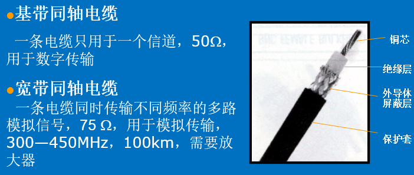

* 光纤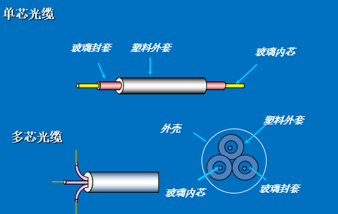

* 无线电

* 地面微波接力

* 同步卫星：


## 2.4 公共电话交换网络

**（PSTN，public switched telephone network）PSTN** 是一种常用的旧式电话系统，提供的是一个模拟的专用通道，通道之间经由若干电环交换机连接而成，当两台主机或路由器需通过 PSTN 连接时，必须在网络接入侧使用调制解调器实现模拟信号到数字信号/数字信号到模拟信号的转换。

电话系统的组成：本地回路、交换局的（交换机、交换技术如虚电路交换和分组交换等）和干线上的（多路复用）

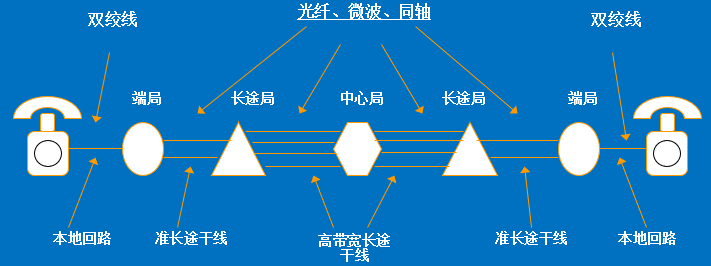


### 2.4.1 编码与调制

不同类型的信号在不同类型的信道上传输有4种组合，每一种相应地需要进行不同的编码处理。


下图是对应的转换方式：


* **编码**：用数字信号承载数字或模拟数据*
  
  
  
  * 归零编码：高电平表示1，低电平表示0，每个时钟周期中间归零，易于传输双方同步时钟信号
  
  * 非归零(NRZ)编码：高电平表示1，低电平表示0
  
  * 反向非归零编码：信号的翻转代表0，信号保持不变代表1，翻转的信号可以传输时钟
  
  * 曼彻斯特编码：将一个码元分为两个相等的间隔，前高后低为1，反之为0，码元中间的跳变可作为时钟信号——以太网使用的编码方式
  
  * 差分曼彻斯特编码：若码元为1，则前半段码元的电平与上一个码元后半段相同，0则相反。每个码元中间都有一个电平跳转

* **调制**：用模拟信号承载数字或模拟数据
    $$
    S(t)=Acos(\omega t+\varphi)
    $$
    S(t)的参量包括： 幅度A、频率ω 、相位φ。调制就是要使这三个参量随数字基带信号的变化而变化三种常用的调制技术：
  
  * 幅移键控ASK(Amplitude Shift Keying)，调幅
  
  * 频移键控FSK(Frequency Shift Keying)，调频
  
  * 相移键控PSK(Phase Shift Keying) ，调相
    
    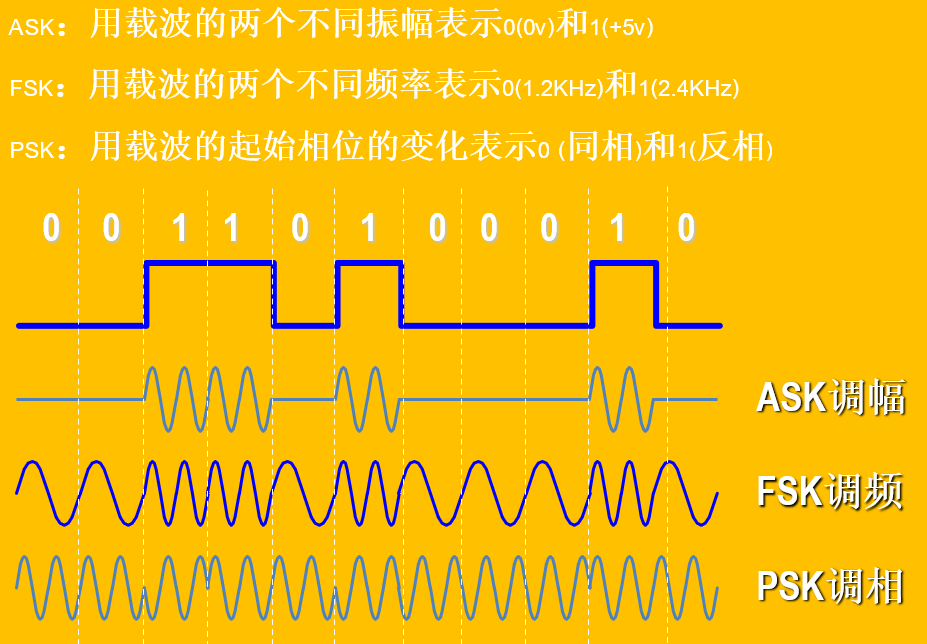

### 2.4.2 复用

复用——多个信息源共享一个公共信道 


* **FDM (频分复用)**：整个传输频带被划分为若干个频率通道，每个用户占用一个频率通道。频率通道之间留有防护频带。
  
  

* **WDM (波分复用)**：整个波长频带被划分为若干个波长范围，每个用户占用一个波长范围来进行传输。
  
  

* **TDM (时分复用)**：把时间分割成小的时间片，每个时间片分为若干个通道（时隙） ，每个用户占用一个通道传输数据。 
  
  
  
  

### 2.4.3 电路交换、报文交换、分组交换

为降低通信线路造价，大型网络主要采用部分连接的拓扑结构。两个端节点之间的通信连接一般都要通过中间节点的转接，中间节点要在它所连接几条线路中选择一条进行接续。就像电话交换机为通话双方接续线路一样，这个过程被称为交换。

* **电路交换**：交换设备在通信双方找出一条实际的物理线路的过程。呼叫——建立连接——传输——挂断 
  
    **特点：数据传输前需要建立一条端到端的通路。**
  
    优缺点：
  
  * 建立连接的时间长，建立连接后，传输延迟小。
  * 一旦建立连接就独占线路，线路利用率低；
  * 无纠错机制；

* **报文交换**：数据交换的单位是报文。在交换过程中，交换设备将接收到的数据先存储，待信道空闲时再以报文的形式转发出去，一级一级中转，直到目的地。这种数据传输技术称为存储-转发。
  
    缺点：
  
  * 报文大小不一，造成缓冲区管理复杂。
  * 大报文造成存储转发的延时过长；
  * 出错后整个报文全部重发。‘

* **分组交换（包交换）**：将报文划分为若干个大小相等的分组(Packet)进行存储转发。**以太网采用分组交换**
  
    特点：
  
  * 数据传输前不需要建立一条端到端的通路。
  * 有强大的纠错机制、流量控制和路由选择功能。


# 3 数据链路层

## 3.1 数据链路层的设计问题

数据链路层使用物理层提供的服务在通信信道上发送和接收比特。它要完成一些功能， 包括：

* （1）向网络层提供一个定义良好的服务接口。
* （2）处理传输错误。
* （3）调节数据流，确保慢速的接收方不会被快速的发送方淹没。

数据链路层从网络层获得数据包，然后将这些数据包封装成帧 （frame）以便传输。每个帧包含一个帧头、一个有效载荷（用于存放数据包〉以及一个帧尾


### 3.1.1 提供给网络层的服务

数据链路层的功能是为网络层提供服务。最主要的服务是将数据从源机器的网络层传输到目标机器的网络层。如左图所示。实际的传输过程则是沿着右图所示的路径进行的


数据链路层可以设计成向上提供各种不同的服务。实际提供的服务因具体协议的不同而有所差异。一般情况下，数据链路层通常会提供以下 3 种可能的服务：

* 无确认的无连接服务：**指源机器向目标机器发送独立的帧，目标机器并不对这些帧进行确认。**采用这种服务，事先不需要建立逻辑连接，事后也不用释放逻辑连接。数据链路层不会检测与恢复丢帧情况。
  
    适合：错误率极低的场合或实时通信（追求传输的速率）

* 有确认的无连接服务：**数据链路层仍然没有使用逻辑连接，但其发送的每一帧都需要单独确认。这样，发送方可知道一个帧是否已经正确地到达目的地。如果一个帧在指定的时间间隔内还没有到达，则发送方将再次发送该帧。**
  
    适合：不可靠的信道：无线系统(802.11WiFi)

* 有确认的有连接服务：**源机器和目标机器在传输任何数据之前要建立一个连接。连接上发送的每一帧都被编号，数据链路层确保发出的每个帧都会真正被接收方收到。它还保证每个帧只被接收一次，并且所有的帧都将按正确的顺序被接收。**
  
    适合：长距离切不可靠的链路（卫星通信，长途电话）
  
    面向连接服务时，数据传输必须经过三个不同的阶段：建立连接，初始化资源、传输、释放资源。

### 3.1.2 帧

为了向网络层提供服务，数据链路层必须使用物理层提供给它的服务。物理层所做的只是接收一个原始比特流，并试图将它传递给目标机器。数据链路层接收到的bit流可能有错误，**通过将比特流拆分成多个离散的帧，为每个帧计算一个称为校验和的短令牌（本章后面将讨论校验和算法），并将该校验和放在帧中一起传输的方法应对。**

通常有4种方法拆分比特流。

* (1）字节计数法。

* (2）字节填充的标志字节法。

* (3）比特填充的标志比特法。

* (4）物理层编码违禁法。

#### 3.1.2.1 字节计数法

第一种成帧方法利用头部中的一个字段来标识该帧中的字符数。当接收方的数据链路层看到字符计数值时，它就知道后面跟着多少个字节， 因此也就知道了该帧在哪里结束。这项技术如图 (a）所示，其中 4帧的大小分别为 5、5、8 和 8 个字节。

这个算法的问题在于计数值有可能因为一个传输错误而被弄混。例如b图，所以很少被使用。


#### 3.1.2.2 字节填充的标志字节法

它让每个帧用一些特殊的字节作为开始和结束．这些特殊字节通常都相同，称为标志字节(flag byte)，作为帧的起始和结束分界符，如图(a)中的 FLAG所示。两个连续的标志字节代表了一帧的结束和下一 帧的开始。因此，如果接收方丢失了同步，它只需搜索两个标志字节就能找到当前帧的结束和下一帧的开始位置。

当标志字节出现在数据中时，可在标志字节前面插入一个特殊的转移字节，接收方的数据链路层在将数据传递给网络层之前必须删除转义字节。这种技术就称为**字节填充（byte stuffing ）。**


#### 3.1.2.3 比特填充的标志比特法

使用**“01111110”表示帧的开始和结束**（帧的边界问题解决），并且在数据中，若遇到 5 个连续的比特 1，就在其后填入一个比特 0（帧的填充问题解决）。接收方除了将首尾的“01111110”删除外，还要将数据中所有 5 个连续比特 1 其后的比特 0 删除。


### 3.1.3 流量控制

在数据链路层（以及更高的各层）中，另一个重要的设计问题是如果发送方发送帧的速度超过了接收方能够接受这些帧的速度，发送方该如何处理。

第一种方法是基于反馈的流量控制（feedback-based flow control），接收方给发送方返回信息，允许它发送更多的数据，或者至少告诉发送方自己的情况怎么样。第二种方法是基于速率的流量控制(Crate-based flow control)，使用这种方法的协议有一种内置的机制，它能限制发送方传输数据的速率，而无须利用接收方的反馈信息。

## 3.2 差错检测与纠正

### 3.2.1 奇偶校验码

1位奇偶校验：奇偶校验码是在原信息码元后面附加一个监督码元，使得码组中“1”的个数为奇数或偶数。

* 偶校验：保证1的个数为偶数个
  
    1011010|0

* 奇校验：保证1的个数为奇数个
  
    1011010|1

### 3.2.2 CRC校验码

推断是否发生错误。适用于高度可靠的信道，错误偶尔发生时，只需重传整个数据块即可。**循环冗余校验码（CRC,Cyclic Redundancy Check，也称作多项式编码）**。注意有一定的误判率。

所有参与运算的数据都是生成多项式，记传输的数据为`k`位的`f(x)`，发送时用一个标准的`r`次(最高次)的生成多项式`G(x)`来除`f(x) `，将所除得余式`R(x)`的系数附加在`f(x)`之后发出

接收时用同一生成多项式`G(x)`来除收到的码字多项式，能除尽说明传输正确，否则说明有错。


**步骤**：

1. 收发双方商定一个比帧短且头尾都是 1 的 01 串叫做生成多项式R(x)，如下的 10011

2. 帧的后面附上生成多项式长度减一个 0 后，作为被除数对生成多项式模 2 除，得到商和余数，如 10011 长度为 5（`r=4`），所以附上了 4 个 0
   
    **模 2 除原则**：列竖式的方式同除法，但是模 2 除法中加法无进位，减法无借位，即加减皆等同于异或，**而商 0 还是 1 由被除数首位决定，首位是 1 商 1，否则商 0**

3. 若帧与扩充到`r`位的余数（0010）合并以后在接收方**被生成多项式整除**，那么认为传递的过程没有出错


### 3.2.2 海明纠错码

Hamming于1950年在美国贝尔实验室提出了海明码，所谓海明校验实质上是奇偶校验，是分组奇偶校验。它可以纠正一位差错。

设原信息串长为`k`，监督码元的个数为`r`，海明码它利用r个监督关系式产生的`r`个校正因子来区分无错和在码字中的`k+r`个不同位置的一位错。**其中r与k满足：$2^r\geq k+r+1$**

即所有2的幂次方的数据位就是奇偶校验位(对应编号为1, 2, 4, 8, 16, 32, 64等的位置) 其他数据位用于待编码数据. (编号为3, 5, 6, 7, 9, 10, 11, 12, 13, 14, 15, 17等的位置) 

每个奇偶校验位的值代表了码字中部分数据位的奇偶性，其所在位置决定了要校验和跳过的比特位顺序：

* 位置1：每校验1位，跳过1位 (1,3,5,7,9,11,13,15,…)
* 位置2：每校验2位，跳过2位 (2,3,6,7,10,11,14,15,…)
* 位置4：每校验4位，跳过4(4~7, 12~15, 20~23,…)
* 位置8：每校验8位，跳过8位 (8~15, 24~31, 40~47,…)
    ……
* 如果全部校验的位置中有奇数个1，把该奇偶校验位置为1；如果全部校验的位置中有偶数个1，把该奇偶校验位置为0.

例：

* 设发送信息为1000101，把校验码P1 ，P2，P3，…，顺序插入信息码中，得海明码 P1,P2,1,P3,0,0,0,P4,1,0,1

* 分组：
  
  | **组(位置)** | p1    | p2    | **1** | p3    | **0** | **0** | **0** | p4    | **1** | **0** | **1** |
  | --------- | ----- | ----- | ----- | ----- | ----- | ----- | ----- | ----- | ----- | ----- | ----- |
  | **1**     | **√** |       | **√** |       | **√** |       | **√** |       | **√** |       | **√** |
  | **2**     |       | **√** | **√** |       |       | **√** | **√** |       |       | **√** | **√** |
  | **3**     |       |       |       | **√** | **√** | **√** | **√** |       |       |       |       |
  | **4**     |       |       |       |       |       |       |       | **√** | **√** | **√** | **√** |

* 编码，设发送与接收双方均采用奇校验，则P1 = 0，P2 = 1，P3 = 1，P4 = 1

* 发送端发送的比特流为01110001101

* 假定实际接收到的数据01110011101 ，接收方验证每一个校验位验证，可以发现**校验位P1、P2和P3的数据不正确**。错误校验位的位权求和1+ 2 + 4 = 7, 表明位置7的数据出错。

## 3.3 基本数据链路层协议

一个通用的实现：


假设：一个机器要发送的数据总是准备好的、机器不会崩溃，只处理通信错误。

在涉及数据链路层时，**通过接口从网络层传递到数据链路层的数据包是纯粹的数据**， 它的每一位都将被递交到目标机器的网络层。

**当数据链路层接收到一个数据包，它就在数据包前后增加一个数据链路层头和尾，由此把数据包封装到一个帧中**（见图 3-1)。因此，一个帧由一个内嵌的数据包、一些控制信息（在头中）和一个校验和（在尾部）组成。


然后，帧被传输到另一台机器上的数据链路层。下面的代码是协议需要遵守的定义，在协议文件中使用 C 预处理器的＃include 设施将这些定义包含进来。：

```c++
#define MAX_PKT 4    /* determines packet size in bytes */

typedef enum {false, true} boolean;    /* boolean type */
typedef unsigned int seq_nr;    /* 对帧进行编号，从0到MAX_SEQ */
typedef struct {unsigned char data[MAX_PKT];} packet;    /* packet definition，实际环境中长度可变 */
typedef enum {data, ack, nak} frame_kind;    /* frame_kind definition */

typedef struct {    /* frames are transported in this layer，前三个控制信息合起来称为帧头 */
  frame_kind kind;    /* what kind of a frame is it? */
  seq_nr seq;       /* sequence number */
  seq_nr ack;       /* acknowledgement number */
  packet info;      /* the network layer packet */
} frame;

/* 数据链路层等待事件发生，返回发生的事件（在实际环境中，数据链路层会接受一个中断）. */
void wait_for_event(event_type *event);

/* 从网络层接收数据包. */
void from_network_layer(packet *p);

/* 向网络层传递数据包. */
void to_network_layer(packet *p);

/* 从物理层接收帧，复制给r */
void from_physical_layer(frame *r);

/* 发送一帧到目标机器的物理层. */
void to_physical_layer(frame *s);

/* 打开计时器可以处理超时事件 */
void start_timer(seq_nr k);

/* 关闭计时器，不能处理超时事件. */
void stop_timer(seq_nr k);

/* Start an auxiliary timer and enable the ack_timeout event能处理确认信息事件. */
void start_ack_timer(void);

/* Stop the auxiliary timer and disable the ack_timeout event停止确认信息事件. */
void stop_ack_timer(void);

/* Allow the network layer to cause a network_layer_ready event. */
void enable_network_layer(void);

/* Forbid the network layer from causing a network_layer_ready event. */
void disable_network_layer(void);

/* Macro inc is expanded in-line: Increment k circularly. */
#define inc(k) if (k < MAX_SEQ) k = k + 1; else k = 0
```

* to_physical_ layer 发送一帧，企om_physical_ layer 接 收一帧。这些过程负责计算和附加校验和，并检查校验和是否正确（这部分工作通常由硬 件完成），所以我们无须关心本节数据链路层协议的这部分内容。例如，它们或许会用到上节讨论的 CRC 算法。

* 当一帧到达接收方，校验和被重新计算。如果计算出的帧校验和不正确（即发生了传 输错误），则数据链路层会收到通知（event = cksum err）。如果到达的帧没有受到任何损坏，数据链路层也会接到通知（event=frame arrival），因此它可以利用from_physical layer 得到该帧，并对其进行处理。只要接收方的数据链路层获得了一个完好无损的帧，它就检查头部的控制信息：如果一切都没有问题，它就将内嵌的数据包传递给网络层。无论在什么情况下，**帧头部分的信息都不会被交给网络层。**

* 网络层从传输层获得一个报文， 然后在该报文上增加一个网络层头，由此创建了一个数据包。该数据包被传递给数据链路层，然后被放到输出帧的 info 宇段中。当该帧到达目标机器时，数据链路层从帧中提取出 数据包，将数据包传递给网络层。在这样的工作方式中，网络层就好像机器一样可以直接交换数据包。

* 注意，from_physical_layer 和 to_physical_ layer 在数据链路层和物理层之间传递帧。换句话说， to_network_layer 和from_network _layer 处理第二层和第三层之间的接口，而from_physical_layer 和 to_physical_ layer 则处理第一层和第二层
    之间的接口。

* 在大多数协议中，我们假设信道是不可靠的，并且偶尔会丢失整个帧。为了能够从这 种灾难中恢复过来，发送方的数据链路层每当发出一帧，就要启动一个内部计时器或者时钟。如果在预设的时间间隔内没有收到应答，则时钟超时，数据链路层会收到一个中断
    信号。实现方式如下：
  
    让过程 wait for event 返回 event= timeout。过程 start_timer 和 stop_timer 分别打开和关闭计时器。只有当计时器在运行并且调用 stop_timer 之前，超时事件才有可能发生。在计时器运行的同时，允许显式地调用 start_timer: 这样的调用只是重置时钟，等到再经过一个完整的时钟间隔之后引发下一次超时事件（除非它再次被重置，或者被关闭〉。

* 过程 start_ack一timer 和 stop_ack一timer 控制一个辅助计时器，该定时器被用于在特定条件下产生确认。

* 过程 enable_network _layer 和 disable_network_layer分别表示启动网络层与禁用网络层，允许网络层在有数据包要发送时中断自己。我们用 event=network_layer_ready 来表示这种情况。

* 宏inc用于循环加一处理

### 3.3.1 理想化的单工协议

考虑一个简单得不能再简单的协议，它不需要考虑任何出错的情况。在这个协议中，数据只能单向传输。发送方和接收方的网络层总是处于准备就绪状态。数据处理的时间忽略不计。可用的缓存空间无穷大。最强的一个条件是**数据链路层之间的通信信道永远不会损坏帧或者丢失帧**。

协议由两个单独的过程组成：一个发送过程和一个接收过程。这里没有用到序号和确认，所以不需要 MAX_SEQ。 唯一可能的事件类型是frame_arrival （即到达了一个完好无损的帧）

* 发送过程运行在源机器的数据链路层上：无限的while循环，from_network_layer(&buffer)获取数据包，构造一个帧S，通过物理层发送帧

* 接收过程运行在目标机器的数据链路层上。while循环中等待唯一的事件frame_arrival发生。调用from_physical_ layer 将新到达的帧从硬件缓冲区中删除，并且放到变量 r 中，最后将该帧的info数据传递给网络层，数据链路层继续等待


当然这种协议是不现实的，它不处理任何流量控制或纠错工作。

### 3.3.2 无错信道上的单工停-等协议

假设：发送方以高于接收方能处理到达帧的速度发送帧，导致接收方被淹没。一般化的解决方案是让接收方给发送方提供反馈信息。**接收方每收到一个帧后，给发送方回送一个响应。**发送方每发送一个帧，都要持续等待接收方的应答信号。

工作过程：

* 发送程序：取数据，成帧，发送帧，等待响应帧；

* 接收程序：等待，接收帧，送数据给高层，回送响应帧

这样的协议称为**停-等协议 (stop-and-wait)**。虽然这个例子中的数据流量是单工的，即只是从发送方传到接收方，但是帧可以在两个方向上传送。因此，两个数据链路层之间的通信信道必须具备双向传输信息的能力。然而，这个协议限定了流量的严格交替关系： 首先发送方发送一帧，然后接收方发送一帧： 接着发送方发送另一帧，然后接收方发送另一帧，以此类推。这里采用一个半双工的物理信道就足够了。


在 receiver1和receiver2之间的唯一区别在于receiver2 将数据包递交给网络层之后， 在进入下一轮等待循环之前，要先给发送方返回一个确认帧。

### 3.3.3 有噪声信道的单工协议（A Simplex Protocol for a Noisy Channel）

在3.3.2节的基础上增加约束条件：**信道（线路）有差错，信息帧可能损坏或丢失。**

带来的问题：

* 什么时候重传—— 定时
  
    增加一个计时器。发送方发出一帧， 接收方只有在正确接收到数据之后才返回一个确认帧。如果到达接收方的是一个己经损坏的帧，则它将被丢弃。经过一段时间之后发送方将超时，于是它再次发送该帧。这个过程将不断重复，直至该帧最终完好无损地到达接收方。

* 接收方发送给发送方的**响应帧**损坏怎么办（重复帧）——发送帧头中放入序号，接收方可以检查它所接收到的每个帧的序号，由此判断这是个新帧还是应该被丢弃的重复帧。

* 为了使帧头精简，序号取多少位—— 1位


发送方在 next frame to send 中记录了下一个要发送的帧的序号：接收方则在frame_expected 中记录了下一个期望接收的序号。只能一帧一帧传输，所以该序号只有两个可能值{0,1}，是一个环。

## 3.4 滑动窗口协议

滑动窗口协议实现由单工——全双工的数据传输。

一种改进的技术——**捎带/载答（piggybacking）**：**暂时延迟待发确认，以便附加在下一个待发数据帧的技术。**

* 优点：充分利用信道带宽，帧头的ack字段只占用很少几位，而一个单独的帧则需要一个帧头，减少帧的数目意味着减少“帧到达”中断；

* 带来的问题：数据链路层应该等网络层传递给它下一个数据包，要等多长时间？

本节的三个协议统称滑动窗口协议，都能在实际（非理想）环境下正常工作，区别仅在于效率、复杂性和对缓冲区的要求。

**滑动窗口协议（Sliding Window Protocol）**工作原理：发送的信息帧都有一个序号，从0到(2^n)-1，一般用n位二进制表示；发送方与接收方在任何时刻发送方总是维持着这组序号：

* **发送窗口：发送端始终保持一个已发送但尚未确认的帧的序号表**，发送窗口的上界表示要发送的下一个帧的序号，下界表示未得到确认的帧的最小编号。发送窗口大小 **=** 上界 - 下界，大小可变；
  
    发送端每发送一个帧，序号取上界值，上界加1；每接收到一个正确响应帧，下界加1；

* **接收窗口：对应于它可以接受的帧。任何落在窗口内的帧被放入接收方的缓冲区。**当收到一个帧，而且其序号等于**窗口下边界**时，接收方将它传递给网络层，并且产生一个响应帧，并将整个窗口向前移动 1 个位置。任何落在窗口外面的帧都将被丢弃。


### 3.4.1 一比特滑动窗口协议（A One Bit Sliding Window Protocol）

**协议特点**

* 窗口大小：N = 1，发送序号和接收序号的取值范围：0，1；
* 可进行数据双向传输，信息帧中可含有确认信息（piggybacking技术）；
* 信息帧中包括两个序号域：发送序号seq和接收序号ack（已经正确收到的帧的序号,或者为**确认帧的帧号**）
* 源站发送单个帧后必须等待确认，在目的站的确认到达源站之前，源站不能发送其他数据帧。这是因为发送窗口大小仅为 1，必须用来保存当前未确认的帧以超时重传。


协议问题：能保证无差错传输，但是基于停等方式；若双方同时开始发送，则会有一半重复帧；效率低，传输时间长。下图表示了协议4的两种场景。

> 假设计算机 A 试图将它的0号帧发送给计算机B，同时B也试图将它的 0 号帧发送给 A。假定A发出一帧给B，但是 A 的超时间隔设置得有点短。因此， A 可能会不停地超时而重发一系列相同的帧，并且所有这些帧的 seq=0，以及 ack=1。 当第一个有效帧到达计算机B，它会被接受，并且frame_expected 设置为 1。所有到达的后续帧都将遭到拒绝，因为B现在等待的是序号为 1 的帧，而不是序号为0的帧。而且，由于所有的重复帧都有 ack= 1，并且B仍然在等待0号帧的确认，所以它不会从网络层获取新的数据包。


### 3.4.2 多帧滑动窗口（A Protocol Using Go Back n）

**往返时延**指的是一个信号在信道上来回传输的时间。我们需要知道在一帧从发送方传播到接收方期间信道上能容纳多少个帧。这种容量由比特/秒的带宽乘以单向传送时间所决定，这个概念被成为**带宽-延迟乘积(bandwidth-delay product）**

例：卫星信道传输速率50kbps，往返传输延迟500ms，若传1000bit的帧，使用**一比特滑动窗口协议**，则传输一个帧所需时间为：发送时间 + 信息信道延迟 + 确认信道延迟（确认帧很短，忽略发送时间）=1000bit / 50kbps + 250ms + 250ms = 520ms。信道利用率 = 20 / 520 = 4%

一般情况：信道带宽b比特/秒，帧长度L比特，往返传输延迟R秒，则信道利用率为 **(L/b) / (L/b + R) = L / (L + Rb)**，一般情况下传输延迟大，信道带宽高，帧短时，信道利用率低。

而退后n帧协议是为提高传输效率而设计。退后n帧协议的解决办法：**连续发送多帧后再等待确认**，称为**管道化/流水线技术（pipelining）**。带来的问题：信道误码率高时，对损坏帧和非损坏帧的重传非常多

有两种方法来处理管道化传输中出现的错误：

* **退后n帧（go back n）**
  * 接收方从出错帧起丢弃所有后继帧，针对这些丢弃帧不返回，除了数据链路层必须要递交给网络层的下一帧以外，它拒绝接受任何帧。
  * 发送窗口>1，接收窗口为1；
  * 对于出错率较高的信道，浪费带宽。
  * 在下图中，我们可以看到回退 n 帧的情形，其中接收方的窗口比较大。 0 号帧 和 1 号帧被正确地接收和确认。然而， 2 号帧被损坏或者丢失。发送方并有意识到出现了 问题，它继续发送后续的帧，**直到 2 号帧的计时器超时。然后，它退回到 2 号帧**，从这里重新发送 2 号、 3 号、 4 号帧等，一切从头再来。
  * 注意：GBN协议采用的是**累计确认**的策略
* **选择重传（selective repeat）**
  * 接收窗口大于1，先暂存出错帧的后继帧；
  * 当发送方超时，只重传坏帧；
  * 对最高序号的帧进行确认；
  * 接收窗口较大时，需较大缓冲区。
  * 选择重传策略通常跟否定策略结合起来一起使用，即当接收方检测到错误（例如，帧的校验和错误或者序号不正确），它就发送一个**否定确认（NAK., negative acknowledgement ）**。 NAK可以触发该帧的重传操作，而不需要等到相应的计时器超时，因此协议性能得以提高。 在下图(b)中， 0 号帧和 1 号帧被正确接收，并得到确认，2 号帧丢失了。当 3 号帧到达接收方时，那里的数据链路层注意到自己错过了一帧，**所以它针对错失的2号帧返回一个NAK，但是将第3帧缓存起来。当4号和5号帧到达之后，它们也被数据链路层缓存起来，而没有被传递给网络层。** 2 号帧的NAK抵达发送方后，发送方立即重传2号帧。当该帧到达接收方时，数据链路层现在有了 2号、3号、4号和5号帧，于是就将它们**按照正确的顺序传递给网络层**，也可以确认所有这些帧（从 2 号帧到 5 号帧）。


## 3.5 常用的数据链路层协议

Internet常见情况数据链路层协议有PPP协议，SONET 和 ADSL 链路都采用了 PPP（点到点协议），但在使用方式上有所不同。

* 点到点通信的两种主要情形
  
  * 路由器到路由器（router-router leased line connection）
  
  * 通过modem拨号上网，连到路由器或接入服务器（Access Server）（dial-up host-router connection）
    
    

* 点到点协议 PPP —— **Point-to-Point Protocol** RFC 1661，RFC 1662，RFC 1663
  
  * 与SLIP相比，PPP有很大的提高，提供差错校验、支持多种协议、允许动态分配IP地址、支持认证等。
  * 以帧为单位发送，而不是原始IP包；
  * 包括两部分
    * 链路控制协议LCP（Link Control Protocol）
        可使用多种物理层服务：modem，HDLC串线，SDH/SONET等
    * 网络控制协议NCP（Network Control Protocol）
        可支持多种网络层协议
  * 帧格式与HDLC（高级数据链路控制协议High-level Date Link Control）相似，**区别在于PPP是面向字符的，采用字符填充技术**

* PPP帧格式：
  
  * 标记域：01111110，字符填充，标记开始；
  * 地址域：总是被设置为11111111，表示所有站点都应该接受该帧。使用这个值可避免如何为数据链路层分配地址这样的问题。
  * 控制域：缺省值为00000011，表示无序号帧，不提供使用序号和确认的可靠传输；不可靠线路上，也可使用有序号的可靠传输。
  * 协议域：指示净负荷（payload）中是何种包，缺省大小为2个字节。
  * 净负荷域：变长，缺省为1500字节；
  * 校验和域：2或4个字节
  * 


总结：PPP具有多协议成帧机制，可以在modem, HDLC bit-serial lines, SDH/SONET等物理层上运行，支持差错检测、选项协商和包头压缩功能，并具有利用HDLC帧进行可靠传输的可选功能。

# 4 介质访问控制子层

网络链路可以分成两大类：

* 点到点连接——广域网WAN

* 使用广播信道——局域网LAN
  
  

本章将讨论**广播网络**和相应的协议。在任何一个广播网络中，**关键的问题是当多方竞争信道的使用权时如何确定谁可以使用信道。**广播信道有时候也称为**多路访问信道 ( multiaccess channel) 或者随机访问信道（random access channel）。**

用来确定多路访问信道下一个使用者的协议属于数据链路层的一个子层，该层称为**介质访问控制（MAC, Medium Access Control ）子层。** LAN 中，MAC 子层显得尤为重要，特别是在无线局域网中，因为无线本质上就是广播信道。相反，WAN则使用点到点链路，

技术上，MAC子层位于数据链路层底部

## 4.1 信道分配问题

* 静态分配：
  
  * 频分多路复用 FDM（波分复用WDM）：将频带平均分配给每个要参与通信的用户
    
    
  
  * 时分多路复用 TDM：每个用户拥有固定的信道传送时槽；
    
    
    
    优点：适合于用户较少，数目基本固定，各用户的通信量都较大的情况；
    
    缺点：无法灵活地适应站点数及其通信量的变化。

* 动态分配：
  
  * 动态信道分配模型的五个基本假设：
    
      站点模型：每个站点是独立的，并以统计固定的速率产生帧，一帧产生后到被发送走之前，站点被阻塞，直到该帧被成功的发送出去
    
      单信道假设：所有的通信都是通过**单一的信道**来完成的，各个站点都可以从信道上收发信息；
    
      冲突假设：若两帧同时发出，会相互重叠，结果使信号无法辨认，称为冲突。所有的站点都能检测到冲突，冲突帧必须重发
    
      确定何时发送：连续时间和时间分槽（帧的传输只能从某个时间槽的起始点开始）
    
      确定能否发送：载波监听和非载波监听。有了载波侦听的假设，一个站在试图用信道之前就能知道该信道当前是否正被使用。

## 4.2 多路访问协议

定义：控制多个用户共用一条信道的协议

### 4.2.1 ALOHA协议

70年代，Norman Abramson设计了ALOHA协议，是一种用于短程无线电通信的方法

目的：解决信道的动态分配，基本思想可用于任何无协调关系的用户争用单一共享信道使用权的系统；

分类：纯ALOHA协议和分槽ALOHA协议，它们的区别在于时间是连续的还是离散的槽。

#### 4.2.1.1 纯ALOHA协议

基本思想：用户有数据要发送时，可以直接发至信道；然后监听信道看是否产生冲突，若产生冲突，则等待一段**随机**的时间重发;


无论何时，只要两个帧在相同时间试图占用信道，冲突就会发生（如图 4-1 所示），并且两帧都会被破坏。


> 信道效率：
> 
> 

#### 4.2.1.2 分槽ALOHA

基本思想：把信道时间分成离散的时间槽，槽长为一个帧所需的发送时间。每个站点只能在时槽开始时才允许发送。其他过程与纯ALOHA协议相同。

信道效率：冲突危险区是纯ALOHA的一半，与纯ALOHA协议相比，降低了产生冲突的概率，信道利用率最高为36.8%。

### 4.2.2 载波侦听多路访问协议CSMA

如果在一个协议中，多个用户共用一条线路，并且站**监听**是否存在载波（即是否有传输），并据此采取相应的动作，则这样的协议称为**载波侦听多路访问协议CSMA（Carrier Sense Multiple Access Protocols）**

| 分类                                       | 原理                                                                                                                                                       | 优点        | 缺点                 | 其他                                    |
| ---------------------------------------- | -------------------------------------------------------------------------------------------------------------------------------------------------------- | --------- | ------------------ | ------------------------------------- |
| 1-坚持型CSMA（1-persistent CSMA）             | 若站点有数据发送，先监听信道；<br>若站点发现信道空闲，则立即发送；<br>若信道忙，则继续监听直至发现信道空闲，然后完成发送；<br>若产生冲突，**等待一随机时间**，然后重新开始发送过程。<br>这样的协议之所以称为1-坚持，是因为当站发现信道空闲时，它传输数据的概率为 1            | 减少了信道空闲时间 | 增加了发生冲突的概率         | 传播延迟对协议性能的影响：传播延迟越大，发生冲突的可能性越大，协议性能越差 |
| 非坚持 CSMA (nonpersistent CSMA ）           | 若站点有数据发送，先监听信道；<br>若站点发现信道空闲，则立即发送；<br>**若信道忙，放弃监听，等待一随机时间，然后重新开始发送过程**；<br>若产生冲突，等待一随机时间，然后重新开始发送过程。                                                    | 减少了冲突的概率  | 增加了信道空闲时间，数据发送延迟增大 | 信道效率比 1-坚持CSMA高，传输延迟比 1-坚持CSMA大。      |
| p-坚持型CSMA（p-persistent CSMA）：**适用于分槽信道** | 若站点有数据发送，先监听信道<br>**若站点发现信道空闲，则以概率p发送数据**，以概率q=1- p延迟至下一个时槽发送。若下一个时槽仍空闲，重复此过程，直至数据发出或时槽被其他站点所占用；<br>若信道忙，则**等待下一个时槽**，重新开始发送；<br>若产生冲突，等待一随机时间，然后重新开始发送。 |           |                    |                                       |


| 信道状态 | 1-坚持   | 非坚持               | p-坚持                    |
| ---- | ------ | ----------------- | ----------------------- |
| 空闲   | 立即发送数据 | 立即发送数据            | 以概率p发送数据，以概率1-p推迟到下一个时隙 |
| 忙    | 坚持侦听   | 放弃侦听，等待一个随机时间后再侦听 | 等待下一个时槽重新发送             |

下面重点讨论**带冲突检测的载波监听多路访问协议(CSMA/CD，Carrier Sence Multiple Access with Collision Detection)**，是经典以太局域网的基础

* 引入原因
  
    当两个帧发生冲突时，两个被损坏帧继续传送毫无意义，而且信道无法被其他站点使用，对于有限的信道来讲，这是很大的浪费。如果站点边发送边监听，并在监听到冲突之后立即停止发送，可以提高信道的利用率，因此产生了CSMA/CD

* 原理：概括为先听后发、**边听边发(区别于CSMA)**、冲突停发、随机重发
  
  * 站点使用CSMA协议进行数据发送；
  
  * 在发送期间如果检测到冲突，立即终止发送，并发出一个瞬间干扰信号，使所有的站点都知道发生了冲突；
  
  * 在发出干扰信号后，等待一段随机时间，再重复上述过程。

CSMA/CD 模型将由交替出现的竞争期、传输期，以及当所有站都静止的空闲期（比如没有传输任务）组成。


CSMA/CD的等待时间的计算依赖于**二进制指数后退算法（binary exponential backoff）**，算法的描述如下：

* 将冲突发生后的时间划分为长度为51.2微秒的时槽

* 发生第一次冲突后，各个站点等待 0-2 个时槽再开始重传；

* 发生第二次冲突后，各个站点随机地选择等待0-4个时槽再开始重传；

* 第 i 次冲突后，在 0 至$2^{10}$间随机地选择一个等待的时槽数，再开始重传；

* 10次冲突后，选择等待的时槽数固定在0至$2^{10}$间；

* 16次冲突后，发送失败，报告上层。


### 4.2.3 无冲突协议

这些冲突严重地影响了系统的性能，特别是当带宽延迟积很大，比如电缆很长（即$\tau$很大）而帧的长度又很短时。冲突不仅降低了带宽，而且使得发送一个帧的时间变得动荡不定，这样就无法很好地适应实时流量比如：IP语音。而且 CSMA/CD 也不是普遍适用的。

本节介绍的协议，它们以根本不可能产生冲突的方式解决了信道竞争问题。

#### 4.2.3.1 基本位图协议

工作原理：共享信道上有N个站，竞争周期分为N个时槽，如果一个站有帧发送，则在对应的时槽内发送比特1；N个时槽之后，每个站都知道哪个站要发送帧，这时按站序号发送。


像这样在实际发送信息前先广播发送请求的协议称为**预留协议**（reservation protocol）

缺点：

* 与站序号有关的不平等性，序号大的站得到的服务好；

* 每个站都有 1 比特的开销。

#### 4.2.3.2 令牌协议

位图协议的实质是让每个站以预定义的顺序轮流发送一帧。完成同样事情的另一种方法是通过传递一个称为**令牌（token）**的短消息。

令牌同样也是以预定义的顺序从一个站传到下一个站。令牌代表了发送权限。如果站有个等待传输的帧队列，当它接收到令牌就可以发送帧，然后再把令牌传递到下一站。如果它没有排队的帧要传，则它只是简单地把令牌传递下去。

在令牌环（ token ring ）协议中，网络的拓扑结构被用来定义站的发送顺序。所有站连 接成一个单环结构，一个站依次连接到下一个站。因 此令牌传递到下一站只是单纯地从一个方向上接收 令牌和在另一个方向上发送令牌


#### 4.2.3.3 二进制倒计数法

Binary Countdown

工作原理：

* 所有站的地址用等长二进制位串表示，若要占用信道，则广播该位串；

* 不同站发的地址中的位做“或”操作，**一旦某站了解到比本站地址高位更高的位置被置为“1”，便放弃发送请求。**


### 4.2.4 有限竞争协议

如何在一个广播网络中获取信道，我们已经考虑了两种基本策略：

* 一种是竞争的方法，如同 CSMA 的做法那样

* 另一种是无竞争协议。

每一种都可以用两个重要性能指标来衡量： **低负载下的延迟，以及高负载下的信道利用率。**在负载较轻的情况下，竞争方法（即纯 ALOHA 或者分槽 ALOHA ）更为理想，因为它的延迟较短（冲突很少发生）。随着负载的增加，竞争方法变得越来越缺乏吸引力，因为信道仲裁所需要的开销变得越来越大。而对于无冲突协议，则结论刚好相反。在低负载情况下，它们有相对高的延迟，但是随着负载的增加，信道的效率反而得到提高（因为开销是固定的）。

结合起来，**在低负载下来用竞争的做法而提供较短的延迟，但在高负载下来用无冲突技术， 从而获得良好的信道效率。我们把这样的协议称为有限竞争协议（ limited-contention  protocol ）**

有限竞争协议的基本思路：将站分组，组内竞争；因此关键是如何进行分组

* 适应树搜索协议（The Adaptive Tree Walk Protocol）
  
    站点组织成二叉树；
  
    一次成功传输之后，第0槽全部站可竞争信道，只有一个站要使用信道则发送；有冲突则在第1槽内半数站（2以下站）参与竞争。如其中之一获得信道，本帧后的时槽留给3以下的站；如发生冲突，继续折半搜索。
  
  

### 4.2.5 无线局域网协议

笔记本电脑通过无线电进行通信，它们组成的系统可以看作是**无线局域网（ wireless LAN ）**，这样的局域网是广播信道的一个例子。它具有某些和有线局域网不同的属性，这些属性导致了无线局域网不同的MAC(介质访问控制)协议。

无线局域网的特点：

* 基于蜂窝（cell）的通信：无线局域网的一种常见配置是在座办公大楼内，有策略地放置一些环绕大楼的接入点（AP）。AP通过铜缆或光纤连接在起，并为与之联系的站提供接入服务。如果 AP 笔记本电脑的发射功率调整在一个数十米的范围内，附近的房间就变得像单个蜂窝。

* 每个蜂窝内只有一个信道（与蜂窝电话不同）

* 一个站点发送的信号，只能被它周围一定范围内的站点接收到

* 短距离传输

无线局域网与有线局域网不同，具有

* **隐藏站点问题**（hidden station problem）
  
    由于站点距离竞争者太远，从而不能发现潜在介质竞争者的问题称为隐藏站点问题。
  
    Fig. 4-11(a)，A向B发送数据的过程中，C由于收不到A的数据，也可以向B发送数据，导致B接收发生冲突。

* **暴露站点问题**（exposed station problem）
  
    由于非竞争者距离发送站点太近，从而导致介质非竞争者不能发送数据的问题称为暴露站点问题。


其次，无线电几乎总是半双工的，这意味着它们不能在一个频率上传输的同时侦听该频率上的突发噪声。**接收到的信号很容易变得比发射信号弱上一百万倍**，因此它无法在同一时间听到这么微弱的信号。对于无线介质，这种冲突检测机制根本不起作用。

因此传统的CSMA协议不适合于无线局域网，需要特殊的MAC子层协议

| CSMA                    | 无线局域网                             |
|:-----------------------:|:---------------------------------:|
| 在电缆上，信号传播给所有站点          | 信号只能被发送站点周围一定范围内的站点接收             |
| CSMA能判断本发送站点周围是否有活跃发送站点 | MAC子层协议需要尽量保证接收站点周围一定范围内只有一个发送站点。 |
| 冲突被发送站点发现               | 冲突被接收站点发现                         |
| 某一时刻，信道上只能有一个有效数据帧      | 某一时刻，信道上可以有多个有效数据帧                |

能处理无线 LAN 这些问题的一个早期且有影响力的协议是**冲突避免多路访问MACA, （Multiple Access with Collision Avoidance) (Karn, 1990)。**

* 是IEEE 802.11无线局域网标准的基础

* 基本思想：发送站点刺激接收站点发送应答短帧，从而使得接收站点周围的站点监听到该帧，并在一定时间内避免发送数据

* 基本过程
  
  * A向B发送RTS（Request To Send）帧，A周围的站点在一定时间内不发送数据，以保证CTS帧返回给A；
  
  * B向A回答CTS（Clear To Send）帧，B周围的站点在一定时间内不发送数据，以保证A发送完数据；
  
  * A开始发送，若发生冲突，采用二进制指数后退算法等待随机时间，再重新开始。
    
    

4.2节的小结：


## 4.3 局域网的IEEE 802系列标准

IEEE 802系列标准定义了若干种LAN，包括对物理层、MAC子层的定义和描述。它的组成如下：

* 802.1 基本介绍和接口原语定义

* 802.2 逻辑链路控制（LLC）子层

* 802.3 采用CSMA/CD技术的局域网

* 802.4 采用令牌总线（Token Bus）技术的局域网

* 802.5 采用令牌环（Token Ring）技术的局域网


### 4.3.1 802.3 和 Ethernet

历史：

* ALOHA系统

* ALOHA + 载波监听

* Xerox 设计了2.94Mbps的采用CSMA/CD协议的Ethernet

* Xerox, DEC, Intel共同制定了10Mbps的CSMA/CD以太网标准

* IEEE定义了采用1-坚持型CSMA/CD技术的802.3局域网标准，速率从1M到10Mbps，802.3标准与以太网协议略有差别。

#### 4.3.1.1 以太网物理层

物理层—802.3采用的电缆标准：


* <data rate in Mb/s> <medium type> <maximum segment length
  
    10Base5含义:
  
  * 10：10Mbps; 
  
  * Base：基带传输(baseband medium);
  
  * 5：500米
    
    10Base5：粗缆，AUI接口；
    
    10Base2：细缆，BNC接口，T型头；
    
    10Base-T：RJ-45接口

以太网的每个版本都有电缆的最大长度限制（即无须放大的长度），这个范围内的信号可以正常传播，超过这个范围信号将无法传播。为了允许建设更大的网络，可以用**中继器 (repeater )**把多条电缆连接起来。中继器是一个物理层设备，它能接收、放大（即再生）并在两个方向上重发信号。而**收发器（transceiver）**：处理载波监听和冲突检测。


以太网的布线拓扑结构：总线形，脊椎形，树形，分段


#### 4.3.1.2 以太网MAC子层协议

每块网络适配器(网卡)都有一个地址，称为MAC地址，也叫做物理地址，长6个字节，一般用由连字符（或冒号）分割的6个十六进制数表示：02-60-8c-e4-b1-21

802.3的MAC子层帧格式


* 前导序列（7个字节10101010）

* 帧开始标志（1字节，10101011）

* 目标地址和源地址
  
    2或6个字节，以太网为6个字节 (IEEE 802 specifies the use of either 16- or 48-bit addresses, no conformant implementation of IEEE 802.3 uses 16-bit addresses.)
  
    如果目标地址第一位是0，表示是一个普通地址；如果是1，则表示这是一个组地址，组地址允许多个站同时监听一个地址，该组中的所有站都要接收它。往一组地址的发送行为称为组播（multicasting）。由全组成的特殊地址保留用作广播（broadcasting）。如果一个帧的目标地址字段为全 ，则它被网络上的所有站接收。
  
    站的源地址有一个有趣的特点，那就是它们具有全球唯一性。

* IP数据报的长度(IEEE标准)/类型(以太网)

* 因为以太网有**最短帧长**限制，所以IP数据报长度为46(64-8*3)——1500字，当IP数据报不足46字节时需要填充

* 校验和，采用32位的CRC循环冗余校验。

**最短帧长**限制的两个原因：

* 有时候0字节的数据字段也是有用的，但它会带来一个问题。当一个收发器检测到冲突时，它会截断当前的帧，这意味着冲突帧中已经送出的位将会出现在电缆上。**为了更加容易地区分有效帧和垃圾数据**， 以太网要求有效帧必须至少 64 字节长，

* 另一种情况是针对如果一个站试图传送非常短的帧，则可以想象：虽然发生了冲突，但是在突发噪声到发送方（2$\tau$，$\tau$信号在两个**距离最远端的站**的传输时间）之前，传送已经结束。然后，发送方将会得出刚才一帧已经成功发迭的错误结论。为了避免发生这样的情况，需要在发送完帧之前就能收到自己发送的数据，帧的传输时间至少要大于**往返时延**(2$\tau$，一个信号在信道上来回传输的时间)。最小帧长=信号传播时延 x 数据传输率 x 2。
  
    10Mbps LAN，最大冲突检测时间为51.2微秒，**最短帧长为64字节**。


经典以太网使用**1-坚持 CSMA/CD** 算法，同时采用二进制指数后退算法确定随机等待时间。

#### 4.3.1.3 交换式以太网

集线器模式：每个站都有一条专用电线连接到一个中央集线器。集线器只是在电气 上简单地连接所有连接线，就像把它们焊接在一起。然而，集线器不能增加容量，因为它们逻辑上等同于单根电缆的经典以太网。随着越 来越多的站加入，每个站获得的固定容量共享份额下降。最终，LAN 将饱和。


交换式以太网：这种系统的核心是一个**交换机(switch)**，它包含一块连接所有端口的高速背板，交换机很像集线器。它们都是一个盒子，通常拥有 48 个端口，每个端口都 有一个标准的 RJ-45 连接器用来连接双绞线电缆。每根电缆把交换机或者集线器与一台计算机连接。

使用交换机连接的共享式以太网每个用户能享受满额带宽。


#### 4.3.1.4 802.3局域网的特点

802.3优点：

* 使用最为广泛；

* 算法简单；

* 站点可以在网络运行中安装；

* 使用无源电缆；

* 轻负载时，延迟为0。

缺点

* 使用模拟器件，每个站点在发送的同时要检测冲突；

* 最短帧长64字节，对于短数据来讲开销太大；

* 无优先级，发送是非确定性的，不适合于实时工作；

* 电缆最长2500米（使用中继器）；

### 4.3.2 802.11 无线局域网

802.11 网络的使用模式有两种。最普遍使用的把客户端（比如笔记本电脑和智能手机客户端），连接到另一个网络（比如公司内联网或 Internet ）。这种使用模式如图 4-23 (a)  所示。在有架构模式下，每个客户端与一个**接入点（AP, Access Point ）**关联，该接入点又与其他网络连接。客户端发送和接收数据包都要通过 AP 进行。几个接入点可通过一个称为**分布式系统（ distribution system ）**的有线网络连接在一起，形成一个扩展的 802.11 网络。 在这种情况下，客户端可以通过它们的接入点向其他客户端发送帧。 另一种模式，如图 4-23 (b）所示，是一种**自组织网络（ ad hoc network ）**。这种模式下 的网络由一组相互关联的计算机组成，它们相互之间可以直接向对方发送帧。这里没有接 入点。由于 Internet 接入是无线的杀手级应用，自组织网络并没有那么受欢迎。


#### 4.3.2.1 802.11 物理层

所有的 802.11 技术都使用短程无线电传输信号，通常在2.4GHz或5GHz频段

* **802.11a** ：其在5GHz ISM 频段支持的速率可高达 54 Mbps。**基于正交频分复用( OFDM, Orthogonal Frequency Division Multiplexing ）**：比特在 52 个并行的子载波上发送， 48 个子载波携带数据和4个子载波用于同步控制。每个符号持6微秒，可发送 1 、2、4或6个比特。
* **802.11b** ：它是一种扩展频谱的方法，支持1、2、 5.5、11 Mbps 速率。但实际上运行速率几乎总是在 11 Mbps

#### 4.3.2.2 802.11 MAC子层

802.11采用的MAC子层协议是CSMA/CA协议。该协议在概念上类似于以太网的 CSMA/CD ，**在发送前侦听信道和检测到冲突后指数后退**。区别在于**需要发送帧的站必须以随机后退开始**

具体做法是：通过侦听确定在一个很短的时间内（这段时间称为 DIFS ，我们在下面解释） 没有信号：然后**倒计数空闲时间槽**，当有帧在发送时暂停该计数器：当计数器递减到0, 该站就发送自己的帧。如果帧发送成功，目标站立即发送一个短确认。如果没有收到确认， 则可推断出传输发生了错误，无论是冲突或是其他什么错。在这种情况下，**发送方要加倍后退选择的时间槽数，再重新试图发送。**如此反复，连续像以太网那样以指数后退，直到成功发送帧或达到重传的最大次数。


给出了一个发送帧的时序例子。 站A首先发出一个帧。当发送时， 站B和站C准备就绪发送。它们看到信道正忙，便等待它变成空闲。不久， 收到一个确认，信道进入空闲状态。然而，不是两个站都发出一帧从而立即产生冲突，而是站B和站C都执行后退算法。 站B选择了一个较短的后退时间，因而先获得发送权。 站C侦听到在使用信 道时暂停自己的倒计时，并在收到确认之后立即恢复倒计时。一旦完成了后退，立即发送自己的帧。

#### 4.3.2.3 帧的格式


## 4.4 网桥技术

**网桥（bridge）**是工作在数据链路层的一种网络互连设备，它在互连的LAN之间实现帧的存储和转发。

为什么使用网桥？

* 学校和企业的各个部门分别拥有自己独立管理的LAN，为了进行交互，需要使用桥来实现互连

* 一个企业分布在相隔很远的不同建筑物内，在每个建筑物内组建单独的LAN，并使用桥将这些LAN连接起来，是比较经济的方案；

* 将一个负载很重的大LAN分隔成使用网桥互连的几个LAN以减轻负担
  
  


网桥是站和集线器都能与之相连的设备。**如果 LAN 技术是以太网，则网桥就是广为人知的以太网交换机。**

网桥的工作原理：

* 网桥工作在混杂（promiscuous）方式，接收所有的帧；

* 网桥接收到一帧后，通过查询地址/端口对应表来确定是丢弃还是转发；

* 网桥刚启动时，地址/端口对应表为空，**采用洪泛（flooding）方法转发帧：对于每个发向未知目标地址的入境帧，网桥将它输出到所有的端口，但它来的那个输入端口除外。**

* 在转发过程中采用**逆向学习（backward learning）算法**收集MAC地址。网桥通过分析帧的源MAC地址得到MAC地址与端口的对应关系，并写入地址-端口对应表
  
    例如，如果在上图(b)中，网桥 B1 到端口3上的一帧来自站C ，那么它就知道通过端口3一定能到达C，因此它就在哈希表 中构造一项。以后所有抵达 B1 要去C的帧都将被转发到端口3。 

* 网桥软件对地址-端口对应表进行不断的更新，并定时检查，删除在一段时间内没有更新的地址/端口项；

* 帧的路由过程
  
  * 目的LAN与源LAN相同，则丢弃帧；
  
  * 目的LAN与源LAN不同，则转发帧；
  
  * 目的LAN未知，则洪泛帧，并逆向学习。

* 多个网桥（并行网桥）可能产生回路，使用**洪泛算法**时会无限循环
  
    解决方法——**生成树算法**：让网桥之间互相通信，用一棵连接每个LAN的生成树（Spanning Tree）覆盖实际的拓扑结构。
  
  
  
    构造生成树：
  
  * 每个桥广播自己的桥编号，号最小的桥称为生成树的根；
  
  * 每个网桥计算自己到根的最短路径，构造出生成树，使得每个LAN和桥到根的路径最短；
  
  * 当某个LAN或网桥发生故障时，要重新计算生成树；
  
  * 生成树构造完后，算法继续执行以便自动发现拓扑结构变化，更新生成树。

连接k个不同LAN的网桥具有k个MAC子层和k个物理层。网桥最高层是中继（relay ）模块，该模块仍属于 MAC 层。网桥的中继功能仅仅使用了以太网的MAC头来确定如何处理帧。一般情况下，在给定层上中继时可以**重写该层的头**。下图连接802.3与802.4的一个网桥


## 4.5 概念辨析：中继器、集线器、网桥、交换机、路由器和网关

理解这些设备的关键是它们运行在不同的层次上，如图所示。在典型场景中，用户生成某些数据，然后将这些数据发送给一台远程的机器。这些数据先被传递给传输层，传输层会加上一个头（比如 TCP 头），然后将结果单元往下传递给网络层。网络层也会加上一个头，形成一个网络层数据包（比如，形成一个IP包）。在图4-45 (b）中，我们看到，灰色阴影中的是 IP 分组。然后，该分组再往下到达数据链路层，数据链路层加上它自己的头和校验和(CRC)，并将结果帧交给物理层传送出去，比如，通过一个 LAN 传送出去。


* 中继器（将信号整形并放大再转发出去，消除信号的失真和衰减）：中继器是模拟设备，主要用来处理自己所连的线缆上的信号。在 一个线缆上出现的信号被清理、放大，然后再被放到另一个线缆上。中继器并不理解帧、数据包或帧头，它们只知道把比特编码成电压的符号。例如，在经典以太网中，为了将电缆的最大长度从 500 米扩展到 2500 米，以太网允许最多使用4个中继器来增强信号。
* 集线器（实际上是一个多端口中继器，对信号进行放大后发送到其他所有端口）：集线器有许多条输入线路，它将这些输入线路连接在一起。从任何一条线路上到达的帧都被发送到所有其他的线路上。如果两帧同时到达，它们将会冲突， 就好像它们在同一根同轴电缆上遇到后发生碰撞一样。**连接到同一个集线器上的所有线路必须以同样的速度运行**。集线器与中继器不同，它们（通常）不会放大入境信号，并且可以有多个输入线路，但是，两者之间的差别并不大。与中继器一样，集线器也是物理层设备，因而它不会检查链路层地址，也不以任何方式使用该地址。——星型。
* 网桥：现代网桥通常都工作在一种网络类型，然后用我们很快会看到的路由器来连接不同类型的网络。
* 交换机：是现代网桥的另一个称呼。开发网桥时正是经典以太网被广泛使用之际， 网桥倾向于连接相对数目较少的局域网，因而端口数也相对较少。现在“交换机”一词更为流行。此外，现代交换机的安装都使用了点到点链接（例如双绞线），单个计算机通过双绞线直接插入到交换机端口，因此交换机的端口数往往有许多个。最后，“交换机”也可作为一般术语使用。使用网桥，功能是明确的。另一方面，交换机可以指以太网交换机，也可以指一个完全不同类型的转发决策设备，例如电话交换机。
* 路由器：当一个数据包进入到路由器时，帧头和帧尾被剥掉，帧的有效载荷宇段中（如图 4-45 中的阴影部分）的数据包被传给路由软件。路由软件利用数据包的头信息来选择输出线路。
* 传输网关：它们将两台使用了不同面向连接传输协议的计算机连接起来。例如，假设一台计算机使用了面向连接的 TCP/IP 协议，另一台计算机使用了 一个不同的面向连接传输协议一SCTP ，现在它们需要通话。于是，传输网关将数据包从一个连接复制到另一个连接上，并且根据需要对数据包重新进行格式化。

# 5 网络层

数据链路层保证了数据在相邻节点的可靠传输，网络层关注的是如何将数据包从源机器路由到目标机器。为了实现这个目标，网络层必须知道网络拓补结构，并从中选出适当的路径。本章包含到路由算法、拥塞控制、服务质量、网络互连和 IP 协议。

## 5.1 网络层设计

网络层提供的服务：

* 无连接服务——数据报网络(DN，Datagram Network)
  
    特点：数据包独立路由。
  
  

* 面向连接服务——虚电路网络(VC, Virtual Circuit）
  
    特点：发送数据报前，首先建立一条从源到目标的路径，每条报文都沿这条路径传送。
  
  


## 5.2 路由算法

网络层的主要功能是将数据包从源机器路由到目标机器。在大多数网络中，数据包需要经过**多跳(hop)**才能到达目的地。唯一一个值得指出的例外是广播网络。

**路由算法 (routing algorithm）**是网络层软件的一部分，它负责确定一个入境数据包应该被发送到哪一条输出线路上。根据不同的服务：

* 数据报：那么路由器必须针对每一个到达的数据包重新选择路径，因为自上一次选择了路径之后，最佳路径可能已经发生了改变。

* 虚电路：那么只有当建立一条新的虚电路时，才需要做路由决策： 此后，数据包只要沿着己经建立的路径向前传递即可。

路由算法分为：

* 非自适应算法，静态路由算法
  
    最短路径路由、洪泛算法

* 自适应算法，动态路由算法
  
    距离向量路由算法、链路状态路由算法

**最优化原则**：如果 J 在从 I 到 K 的最优路径上，那么从 J 到 K 的最优路径也必定遵循相同的路由。即最优路径的子路径还是最优路径。

**汇集树**：依照最优化原则，从所有的源到一个指定目标的最优路径的集合构成一颗以目标节点为根的树。


### 5.2.1 最短路径路由

基本思想：**构建子网的拓扑图**，图中的每个结点代表一个路由器，每条弧代表一条通信线路。为了选择两个路由器间的路由，最短路径路由算法利用`Dijkstra`算法在图中找出最短路径。

测量路径长度的方法：结点数量、地理距离、传输延迟、距离、信道带宽等参数的加权函数


### 5.2.2 洪泛算法

* 基本思想：把收到的每一个包，向除了该包到来的线路外的所有输出线路发送。

* 主要问题：洪泛要产生大量重复包。

* 解决措施：每个封装头包含站点计数器，每经过一站计数器减1，为0时则丢弃该包；同时记录包经过的路径

### 5.2.3 距离向量路由算法

**距离向量路由算法(Distance Vector Routing)**又叫做分布式 Bellman-Ford 路由算法。在距离矢量路由算法中，每个路由器维护一张**路由表**，它以网络每个路由器为索引， 并且每个路由器对应一个表项。该表项包含两部分：**到达该目标路由器的首选出境线路， 以及到达该目标路由器的距离估计值。**距离的度量可能是跳数，或者其他因素。

通过每隔一段时间，在邻居之间相互交换信息，路由器不断地更新它们的内部表，最终每个路由器都了解到达目的地的最佳链路。届时就可以根据路由表和目的地址，在任意路由上确定下一跳进行跳转。

路由表的具体维护方式：当前点与所有邻居节点交换的路由表，然后根据这些表计算该点去所有其他点的最优下一跳$min_{i\in Adj(A)}{cost(A,i)+cost(i,B)}$


以上图为例，假定J已经测量和估计了它到邻居A、I、H、K的延迟分别为8、10、12、6毫秒。当求点 J 到点 C 的最短距离和下一跳时，分别求出 `JI + IC (I=A I H K )`的最小值，即 `min{8+25,10+18,12+19,6+36}=28`，最短路径是经过 I，时长 28。

最常见的距离—向量路由算法是RIP算法，它采用跳数作为距离的度量。

**无穷计算问题**

整个网络最佳路径的寻找过程称为**收敛（ convergence ）**。虽然它总是能够收敛到正确的答案，但速度可能非常慢。尤其是，它**对于好消息的反应非常迅速，而对于坏消息的反应异常迟缓**。


最初构建了如(a)所示的路由表，某时刻突然间A停机了，或者A和B的链路断了。

在第一次信息交换时，B没有收到A的任何信息，但知道从C-A有条距离为2的路径，于是更新为3。

在第二次信息交换时，C注意到它的每一个邻居都声称有一条通向A的长度为3路径。它随机地挑选出一条，并且将它到A的距离更新为4。逐渐地，所有的路由器都会趋向无穷大。

问题的核心在于当 X 告诉 Y 有一条通往某个地方的路径， Y无从知道自己是否己在这条路径上

### 5.2.4 链路状态路由算法

**距离向量路由算法(DV)**当网络拓扑结构发生变化后距离矢量路由算法需要太长时间才能收敛到稳定状态（由于无穷计数问题）。

**链路状态路由算法(link state routing)** 思想分为五部：

1. 发现它的邻居节点，并了解其网络地址。 

2. 设置到每个邻居节点的距离或者成本度量值。 

3. 构造一个包含所有刚刚获知的链路信息包。 

4. 将这个包发送给所有其他的路由器，并接收来自所有其他路由器的信息包。 

5. 计算出到每个其他路由器的最短路径。

实际上，算法将完整的拓扑结构分发给了每一个路由器。然后每个路由器运行 Dijkstra 算法就可以找出从本地到每一个其他路由器的最短路径。

* **发现邻居**
  
    路由器启动后，通过发送HELLO包发现邻居结点；
  
    两个或多个路由器连在一个广播链路时，把 LAN 建模成许多个点到点链路会增大拓扑结构，从而导致浪费消息。模拟局域网的一个更好方法来是把它看作一个节点
  
  

* **设置链路成本**
  
    可以使成本与链路带宽成反比，另一种直接的方法是：发送一个要对方立即响应的ECHO包，来回时间除以2即为延迟。

* **构造链路状态包**
  
    该数据包的内容首先是发送方的标识符，接着是一个**序号(seq)和年龄(age)**，以及一个邻居列表。对于每个邻居，同时要给出到这个邻居的延迟。
  
  
  
  * **Seq**：序号随着每一个新数据包发出而逐一递增。
  
  * **Age**：在数据包发出时设定初值，然后每一秒都会减一，变为 0 则会被丢弃：

* **分发链路状态包**
  
    基本思路是使用泛洪法将链路状态数据包分发给所有路由器
  
    **每个路由器都有一个缓冲区，路由器记录下它所看到的所有（源路由器、序号） 对**。当一个新的链路状态数据包到达时，路由器检查这个新来的数据包是否己经出现在上述观察到的列表中。
  
  * 如果这是一个新数据包，则丢弃老的数据包，把它被放到一个保留区中等待一段时间。之后转发到除入境线路之外的所有其他线路上。
  
  * 如果这是一个重复数据包，则将它丢弃。
  
  * 如果数据包的序号小于当前所看到过的来自该源路由器的最大序列号，则它将被当作过时数据包而拒绝接受，因为路由器己经有了更新的数据。
    
    **在数据包发出时设定初值，然后每一秒都会减一，变为 0 则会被丢弃：**
  
  * 可以在泛洪时防止数据包无限生存
  
  * 及时清理路由器中链路状态数据库中旧的或无效的信息，以防以下问题的影响，如：路由器崩溃后重启序号从 0 开始的话会被当做过时信息丢弃；传递过程中序号出现差错如 4 变65540，那么只有 seq 字段就会导致后面的 5-65539 全被拒绝。

* **计算新路由**
  
    一旦路由器己经积累了全部的链路状态数据包之后，它就可以构造出完整的网络图，现在可以在路由器本地运行`Dijkstra` 算法，以便构建出从本地出发到所有可能目标的 最短路径。

> 以5-12(a)为例，路由器B的缓冲区如下：这里的每一 行对应于一个刚刚到达的，但是还没有完全处理完毕的链路状态数据包。该表记录了数据包的来源、序号和年龄，以及状态数据。针对B的三条线路（分别到A，C，F) 还记录了发送和确认标志。发送标志表明该数据包必须在所指示的线路上发送。确认标志表明它必须在这条线路上得到确认。（来自A的链路状态数据包可以直接到达，所以B必须将它发送给C和F，并且按照标志位的指示向A发回确认）
> 
> 
> 
> 然而，第三个数据包，即来自E的数据包有所不同。它到达两次，一次经过 EAB ，另 一次经过 EFB. 因此，它只需被发送给C ，但是要向A和F确认，正如标志位所示。
> 
> 如果一个重复数据包到来时原来的数据包仍然在缓冲区中，那么标志位必须作相应的改变。例如，如果表中第四项被转发出去之前， C的链路状态数据包的一份副本从F到达， 那么，这六位将被改变为 100011 ，以表明该数据包必须向F确认，但是不用转发了。

### 5.2.5 DV与LS的比较

* 在距离向量路由算法中，每个节点仅于它的邻居直接交谈，为邻居提供从自己到网络中所有其他节点的费用估计

* 在链路状态路由算法中，每个节点通过广播的方式与其他所有节点交谈，但仅告诉他们与他直接的节点的费用估计

### 5.2.6 层次路由

随着网络规模的增长，路由器的路由表也成比例增长，结果是路由器效率下降，成为网络服务的瓶颈。

在采用了分层路由之后，路由器被划分成区域（region）。每个路由器知道如何将数据包路由到自己所在区域内的目标地址，但是对于其他区域的内部结构毫不知情。当不同的网络被相互连接在一起，很自然地就会将每个网络当作一个独立的区域，一个网络中的路由器不必知道其他网络的拓扑结构。

下图中(b)为原路由表，(c)是采用分级路由形成的路由表


可能无法选择最短的路径

### 5.2.7 广播路由

同时给全部目标地址发送一个数据包称为**广播（broadcasting）**，相关技术：

* **受控洪泛**：当每个源实现了序号(seq)控制，洪泛能有效地利用链路

* **逆向路径转发**：假设我们已经知道了一个节点的生成树，当一个广播数据包到达一个路由器时，路由器检查它到来的那条线路是否是生成树线路。
  
  * 如果是，该广播数据包是沿着最佳路径被转发过来的，因而是到达当前路由器的第一份副本。则路由器将该数据包转发到除了到来的那条线路之外的所有其他线路上。
  
  * 如果不是，该数据包被当作一个可能的重复数据包而丢弃。
    
    

* **生成树算法**：它明确使用了以发起广播的路由器为根的汇集树，或者任何其他便利的生成树。
  
    唯一的问题是，每个路由器都必须知道这棵生成树才可以正常工作。

### 5.2.8 移动主机路由

为了能够将数据包转发给移动主机，网络必须首先要找到移动的主机。


* **移动用户（mobile users）**：包括位置发生变化，通过固定方式或移动方式与网络连接的两类用户；

* **家乡位置（home location）**：所有用户都有一个永久的家乡位置，用一个地址来标识；

* **外部代理（foreign agent**）：每个区域（一个LAN或一个 wireless cell）有一个或多个外部代理，它们记录正在访问该区域的移动用户；

* **家乡代理（home agent）**：每个区域有一个家乡代理，负责记录家乡在该区域，但是目前正在访问其它区域的用户。

移动用户进入一个新区域时，必须首先向外部代理注册

* 外部代理定期广播声明自己的存在和地址的包，新到达的移动主机接收该信息；若移动用户未能收到该信息，则移动主机广播包，询问外部代理的地址；

* 移动主机向外部代理注册，告知其家乡地址、目前的数据链路层地址和一些安全信息；

* 外部代理与移动主机的家乡代理联系，告知移动主机的目前位置、自己的网络地址和一些安全信息；

* 家乡代理检查安全信息，通过，则给外部代理确认；

* 外部代理收到确认后，在登记表中加入一项，并通知移动主机注册成功。

移动用户的路由转发过程：

* 当一个包发给移动用户时，首先被转发到用户的家乡局域网；
* 该包到达用户的家乡局域网后，被家乡代理接收，家乡代理查询移动用户的新位置和与其对应的外部代理的地址；
* 家乡代理采用**隧道技术**，将收到的包作为净荷封装到一个新包中，发给外部代理；
* 外部代理给发送方发送应答响应包，发送者可借鉴上一步的外部代理的地址，发给移动用户的后续包作为净荷封装成包直接发给外部代理；


## 5.3 拥塞控制

完整的流量控制应该是网络层（RED 协议）和传输层（TCP 慢启动）配合的任务。

**拥塞**：网络中存在太多数据包导致数据包被延迟和丢失，从而降低了传输性能。当拥塞出现后，有可能遭遇拥塞崩溃。


拥塞控制的基本策略

* **开环控制**：事先对通信流参数进行协商，协商后，不管网络是拥塞还是带宽充足，**参数不能动态改变**。开环控制属于预防性拥塞控制，它竭力使网络总是处于无拥塞状态运行。开环控制的方法包括决定什么时候接受新流量，什么时候丢弃数据包和丢弃哪些数据包。其缺点是没有考虑网络的当前状态

* **闭环控制**：根据网络状态进行动态控制，包括两部分：反馈机制和控制机制。闭环控制方法分为两个子类：显式反馈与隐式反馈

**数据报中拥塞控制的常用方法**：

* 抑制包：检查到来的包的路径的资源是否超过某个阈值，超过则向该包的源地址发送抑制包

* 加权公平队列（Weighted Fair Queueing）：
  
  * 公平队列（Fair Queueing）算法：路由器的每个输出线路有多个队列；路由器循环扫描各个队列，发送队头的包；所有主机具有相同优先级
    
    
  
  * 加权公平队列算法：给不同主机以不同的优先级；优先级高的主机在一个轮讯周期内获得更多的时间片。

* 逐跳抑制包（Hop-by-Hop Choke Packets）：在高速、长距离的网络中，由于源主机响应太慢，抑制包算法对拥塞控制的效果并不好，可采用逐跳抑制包算法；
  
  * 抑制包对它经过的每个路由器都起作用；
  
  * 能够迅速缓解发生拥塞处的拥塞；
  
  * 上游路由器要求有更多的缓冲区；
    
    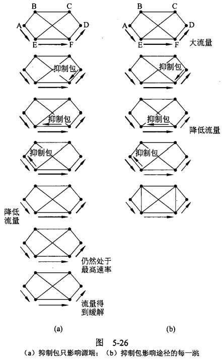

**虚电路子网中的拥塞控制**：

* 许可控制（admission control）：一旦发生拥塞，在问题解决之前，不允许建立新的虚电路；

* 发生拥塞后可以建立新的虚电路，但要绕开发生拥塞的地区；

* 资源预留：建立虚电路时，主机与子网达成协议，子网根据协议在虚电路上为此连接预留资源。
  
    **资源预留协议（RSVP, Resource Reservation Protocol）**主要针对单播和组播应用。
  
    重点讨论组播： RSVP 使用了基于生成树的组播路由。每个组都分配一个组地址。为了给一个组发送数据包，发送方把该组的地址放到这些数据包中。然后，标准的组播路由算法建立起一棵覆盖所有组成员的生成树。**这里的组播需要些额外的信息，这些信息被周期性地组播给生成树中的路由器，告诉它们在内存中维护 特定的数据结构以用于缓存。**
  
    主机1和主机2是组播发送方，主机3/4/5是组播接收方。在这个例子中，发送方和接收方是分离的。
  
  
  
    为了获得更好的接收效果并且消除拥塞，一个组中的任何接收方都可以沿着树给组播发送方发送一条预留消息。利用前面讨论过的**逆向路径转发算法**，该预留消息被传播到发送方。在沿途的每一跳路由器会注意到此预留消息，并**预留必要的带宽**。加权公平队列包调度算法来进行资源预留。如果没有足够的带宽， 它就返回报告失败。当这条预留消息到达组播发送方时从发送方到该接收方路上的带宽都得到预留，因为沿着生成树完成了预留。
  
  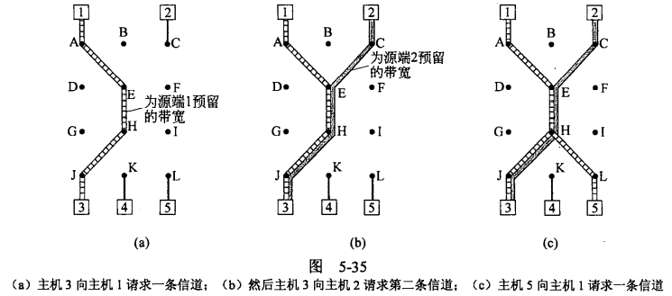
  
  * 主机1请求一条通向主机3的信道。一旦该信道被建立起来，则从主机1到主机3的数据包流将不会再遭遇拥塞。
  
  * 主机3要预留一条通向另一个发送 方（即主机 ）的信道，从主机3到路由器E之间需要两条独立的信道，因为**传输的是两个独立的流**。
  
  * 主机5也想要预留从主机1的信道，则H之前已经存在没有必要保留了。

当拥塞时，若路由器向发送方发抑制包，那么大量的抑制包反而会加重拥塞。所以网络层解决拥塞的思路就是防患于未然，在局面变得毫无希望前让路由器舍弃负担。后面配合传输层可以降低用户发送速率，从根本上解决拥塞。

**随机早期检测（RED, Random Early Detection)**：使路由器的队列维持两个参数，即**队列长度最小门限 THmin 和最大门限 THmax**。RED 对每一个到达的数据报都先计算平均队列长度 LAV

* 若平均队列长度小于最小门限 THmin ，则将新到达的数据报放入队列进行排队

* 若平均队列长度超过最大门限 THmax，则将新到达的数据报丢弃

* 若平均队列长度在最小门限 THmin 和最大门限THmax 之间，则按照某一概率 p 将新到达的数据报丢弃

* RED 将路由器的到达队列划分成为三个区域
  
  

* 丢弃概率 *p* 与 THmin 和 Thmax 的关系 
  
  * 当 *L*AV < Thmin 时，丢弃概率 *p* = 0。
  
  * 当 *L*AV >Thmax 时，丢弃概率 *p* = 1。
  
  * 当 THmin < *L*AV < THmax时，  0 < *p* < 1 。  例如，按线性规律变化，从 0 变到 *p*max。
    
    

## 5.4 服务质量

互联网本身只能提供“尽力而为的服务”或称“尽最大努力交付的服务”

从一个源端发到一个接收方的数据包流称为一个**流(flow)**，每个流的需求可由四个主要参数来表示：带宽、延 迟、抖动和丢失，这些参数决定了一个流要求的**服务质量(QoS, Quality of Service )**。

* 延迟的变化（即标准方差）或者数据包到达时间的变化称为**抖动(jitter)**

**流量整形（traffic shaping）**是指调节进入网络的数据流的平均速率和突发性所采用的技术，包括漏桶和令牌桶

* 漏桶：
  
  * 到达的数据包被放置在底部具有漏孔的桶中（数据包缓存）。
  
  * 漏桶最多可以排队b个字节，漏桶的这个尺寸受限于内存。
  
  * 如果数据包到达的时候漏桶已经满了，那么数据包应被丢弃数据包从漏桶中漏出，以常量速率（r字节/秒）注入网络，因此平滑了突发流量
    
    

* 令牌桶：
  
  * 产生令牌：周期性的以速率r向令牌桶中增加令牌，桶中的令牌不断增多。如果桶中令牌数已到达上限，则丢弃多余令牌
  
  * 消耗令牌：输入数据包会消耗桶中的令牌。
  
  * 当桶中的令牌数量可以满足数据包对令牌的需求，则将数据包输出，否则将其丢弃
    
    

* 漏桶算法和令牌桶算法的区别在于漏桶算法输出的流量永远不可能超过一定限制，而令牌桶算法可以容忍短时间内的高流量输出，对于一些突发流量的需求比较友好

## 5.5 网络互联

当两个或者多个网络连接起来形成网络互联(internetwork)，网络互连设备：

* **中继器（repeater）**：物理层设备，在电缆段之间拷贝比特；对弱信号进行放大或再生，以便延长传输距离。

* **网桥（bridge）**：数据链路层设备，在局域网之间存储转发帧；网桥可以改变帧格式。

* **多协议路由器（multiprotocol router）**：网络层设备，在网络之间存储转发包；必要时，做网络层协议转换。

* **传输网关（transport gateway）**：传输层设备，在传输层转发字节流。

* **应用网关（application gateway）**：应用层设备，在应用层实现互连

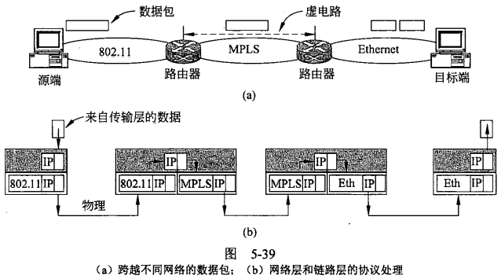

**隧道技术(Tunneling)**：源和目的主机所在网络类型相同，连接它们的是一个不同类型的网络，这种情况下可以采用隧道技术。


1. 主机1发送一个包，目的IP地址 = 主机2的IP，将包封装到以太网帧中，帧目的地址 = 路由器1的MAC地址；

2. 局域网(以太网)传输；

3. 路由器1剥掉局域网帧头、帧尾，将得到的IP包封装到广域网**网络层包**中，包目的地址 = 路由器2IP地址；

4. 广域网传输；

5. 路由器2剥掉广域网封装头，将得到的IP包封装到局域网帧中，包目的IP地址 = 主机2的IP，帧目的地址 = 主机2的MAC地址；

6. 局域网传输；

7. 主机2接收。

## 5.6 Internet网络层

在网络层，可以把` Internet `看作是一种相互关联的网络或自治域（自治系统）集合。没有真正的结构，但存在几个主要骨干网。这些都是由高带宽线路和快速路由器组成。这些骨干网中最大的一个称为一级网络（Tier 1 networks ），每个骨干网都与它连接，进而到达其他骨干网。连接到骨干网上的是 **Internet 服务提供商（ISP, Internet Service Provider ）**，它为家庭和企业、数据中心和服务器托管设施，以及区域（中级）网络提供` Internet `接入服务。

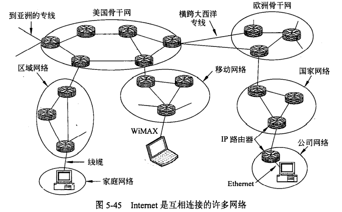

将整个` Internet` 黏合在一起的正是网络层协议，即` Internet `协议（IP, Internet Protocol）。

IP 的任务是提供一种尽力而为（best-effort）地把数据包从源端传输到接收方 的方法（**即不提供任何保证**），无须考虑这些机器是否在同一个网络，也不必关心它们之间是否还有其他网络。

`Internet` 中的通信过程是这样的。传输层获取数据流，并且将数据流拆分成段，以便作 IP 数据包发送。理论上，每个数据包最多可容纳 64 KB，但实际上，数据包通常不超过 1500 个字节（因而它们正好可被放到一个以太网帧中）。 IP 路由器转发每个数据包穿过`Internet` ，沿着一条路径把数据包从一个路由器转发到下一个路由器，直到数据包到达目的地。在接收方，网络层将数据交给传输层，再由传输层交给接收进程。当所有的数据段最终都抵达目标机器，它们被网络层重新组装还原成最初的数据报：然后该数据报被网络层传给传输层。

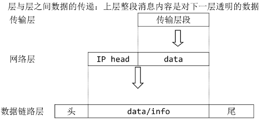

### 5.6.1 IPv4

IPv4即普遍使用的IP协议版本4，定义了数据传送的基本单元——IP分组及其确切的数据格式。

#### 5.6.1.1 IP Head

**IP 数据报由头和正文组成**，正文是有效净荷，携带数据；头由 **20 字节定长及一个可选变长组成**，携带此数据报的解释信息。下面是 IP 头的相关介绍：


1. **版本(Version)**：记录数据报属于什么版本，Ipv4 Ipv6

2. **IHL**：IP 头长，**单位为 4 字节**，因为头部至少 20 字节定长，所以值域 5~15。

3. **区分服务(Type of service)**：前 6 位标识数据报服务类型，后 2 位携带显示拥塞信息，了解。

4. **总长度(Total length)**：数据报总长度，单位是 **1 字节（8bit）**，包括头和数据，**最大长度为$2^{16}-1=65535\;bytes$**，以太网帧的最大传送单元(MTU)为1500bytes，当IP封装成帧时，数据报总长度不能超过MTU的值

5. IP 头第二行都是关于分段的处理，其用途就是：不同网络的最大帧长的要求可能不同，从而大数据进入小网络需要对大的数据进行分段。**标识(identification)**字段的用途是让目标主机确定一个新到达的分段属于哪一个数据报。同一个数据报的所有段包含同样的标识值。**DF(Don't Fragment)** 表示是否允许分段，DF=1 表示该数据报不允许分段，到达需要分段的地方就丢包返回消息；**MF(More Fragment)** 表示所属于的数据报是否还有更多的段。。除了最后一个段以外，其他所有的段都必须设置这一位。MF=0 表示当前分段是该数据报的最后一段；**分段偏移量(Fragment offset)**表示该分段在整个数据包中的位置，以 **8 字节**为单位。

6. **生存期(Time to live)**：计数单位为跳数，每经过一跳减一，递减到 0 的时候数据包被丢弃并由路由器给源地址发送一个报警包。设定目的主要解决环路问题，避免数据包被永远都留在网路中。不同协议的技术单位不同，有的还设定为秒，这是为了控制拥塞，但是秒不好实现。

7. **协议(Protocol)**：记录 IP 分组携带数据的协议类型，即传输层协议的编号，如 TCP、UDP 等

8. **头校验和(Header checksum)**：对 IP 头信息进行校验，检测数据包穿过网络时是否发生错误。但是由于
    只校验了头，所以 IP 数据报整体依旧不可靠

9. **源地址和目的地址**：源地址可以用于丢包时给源地址发消息；目的地址用于寻找路径时查路由表

10. **选项(Option)**：给出对寻址过程中要求必须经过的路由器，如今，几乎已经不再使用 IP 选项
    
    

#### 5.6.1.2 分段

每种网络都对最大包长有限制，大包经过小包网络时，网关要将大包分成若干**段（fragment）**，每段作为独立的包传输。IP数据报被封装在数据链路层帧中，因此链路层的**MTU(Max Transmission Unit)**限制IP数据报的长度。例如：以太网的MTU为1500B。

**段重组策略**

* 分段重组过程对其它网络透明：网关将大包分段后，每段都要经过同一出口网关，并在那里重组；例，ATM网络；
  
    带来的问题：
  
  * 出口网关需要知道何时所有分组都到齐；
  * 所有分组必须从同一出口网关离开；
  * 大包经过一系列小包网络时，需要反复地分段重组，开销大。

* 分段重组过程对其它网络不透明：中间网关不做重组，而由目的主机做；
  
    带来的问题：
  
  * 对主机要求高，能够重组；
  
  * 每个段都要有一个封装头，网络开销增大；
    
    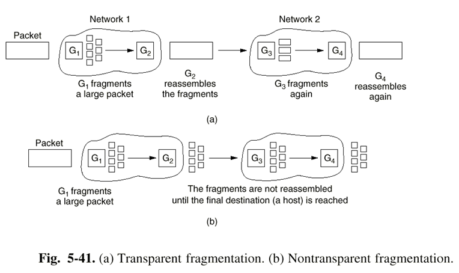

IPv4属于不透明的段重组，段在目的地的网络层被重新组装，目的主机使用IP首部中的**标识(identification)、标志(DF/MF)、偏移量(Fragment Offset，最后一个段外的所有段的长度必须是8字节（基本段长）的倍数。)**来重组。下图传输一个数据部分为3800byte到MTU为1400+IP头部长的链路上，


#### 5.6.1.3 IP地址

网络上的每一台主机（或路由器）的每一个网络接口都会分配一个全球唯一的**32位**的标识符。将IP地址划分为固定的类，每一类都由两个字段组成，IP地址={ 网络号,主机号 }，同一网络上所有主机的网络号相同，一个网络对应一块连续的 IP 地址空间，这块地址空间就被称为地址的**前缀**。

* 写法：点分十进制，如 18.0.31.0/24，24 表示网络号位数。

* **子网掩码（ subnet mask ）**，它可以与一个 IP 地址进 AND 操作，以便提取出该地址的网络部分。在我们的例子中，子网掩码为 255.255.255.0 。下图显示了一个前缀和一个子网掩码。
  
  

* IP地址共分为A、B、C、D、E五类，A类、B类、C类为单播地址，D类为组播地址
  
  

* IP地址全0和全1有特殊含义
  
  * 主机号全0：表示本网络
  
  * 主机号全1：表示本网络的广播地址
  
  * 127.xx.yy.zz：所有该形式的地址保留给回环测试用。发送到该地址的数据包并没有被真正放在线路上，它们如同入境数据包一样在本地处理。这样在发送方不知道网络号的情况 下，可以给主机发送数据包，这对测试网络软件很有用。
  
  * 32位全0：表示这个网络/这个主机，这些地址允许机器在不知道网络号的情况下访问自己所在的网络（但它们必须知道网络掩码包括多少个0）
  
  * 32位全1：表示整个TCP/IP网络的广播地址
    
    

#### 5.6.1.4 子网划分

**子网划分 subnetting**：在内部将一个网络块分成几个部分供多个内部网络使用，但对外部世界仍然像是单个网络一样。子网划分减少了 IP 地址的浪费、网络的组织更加灵活、便于维护和管理。


**子网掩码 subnet mask**：与 IP 地址一一对应，是32 bit 的二进制数，置1表示网络位，置0表示主机位。**可以与一个 IP 地址进 AND 操作，以便提取出该地址的网络部分。**


转发过程：数据报到达后，路由器检查该数据包的目的地址，将该目的地址与路由表中每个子网目标的子网掩码按位与看是否匹配

#### 5.6.1.5 CIDR一一无类域间路由

**无类域间路由(CIDR,Classless Inter-Domain Routing)**，是为解决 IP 路由表爆炸、IP 地址耗尽而提出的一种措施。在变长子网掩码的基础上提出的一种消除 ABCDE 类网络划分，并且可以在软件的支持下实现构造超网的一种 IP 地址的划分方法。

例：用一块从 194.24.0.0 开始的大小为$2^{13}$的地址按剑桥->爱丁堡->牛津的顺序分配三个大学的地址。计算过程如下。其中每个地点的两行分别代表该地的起始和终止 IP 地址。竖虚线为网络号和主机号划分。


| 起始地址 | 194             | 24              | 0                 | 0               | 地址数      |
| ---- | --------------- | --------------- | ----------------- | --------------- | -------- |
|      | 1 1 0 0 0 0 0 0 | 0 0 0 1 1 0 0 0 | 0 0 0 \|0 0 0 0 0 | 0 0 0 0 0 0 0 0 | $2^{13}$ |
| 剑桥   | 1 1 0 0 0 0 0 0 | 0 0 0 1 1 0 0 0 | 0 0 0 0 0 \|0 0 0 | 0 0 0 0 0 0 0 0 | $2^{11}$ |
|      |                 |                 | 0 0 0 0 0 \|1 1 1 | 1 1 1 1 1 1 1 1 |          |
| 爱丁堡  | 1 1 0 0 0 0 0 0 | 0 0 0 1 1 0 0 0 | 0 0 0 0 1 0 \|0 0 | 0 0 0 0 0 0 0 0 | $2^{10}$ |
|      |                 |                 | 0 0 0 0 1 0 \|1 1 | 1 1 1 1 1 1 1 1 |          |
| 空    | 1 1 0 0 0 0 0 0 | 0 0 0 1 1 0 0 0 | 0 0 0 0 1 1 \|x x | x x x x x x x x | $2^{10}$ |
| 牛津   | 1 1 0 0 0 0 0 0 | 0 0 0 1 1 0 0 0 | 0 0 0 1 \|0 0 0 0 | 0 0 0 0 0 0 0 0 | $2^{12}$ |
|      |                 |                 | 0 0 0 1 \|1 1 1 1 | 1 1 1 1 1 1 1 1 |          |

**分配的原则是：一个网络只能有一个网络号，进行 IP 地址分配时尽可能连续分配。**以牛津大学为例，尽管前面余下$2^{10}$个空白，但是依旧选择向后，否则牛津子网会有两个网络号(194.24.12.0与194.24.16.0)

**路由聚合(rounte aggregation)**：为了减小路由表长度，将多个小前缀地址块合并为个大前缀地址块，如上面的三个地址就可以聚合成一个地址，方法是将三者网络号**最大公共部分**聚合为新网络号：

```
194.24.0.0/21
194.24.8.0/22 → 194.24.0.0/19
194.24.16.0/20
```

然后传递给其他路由器。这个前缀包含了 8K 个地址，并涵盖了3所大学的地址和其他未分配的 1024 个地址。通过聚合， 三个前缀己经减少为一个，由此减少了必须告知其他路由器的前缀。

`CIDR`的工作原理如下所述。当一个数据包到达时，路由器扫描路由表以便确定目的地是否在前缀的地址块内。有可能多个具有不同前缀的表项得到匹配，在这种情况下，使用**具有最长前缀的表项**。因此，如果有一个匹配/20掩码的表项，同时还有一个匹配/24掩码的表项，则使用/24表项来查询数据包的出境线路。

#### 5.6.1.6 NAT——网络地址转换

**网络地址转换（NAT, Network Address Translation）**为了短期解决IP地址短缺问题，其基本思想是 ISP 为每个家庭或每个公司设定两套 IP 地址,内网相对于外网来说共用一个 public 地址，而在内网中，每台机器对应一个 private 地址。

在客户网络内部，每台计算机有唯一的 IP 地址(public)，该地址主要用来路由内部流量。然而，当一个数据包需要离开客户网络，发向其 ISP 时，它必须执行一个**地址转换**，把唯一的内部 IP 地址转换成那个共享的公共 IP 址。这种地址转换使用了 IP 地址的三个范围，这些地址己经被声明为**私有IP地址(private)**。任何网络可以在内部随意地使用这些地址。仅有的规则是**不允许包含这些地址的数据包出现在 Internet 上**。这个保留的地址范围为：

```
10.0.0.0 ~ 10.255.255.255/8 (16,777,216个主机)
172.16.0.0 ~ 172.31.255.255/12 (1,048,576个主机)
192.168.0.0 ~ 192.168.255.255/16 (65,536个主机)
```


当应答数据包返回时（比如从 Web 务器返回的应答包），本质上它的目标地址是公有地址，**如何找到对应的私有地址呢？**传输层以TCP为例(UDP类似)，传输的数据包含源端口与目标端口字段，NAT路由器安装了NAT软件，其NAT转换表存放着：**{私有IP地址：端口}<===>{公用IP地址：端口}**的映射。

> 假设某宿舍办理了一个宽带，这个宿舍就有了一个全球唯一的IP地址（如138.76.29.7），而宿舍四台主机使用私有IP地址，宿舍网关路由器的NAT转换表如下：
> 
> | WAN端             | LAN端             |
> |:----------------:|:----------------:|
> | 138.76.29.7:5001 | 192.168.0.2:2233 |
> | 138.76.29.7:5060 | 192.168.0.3:1234 |
> | ...              | ...              |
> 
> 当路由器从WAN端收到目的IP即端口为138.76.29.7:5001时，就将其映射到192.168.0.2:2233，然后从LAN端发送给响应的主机。
> 
> NAT路由器不同于普通路由器，会查看传输层端口以及修改IP地址。

缺点：

* NAT 违反了IP的结构模型。 该模型声明每个 IP 地址均唯一标识了世界上的一台机器。
* NAT 打破了 Internet 的端到端的连接模型，即任何一个主机可在任何时间给任何 一台其他主机发送数据包。因为 NAT 盒子上的映射是由出境数据包建立的，只能在出境数据包之后到达的入境数据包才能被接受。
* NAT Internet 从一个无连接网络改变成一个面向连接网络特有的形式。
* NAT 违反了最基本的协议分层规则：第 k 层不应该对第 k+l 层在本层的有效载荷宇段中放什么作任何假设。（查看了端口）
* Internet 上的进程并不一定必须使用 TCP 或者 UDP 。

### 5.6.2 Internet控制协议

除了用于数据传输的 IP 协议外，`Internet` 在网络层还有几个辅助控制协议。它们包括 ICMP 、 ARP、DHCP 。

#### 5.6.2.1 ICMP

当路由器在处理一个数据包的过程中发生了意外，**Internet控制报文协议ICMP（The Internet Control Message Protocol）**向数据包的**源端**报告有关事件，每一种ICMP报文都被封装在一个IP包中。


* **目的地不可达**：当路由器不能定位一个目标，或者当一个设置了 DF 标志位的数据包由于途中经过一 个“小数据包”网络而不能被递交时。
* **超时**：当一个数据包由于它的 TTL 生存期达到而被丢弃时，路由器发送超时（TIME EXCEEDED）消息
* **参数问题（Parameter Problem）**：表示在头字段中检测到一个非法值。这个问题说明了发送主机的IP软件中存在错误，或者也可能是中途路由器软件存在错误。
* **源抑制（ SOURCE QUENCH ）**：以前被用来抑制那些发送太多数据包的主机。当一 台主机接收到这条消息时，它应该将发送速度减慢下来。这种消息现在很少使用了，因为当拥塞发生的时候，再发这些包无疑是火上烧油。现在，`Internet`的拥塞控制任务主要由传输层完成。
* **重定向**：当路由器注意到个数据包看起来被错误地路由时，它使用重定向消息将可能的错误信息告诉源端主机。
* **回显(ECHO)和回显应答 (ECHO REPLY)**消息可以用来判断一个指定的目标是否可达，以及是否还活着。目标主机接收到回显消息之后，应该立即送回一个回显应答消息。 这些消息主要被 ping 工具用在探测` Internet `上是否存在某一台特定的主机。 
* **请求时间戳(TIMESTAMP REQUEST) 和应答时间戳 (TIMEST AMP REPLY)**消息的用途类似，只不过在应答消息中还包含了请求消息的到达时间和应答消息的发出时间。此 项设施可以用来测量网络的性能。 
* **路由器通告(ROUTER ADVERTISEMENT)和路由器恳求 (ROUTER SOLICITATION)**消息使得主机拥有寻找附近路由器的能力。主机至少需要学习一个路由器的 IP 地址才能发送离开本地网络的数据包。

#### 5.6.2.2 ARP

**地址解析协议ARP（The Address Resolution Protocol）**解决网络层地址（IP地址）与数据链路层地址（MAC地址）的映射问题

> 以太网卡并不理解 Internet 地址。在以太网的环境里，每一块 NIC 在出厂时都配置了一个唯一的 48 位以太网地址(以太网MAC地址，02-60-8c-e4-b1-21)。以太网NIC的制造商从IEEE请求一块以太网地址，确保不会出现任何两块网卡有相同的地址（以避免两块网卡出现在同一个 LAN 上时发生冲突）。 NIC 根据其 48 位以太网地址来发送和接收帧。 它们对 32 位的 IP 地址完全一无所知。

构建下面一个场景：只有两个/24网络。计算机系有一个交换式以太网，它的前缀是 192.32.65.0/24，另一个在电子工程学系，它的前缀为 192.32.63.0/24 。这两个局域网通过一个 IP 路由器相连。 以太网上的每台机器和路由器上的每个接口都有一个**唯一的以太网MAC地址**，我们将它们标记CS或EE网络上的E1-E6。


每一个主机都设有一个ARP高速缓存，里面有**本局域网**上的各主机和路由器的IP地址到硬件地址的映射表。

每个子网内的主机都将网络外的流量发给某个路由器，该路由器称为**默认网关(Default gateway)**，按照惯例，**默认网关具有网络上的最低地址（ 198.31.65.1 ）**

* 同一子网中消息传递：
  
    当主机1要向本局域网上的某个主机2的IP地址发送IP数据报时，就先在其ARP高速缓存中查看有无主机2的IP地址，如果有，就在ARP高速缓存器中查找出其对应的硬件地址，再把这个硬件地址写入MAC帧中，然后通过局域网把MAC帧发往此硬件地址
  
    否则主机1就自动运行ARP，然后按以下步骤找出主机2的硬件地址：
  
  1. ARP进程在本局网上广播发送一个ARP请求分组。
  
  2. 在本局域网上的所有主机上运行的ARP进程都收到此ARP请求分组。
  
  3. 主机2的IP地址与ARP请求分组中要查询的IP地址一致就收下这个ARP请求分组，并向主机1发送ARP响应分组，并在这个ARP响应分组中写如自己硬件地址。
  
  4. 主机1收到主机2的ARP响应分组后，就在其ARP高速缓存中写入主机2的IP地址到硬件地址的映射。

* 不同子网中消息传递：
  
    假设主机1想要给EE网络上的主机4(192.32.63.8)发送数据包。主机1发现目标 IP 地址不在CS网络。因此准备将数据报发送给默认网关，为了给路由器发送帧，主机必须知道该路由器在 CS 网络上的接口地址。因此，主机发送一个 ARP 广播报文，请求 198.31.65.1 对应的以太网地址，从该广播报文的应答报文它获知所需的以太网地址为E3：然后用该地址给路由器发送帧。
  
    当路由器的以太网NIC得到该帧后，它将数据包交给IP软件。IP软件从网络子网掩码了解到这个数据包要发送到EE网络，**根据路由算法查询下一条路由器IP地址，再利用ARP协议查询下一条路由器的MAC地址，重复执行该过程，直到到达 EE 子网。**
  
    在EE网络再到达主机 。如果路由器不知道主机以太网地址，它可以再次使用 ARP 广播。
  
  

#### 5.6.2.3 DHCP

**动态主机配置协议(DHCP, Dynamic Host  Configuration Protocol）**：当主机加入IP网络，允许主机从DHCP服务器动态获取IP地址。可以有效利用IP地址，方便移动主机的地址获取。

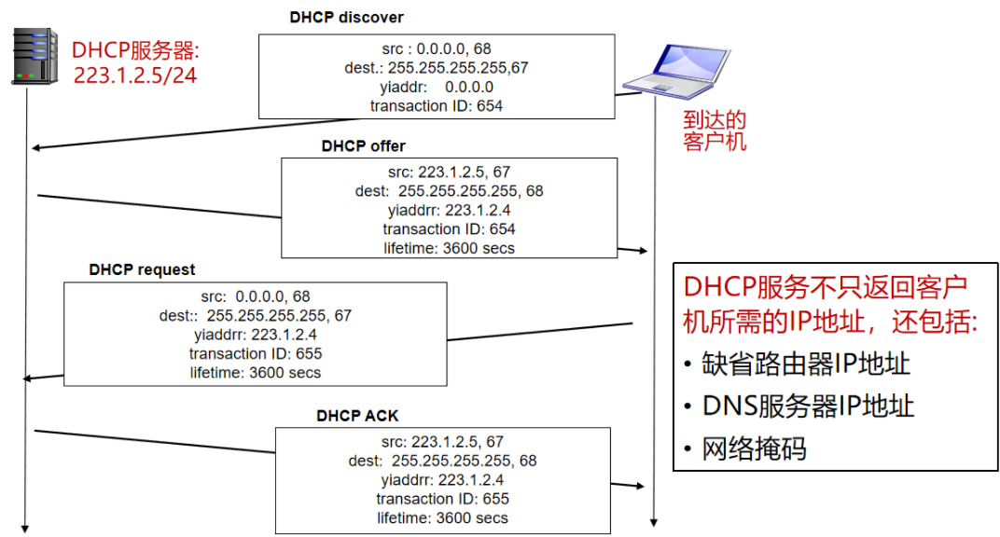

* DHCP 客户从UDP端口68以**广播形式**向服务器发送发现报文（DHCP DISCOVER）
* DHCP 服务器广播发出提供报文（DHCP OFFER）
* DHCP 客户从多个DHCP服务器中选择一个，并向其以广播形式发送DHCP请求报文（DHCP REQUEST）
* 被选择的DHCP服务器广播发送确认报文（DHCP ACK）

DHCP是应用层的协议，他是通过客户机-服务器方式工作的。

### 5.6.3 Internet路由协议

`Internet`由大量的独立网络或**自治系统(AS, Autonomous System)**构成，自治系统内部的路由选择称为域内路由选择。

* **内部网关协议IGP(Interior gateway protocol)**：自治系统AS内使用的路由算法：RIP、OSPF

* **外部网关协议EGP(Exterior gateway protocol)**：自治系统AS之间使用的路由算法：BGP

#### 5.6.3.1 OSPF

**开放最短路径优先OSPF(Open Shortest Path First)**

1. 构造有向拓扑图
   
   * 根据实际的网络、路由器和线路构造有向图
   
   * 每个弧赋一个开销值
   
   * 两个路由器之间的线路用一对弧来表示，弧权可以不同
   
   * 多路访问网络如交换式以太网，网络用一个结点表示，每个路由器用一个结点表示，网络结点与路由器结点的弧权为0
     
     

2. 然后每个路由器使用**链路状态路由**方法计算从自身出发到所有其他节点的最短路径。有可能协议会发现多个同样短的路径，在这种情况下，`OSPF`记住最短路径集合，并在报文转发期间把流量分摊到这些路径上。这种多路径路由方法有助于负载均衡。该方法称为**等价成本多路径( ECMP，Equal Cost Multi Path ）**。

Internet 中的许多 AS 本身非常庞大，而且不便于管理。 OSPF 可以将这样的 AS 划分成编号的**区域(Area)**，每个区域是一个网络，或者一组互连的网络。区域不能相互重叠，但是也不必面面俱到，在区域外看不见网络拓扑结构。

* 全部属于一个区域的路由器称为**内部路由器(internal router)**，每个 AS 有一个**骨干区域 (backbone area)**，称为0号区域。该区域中的路由器称为**骨干路由器(backbone router)**。所有区域都必须连接到骨干区域，从 AS 内的任何一个区域出发，经过骨干区域，总是有可能到达该 AS 的任何其他区域。骨干区域内每个连接到两个或更多区域的路由器称为**区域边界路由器(border router)**。

* 如果只有一个边界路由器通往区域外，甚至路由信息概要都不需要传递。通往该区域外部目的地的路由总是被指令“前往边界路由器”，这类区域称为**存根区域(stub area)**。

* **AS 边界路由器(AS bounry router)**把通往其他 AS 的外部路由注入到本区域。然后外部路由就呈现为可以通过 AS 边界路由器可达的目的地


在正常操作期间，每个区域内的路由器有相同的链路状态数据库，并运行相同的最短路径算法。其主要工作是计算从自身出发到每个其他路由器和整个 AS 内网络的最短路径。 **区域边界路由器需要所有与之连接区域的数据库，并且为每个区域分别运行最短路径算法。**


最后，我们把所有的工作综合到一起。通过**泛洪法**，每个路由器把它与其他路由器和网络的链路以及链路成本告诉给它所在区域中的所有其他路由器。这些信息使得每台路由器都可以构建出它所在区域的拓扑图，并且计算最短路径（类似于链路状态路由算法）。不同于LS算法的是：为了计算出从每个骨干路由器到每个其他路由器的最佳路由，**路由器还要接受来自每个区域边界路由器的信息。最佳路由信息又被传回到区域边界路由器，区域边界路由器再将这些信息在本区域内广播。**利用这些信息，内部路由器可以选择通往区域外目的地的最优路由，包括通向骨干区域的最佳出口路由器。

#### 5.6.3.2 BGP

在一个AS内部，推荐使用的路由协议是 OSPF、IS-IS 。在 AS 之间，则可以使用另一个协议，称为**边界网关协议（BGP, Border Gateway Protocol）**。在域间需要考虑许多政治经济因素

BGP功能

- 外部 BGP(eBGP, external BGP）：从相邻的AS获得网络可达信息
- 内部 BGP(iBGP, internal BGP）： 将网络可达信息传播给AS内的路由器
- 基于网络可达信息和策略决定到其他网络的“最优”路由

BGP会话：两个BGP路由器通过**TCP连接**交换BGP报文，采用**路径向量（path vector）**算法，路由信息中记录路径的轨迹。以下图为例：

、

### 5.6.4 IPv6

CIDR仅仅是一种临时补救措施，不能从根本上解决IP地址空间匮乏的问题；移动电话、家电上网等需要大量的IP地址。

IPv6与IPv4不兼容，但与其它Internet协议兼容，如TCP、UDP、OSPF、BGP、DNS等，但实际上还是需要开发另外一套协议栈。

> IPv6的目标与改变：
> 
> * 即使在不能有效分配地址空间的情况下，也能支持数十亿的主机——地址变长，由32位变成128位；
> 
> * 减少路由表的大小；
> 
> * 简化协议，使得路由器能够更快的处理包——IP头简化，由13个域减少为7个域，提高路由器处理速度
>   
>   * 由于IPv6封装头定长，取消IHL域；
>   
>   * Protocol域取消，用Next header域表示；
>   
>   * 取消与分段有关的域，IPv6采用不同的分段方法：所有主机和路由器必须支持576字节的包，当主机发送一个大包时，路由器不做分段，而是给主机发一个错误信息，由主机做分段；
>   
>   * 取消Checksum域。
> 
> * 提供比IPv4更好的安全性；
> 
> * 更多的关注服务类型，特别是实时数据——更注重服务类型
> 
> * 支持Multicast；
> 
> * 支持移动功能；
> 
> * 协议具有很好的可扩展性——更好的支持选项功能
> 
> * 增强安全性
> 
> * 在一段时间内，允许IPv4与IPv6共存。


* Version，值为6；

* Priority，用来区分源端可以流控或不能流控的包，值0 ~ 7表示发生拥塞时源端可以降速，值8 ~ 15表示发送速率固定的实时负载，值越小优先级越低；

* Flow label，用来允许源和目的建立一条具有特殊属性和需求的伪连接；

* Payload length：**用来指示IP包中40字节封装头后面部分的长度**，与IPv4的total length域不同；

* Next header，指示扩展封装头，若是最后一个封装头，则指示传输协议类型（TCP/UDP）；

* Hop limit，IP包的生存时间；

* Source address，destination address，16字节定长地址

**IPv6地址表示**

16字节地址表示成用冒号（:）隔开的8组，每组4个16进制位，例如8000:0000:0000:0000:0123:4567:89AB:CDEF

由于有很多“0”，有三种优化表示

* 打头的“0”可以省略，0123可以写成123；

* 一组或多组16个“0”可以被一对冒号替代，但是一对冒号只能出现一次。上面的地址可以表示成 8000::123:4567:89AB:CDEF

* IPv4地址可以写成一对冒号和用“.”分隔的十进制数，例如::192.31.20.46

**扩展头**


# 6 传输层

引入传输层的原因：

* 网络具有的这种延迟和重复数据包的特性使得网络层的传输不可靠

* 提供从源端主机到目的端主机的可靠的、与实际使用的网络无关的信息传输。

网络层使用数据报或虚电路技术为端到端通信提供了数据包交付服务。传输层架构在网络层提供的服务之上，把数据传递服务从两台计算机之间扩展到了**两台计算机上的进程**之间。

传输层的代码完全运行在用户的机器上，但是网络层代码主要运行在由运营商操作的路由器上（至少对于广域网是如此）。用户对网络层没有真正的控制权，因为他们不拥有路由器， 所以不能用更好的路由器或者在数据链路层上用更好的错误处理机制来解决服务太差的问题。唯一的可能是在网络层之上再加一层，由该层来提高网络的服务质量。

## 6.1 传输服务

**传输实体（transport entity）**：完成传输层功能的硬软件；传输层实体利用网络层提供的服务向高层提供有效、可靠的服务。

传输层提供两种服务

* 面向连接的传输服务：连接建立，数据传输，连接释放

* 无连接的传输服务

传输原语：


术语**段（segment)** 来表示传输实体之间发送的消息。一些老协议使用了更加笨拙的名称一一**传输协议数据单元(TPDU, Transport Protocol Data Unit)**。这个术语现在己不再使用。前几层当中的传输实体的嵌套关系：


## 6.2 传输协议的要素

传输层与数据链路层的协议有些相似，但两者协议的运行环境不同：在数据链路层，两台路由器通过一条有线或者无线物理信道直接进行通信；而在传输层，该物理信道被整个网络所替代。这种环境差异对于协议设计有很 大的影响。


### 6.2.1 寻址

定义传输服务访问点**TSAP（Transport Service Access Point）**，将应用进程与这些TSAP相连。在Internet中，TSAP为（IP address, local port）

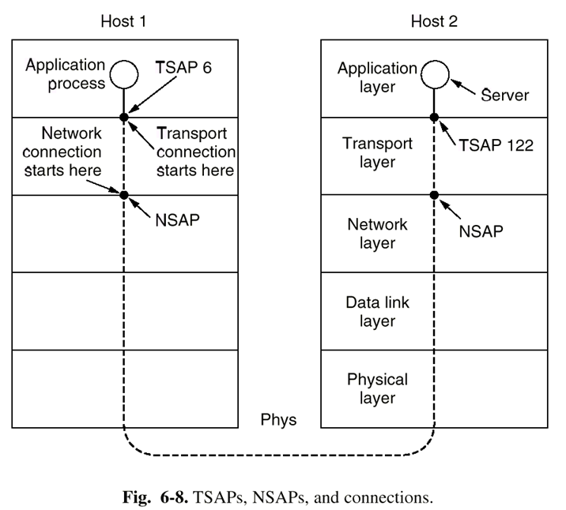

**远方客户程序如何获得服务程序的TSAP？**

* 方法1：预先约定、广为人知的，telnet是（IP地址，端口23）；

* 方法2：从端口映射器获得TSAP
  
  * 用户向端口映射器发送服务名称，获得服务进程的TSAP，释放与名称服务器的连接；
  * 与服务进程建立连接。

* 当服务程序很多时，使用**初始连接协议（initial connection protocol）**
  
  * 一个称为进程服务器（process server）的进程(inetd)同时在多个端口上监听；
  
  * 远方客户程序向它实际想访问的服务程序的TSAP发出连接建立请求；
  
  * 如果没有服务程序在此TSAP上监听，则远方客户和进程服务器建立连接；
  
  * 进程服务器产生所请求的服务进程，并使该进程继承和远程客户的连接；
  
  * 进程服务器返回继续监听；
  
  * 远方客户程序与所希望的服务程序进行数据传输。
    
    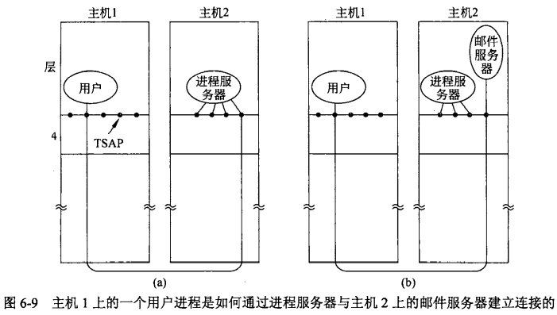

### 6.2.2 建立连接

网络可能丢失、重复包，特别是延迟重复包（delayed duplicates）的存在，导致传输层建立连接的复杂性，设计了**三次握手方案（three-way handshake）**

* A 发出序号为X的CR(CONNECT REQUEST)段；

* B 发出序号为Y的CR段并确认A的序号为x+1的CR段

* A 发出序号为x+1的第一个数据段，并确认B的序号为y+1的CR段。


### 6.2.3 连接释放

非对称式：一方释放连接，整个连接断开，存在丢失数据的危险


对称式：由于**两军问题**的存在，可以证明不存在安全的通过N次握手实现对称式连接释放的方法；但是在实际的通信过程中，使用三次握手 + 定时器的方法释放连接在绝大多数情况下是成功的。

> 请想象1支自军被围困在一个山谷中，如图 6-13 所示。两旁的山上都是蓝军。白军的实力超过了两旁任何1支蓝军单独的力量，但是两支蓝军合起来的实力却超过了自军。如果任何一支蓝军单独发起进攻，则它将被自军击败； 然而，如果两支蓝军同时发起攻击，则它们将会取得胜利。
> 
> 

一个用户发送一个 **DR (DISCONNECTION  REQUEST)** 段来启动释放连接过程。


### 6.2.4 流控与缓存

缓存：由于网络层服务是不可靠的，传输层实体必须缓存所有连接发出的段，而且为每个连接单独做缓存，以便用于错误情况下的重传。接收方的传输层实体既可以做也可以不做缓存。缓存区的设计有三种。


流控：传输层利用可变滑动窗口协议来实现流控。所谓可变滑动窗口协议，是指发送方的发送窗口大小是由接收方根据自己的实际缓存情况给出的。**为了避免控制段丢失导致死锁，每台主机应该定期地在每个连接上发送控制段，这些控制段给出确认和缓冲区状态。采用这种方法，死锁迟早会被打破**。


## 6.3 UDP

无连接的传输协议，该协议称为**用户数据报协议（UDP, User  Datagram Protocol ）**。 

UDP 传输的段（ segment ）由8字节的头和有效载荷宇段构成。


* **两个端口（port）**分别用来标识源机器和目标机器内部的端点。当一个 UDP 数据包到来时， 它的有效载荷被递交给与目标端口相关联的那个进程。

* **UDP 长度（UDP Length）**字段包含8字节的头和数据两部分的总长度。最小长度是8个字节，刚好覆盖 UDP 头。最大长度是 65515 字节，恰好低于IP数据报的最大长度（65535）。

* **一个可选的校验和（UDP Checksum ）**字段执行校验和计算时，校验和字段先被设置为零，如果数据字段的长度是奇数则用零填充成偶字节。
  
    

UDP 尤其适用的一个领域是在**客户-服务器**的情形下,UDP 的一个应用是 DNS，另一个应用领域是实时多媒体应用。

**实时传输协议(RTP, Real-time Transport Protocol)**是一个通用的实时传输协议。将多个实时数据流复用到一个UDP报文流上，这个 UDP 流可以被发送给一台目标主机（单播传输模式），也可以被发送给多台目标主机（组播传输模式）。由于重传是不合适的，因此RTP没有流量控制、差错控制、确认及请求重传的机制。


P位表示该数据包被填充到了4字节的倍数。最后的填充字节指明了有多少个字节被填充进来。 X位表示有一个扩展头。扩展头的格式和含义没有定义。唯一定义的事情是扩 展头的第一个字给出了扩展头的长度。这是针对任何不可预见之需求的最后退路。 

CC字段指明了后面共有多少个贡献源（ contributing source ）。M位是一个与应用相关的标记位，可以用来标记一个视频帧的开始、音频信道中一个字的开始，或者其他由应用解释的某些事情。有效载荷类型（Payload type ）说明使用 了哪一种编码算法（比如未压缩的8位音频、 MP3 等）。由于每个数据包都带有这个字段， 所以在传输过程中可以改变编码方法。序号（ Sequence number ）只是一个计数器，每发送 一个 RTP 数据包该计数器都要递增。该字段可被用来检测数据包的丢失。 

时间戳（ Timestamp ）由媒体流的源端产生，它注明了数据包中第一个样本什么时候产生的。这个值有助于减缓接收端的时间变化一一称为抖动（jitter），具体做法是将播放与数据包的到达时间分离开。同步源标识符（ Synchronization source identifier ）指明了该数据包属于哪一个流。正是通过这个字段，可以将多个数据流复用到一个 UDP 数据包流中，或者从一个 UDP 数据包流中分用出多个数据流。最后，如果在演播室中使用了混合器，则要使用贡献源标识符（ Contributing source identifier ）。在这种情况下，混合器是同步源，被混 合的流就列在这里（即贡献源标识符）。

## 6.4 TCP

**传输控制协议TCP（Transmission Control Protocol）**是为了在不可靠的互联网络上提供可靠的端到端**字节流**而专门设计的一个传输协议。

### 6.3.1 TCP服务模型

应用程序访问TCP服务是通过在收发双方创建**套接字(socket)**来实现的。套接字的地址是用**(IP地址，主机端口号)**来表示的。主机端口号有16位，256以下的端口号被标准服务保留，如FTP/21，TELNET/23；


每条连接用(套接字1,套接字2)来表示，是点到点的全双工通道，一个套接字有可能同时被用于多个连接。换句话说，两个或者多个连接可能终止于同一个套接字。

TCP不支持**多播（multicast）和广播（broadcast）**；

TCP连接是**基于字节流的，而非消息流**，消息的边界在端到端的传输中不能得到保留，接收端都无法获知这些数据被写入字节流时的单元大小。


### 6.3.2 TCP协议

* 按字节分配序号，每个字节有一个32位的序号；

* 传输实体之间使用**段(segment)**交换数据；每个段包含一个20字节的头（选项部分另加）和0个或多个数据字节。段的大小必须首先满足65535字节的IP包数据净荷长度限制，还要满足底层网络传输介质的最大传输单元（MTU）的限制，比如以太网的MTU为1500字节；

* TCP实体使用滑动窗口协议，确认序号等于接收方希望接收的下一个序号。

每个段的起始部分是一个固定格式的 20 宇节头。那么在选项之后是最多可达` 65535-20-20=65495 `个字节的数据，这里的第一个 20 是指 IP 头，第二个 20 是TCP 头。


* 第一行是**源端口（Source port）**和**目标端口（Destination port）**信息。

* 第二行是**序列号（Sequence number）**，表示此次发送数据的第一个字节的编号：以字节为单位编号，

* 第三行是**确认号（Acknowledge number）**，表示下次想要接收数据的第一个字节的编号。TCP采用**累积确认**的方式，用一个数字概括了接收到的所有数据

* 第四行由几个部分组成，第一部分是 **TCP 头长度（TCP header length）**，它占 4 位，**单位是“4 字节”**，另外 4Bits 是可选项(Options）；第二部分是未使用的 4 位域；第三部分是 8 个 1 位标志：
  
  * CWR 和 ECE 用作拥塞控制的信号
  
  * URG 置 1 表示使用了紧急指针，发送紧急数据
  
  * ACK 置 1 表示确认号字段是有效的
  
  * PSH 位指示接收端一旦收到数据后立即将数据移交给应用程序
  
  * RST 位由于不可恢复的错误重置连接
  
  * SYN 被用于建立连接的过程，SYN 位被用来同时表示 CONNECTION REQUEST（ACK=0）和CONNECTION ACCEPT（ACK=1） ，然后进一步用 ACK 位来区分这两种可能情况。
  
  * FIN 被用于释放一个连接；
    
    第四部分是**窗口大小（Window size）**，它表示这个 TCP 数据段发送方当前可用的缓冲区大小，表示的是这一方的接收能力。大小是0也是合法的

* **校验和（ Checksum ）**提供了额外的可靠性。它校验的范围包括头、数据，以及与 UDP 一样的概念性伪头。

* 选项(Options)，最长40字节：
  
  * **最大报文传输段（Maximum Segment Size ---MSS）**：
    
      采用大的段通常比小的段更有效率，因为这 20 字节头的开销可以分摊到更多的数据上，但是小型主机可能处理不了大的段。在连接建立过程中，**每一端可以宣布它的最大段长，并且查看对方给出的最大值。如果一台主机没有使用这个选项，那么它默认可以接 536 字节的有效载荷。**所有 Internet 主机都要求能够接受 536+20=556 个字节，TCP 两个方向上的最大段长可以不同。
  
  * 窗口扩大选项（window scaling）
  
  * 选择确认选项（Selective Acknowledgements-ACK)
  
  * 时间戳选项（timestamps）

### 6.3.3 TCP连接

TCP 使用了三次握手法来建立连接：

* 服务器方执行`LISTEN`和`ACCEPT`原语，被动监听；

* 客户方执行`CONNECT`原语，产生一个**SYN=1和ACK=0**的TCP段，表示连接请求；
  
  * 服务器方的传输实体接收到这个TCP段后，首先检查是否有服务进程在所请求的端口上监听，若没有，回答设置了RST的TCP段；
  * 若有服务进程在所请求的端口上监听，该服务进程可以决定是否接受该请求。在接受后，发出一个**SYN=1和ACK=1**的TCP段表示连接确认，并请求与对方的连接；

* 发起方收到确认后，发出一个**SYN=0和ACK=1**的TCP段表示给对方的连接确认；


如果两台主机同时企图在一对套接字之间建立连接，这些事件的结果是恰好只建立了一个连接，而不是两个。如果第一个请求产生了一个由（x, y）标识的连接，第二个请求也建立了这样一 个连接，那么，实际上只有一个表项，即（x, y）。

**TCP单向的连接释放**：释放连接时，发出**FIN位置1**的TCP段并启动定时器(两倍于最大数据包生存期内)，在收到确认后关闭连接。若无确认并且超时，也关闭连接。


### 6.3.4 TCP滑动窗口

TCP的窗口管理机制：**基于确认和可变窗口大小**。

例如，假设接收端有一个 4096 字节的缓冲区。如果发送端传送了一个 2048 字节的数据段，并且该数据段己被正确地接收， 那么，接收端将确认该数据段。 然而，由于接收端现在只剩下 2048 字节的缓冲区空间（在应用程序从缓冲区中取走数据之前），所以它将宣告下一个期望字节开始窗口为 2048。

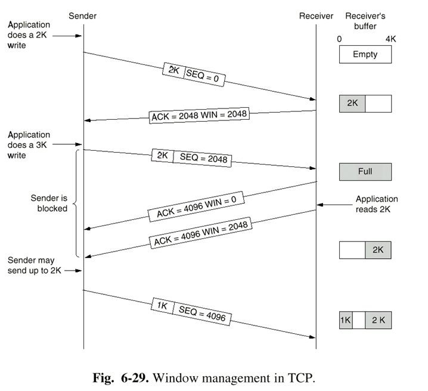

现在发送端又传输了另一个 2048 字节长的段，该段被确认了，但是接收端宣告的窗口大小变成了0。因此，发送端不得不停止，等待接收主机上的应用进程从缓冲区中取走一 些数据。到那时候， TCP 实体可以向发送端宣告一个更大的窗口，发送端才能发送数据。

窗口大小为0时，正常情况下，发送方不能再发TCP段，但有两个例外：

* 紧急数据可以发送；

* 为防止死锁，发送方可以发送1字节的TCP段，以便让接收方重新声明确认号和窗口大小——窗口探测（window probe）

**如何改进传输层的性能？**

* 策略1：发送方缓存应用程序的数据，等到形成一个比较大的段再发出；

* 策略2：在没有可能进行“捎带”的情况下，接收方延迟发送确认段；

* 策略3：使用`Nagle`算法：当应用程序每次向传输实体发出一个字节时，传输实体发出第一个字节并缓存所有其后的字节直至收到对第一个字节的确认；然后将已缓存的所有字节组段发出并对再收到的字节缓存，直至收到下一个确认。
  
    这就是说，任何时候**只有第一个发送的数据包是小数据包。**如果在一个来回时间内应用程序发送了许多数据，那么 Nagle 算法可以将这些数据放置在一个段中发送，由此大大地减少所需的带宽。另外，如 果应用传递来的数据足够多，多到可以填满一个最大数据段，则该算法也允许发送一个新的段。

* 策略4：使用Clark算法解决**傻窗口症状（silly window syndrome）**
    傻窗口症状：当应用程序一次从传输层实体读出一个字节时，传输层实体会产生一个一字节的窗口更新段，使得发送方只能发送一个字节
  
  
  
    解决办法：它强制接收端必须等待一段时间，限制接收方**只有在具备一半的空缓存或最大段长的空缓存**时，才产生一个窗口更新段。

### 6.3.5 TCP拥塞控制

导致网络拥塞的两个潜在因素是：**网络能力和接收能力。**出现拥塞的两种情况：


* 快网络小缓存接收者
  
    处理措施：在连接建立时声明最大可接受段长度；利用可变滑动窗口协议防止出现拥塞；

* 慢网络大缓存接收者
  
    **发送方**维护两个窗口，**发送端的发送窗口**的上限值应当取为接收端窗口 rwnd 和拥塞窗口 cwnd 这两个变量中较小的一个。
  
  * **接收窗口(rwnd)**：**接收端**可以缓冲的字节数。由TCP头部的窗口大小维护
  
  * **拥塞窗口(cwnd)**：**发送端**可以往网络发送的字节数。发送方通过依照**慢启动（slow start）**算法和**拥塞避免（congestion avoidance）**算法维护。

**慢启动（slow start）**算法

* 连接建立时拥塞窗口（congwin）初始值为该连接允许的最大段长，阈值（threshold）为64K；

* 发出一个最大段长的TCP段，若正确确认，拥塞窗口变为两个最大段长；

* 发出（ 拥塞窗口/最大段长）个最大长度的TCP段，若都得到确认，则拥塞窗口加倍；

* 重复上一步，直至发生丢包超时事件，或拥塞窗口大于阈值。

**拥塞避免（congestion avoidance）**算法

* 若拥塞窗口大于**阈值**，从此时开始，拥塞窗口线形增长，一个RTT周期增加一个最大段长，直至发生丢包超时事件；

* 当超时事件发生后，阈值设置为当前拥塞窗口大小的一半，拥塞窗口重新设置为一个最大段长；

* 执行慢启动算法。 

慢启动与拥塞避免遵循了**加法增大乘法减小(AIME)**法则：

* “乘法减小“是指不论在慢启动阶段还是拥塞避免阶段，只要出现一次超时（即出现一次网络拥塞），就把慢启动门限值 ssthresh 设置为当前的拥塞窗口值乘以 0.5。
  
    当网络频繁出现拥塞时，ssthresh 值就下降得很快，以大大减少注入到网络中的分组数。 

* “加法增大”是指执行拥塞避免算法后，当收到对所有报文段的确认就将拥塞窗口 cwnd增加一个 MSS 大小，使拥塞窗口**缓慢**增大，以防止网络过早出现拥塞。

> 以下面的组图为例：在主机刚刚开始发送报文段时可先将拥塞窗口 cwnd 设置为一个最大报文段 MSS（在本例中为1KB）的数值。图中窗口单位不使用字节而使用报文段。慢开始**阈值**的初始值设置为 16 个报文段，即 ssthresh = 16。假定接收端窗口足够大，因此现在发送窗口的数值等于拥塞窗口的数值。
> 
> 
> 
> * 在执行慢开始算法时，拥塞窗口 cwnd 的初始值为 1，发送第一个报文段 M0。  
> * 发送端收到 ACK1 （确认 M0，期望收到 M1）后，将 cwnd 从 1 增大到 2，于是发送端可以接着发送 M1 和 M2 两个报文段。
> * 接收端发回 ACK2 和 ACK3。发送端每收到一个对新报文段的确认 ACK，就把发送端的拥塞窗口加 1。现在发送端的 cwnd 从 2 增大到 4，并可发送 M4 ~ M6共 4个报文段。
> * 发送端每收到一个对新报文段的确认 ACK，就把发送端的拥塞窗口加倍，因此拥塞窗口 cwnd 随着传输次数按指数规律增长。
> * 当拥塞窗口 cwnd 增长到慢开始门限值 ssthresh 时（即当 cwnd = 16 时），就改为执行拥塞避免算法，拥塞窗口按线性规律增长。 
> * 假定拥塞窗口的数值增长到 24 时，网络出现超时（表明网络拥塞了）。
> * 更新后的 ssthresh 值变为 12（即发送窗口数值 24 的一半），拥塞窗口再重新设置为 1，并执行慢开始算法。
> * 当 cwnd = 12 时改为执行拥塞避免算法，拥塞窗口按按线性规律增长，每经过一个往返时延就增加一个 MSS 的大小。 

### 6.3.6 TCP计时重传

TCP 每发送一个报文段，就对这个报文段设置一次计时器。只要计时器设置的重传时间到但还没有收到确认，就要重传这一报文段。

由于 TCP 的下层是一个互连网环境，IP 数据报所选择的路由变化很大。因而传输层的往返时延的方差也很大。不能使用静态的超时重传机制

往返时延的**自适应**算法 

* 记录每一个报文段发出的时间，以及收到相应的确认报文段的时间。这两个时间之差就是报文段的往返时延。

* 将各个报文段的往返时延样本加权平均，就得出报文段的平均往返时延 SRTT。

* 每测量到一个新的往返时延样本R，就按下式重新计算一次平均往返时延 SRTT：

**平滑的平均往返时延SRTT(Smoothed Round-Trip Time)**：$SRTT=\alpha\cdot SRTT+(1-\alpha)R$

这里$\alpha$是一个平滑因子，它决定了老的 SRTT 值所占的权重。典型情况下 α＝7/8 。

TCP 使用多个计时器（至少从概念上讲是计时器）来完成它的工作。其中最重要的是重传计时器 (RTO, Retransmission Timeout ）。

计时器的 RTO 应略大于上面得出的 RTT，即：$RTO=\beta \cdot SRTT$​Beta是大于1的系数，若取 b 很接近于1 ，发送端可及时地重传丢失的报文段，因此效率得到提高。但若报文段并未丢失而仅仅是增加了一点时延，那么过早地重传反而会加重网络的负担。因此 TCP 原先的标准推荐将 b 值取为 2。 

### 6.3.7 TCP发送速率

发送速率可能收到两个因素的限制：

* 流量控制：在接收端没有足够缓冲区的情况下，必须进行流量控制
* 拥塞控制：在网络容量不足的情况下必须进行拥塞控制

TCP实际上通常使用的策略不是调整发送速率，而是基于AIMD控制法则调整滑动窗口的大小。如果窗口大小是W，往返时延是RTT，则**等价的发送速率是W/RTT**。

# 7 应用层


## 7.1 DNS

网络内部使用IP地址来引用资源，而人们往往倾向于使用便于记忆的ASCII名字，这就需要在资源的ASCII名字和它的IP地址之间建立起一种映射关系。**域名系统（DNS, Domain Name System）**将用户提供的主机名字或电子邮件地址转换成IP地址。

域名系统是一种分级结构的基于域的命名方案和实现这种命名方案的分布式数据库：

* 层次命名解决了大规模网络中名字冲突的问题；

* 分布式数据库解决了表的维护与传播问题。

一个指定的**域**是指树中一个特定的节点以及该节点以下所有的节点。


某个域的域名用从该域开始向上直到树根（为空）的标号序列表示，标号之间用句点隔开，如ustc.edu.cn。域名的任一后缀也是一个域。

**域名解析过程：**

当解析器需 要查询一个域名，它就把该查询传递给一个本地域名服务器。如果需要寻找的域恰好落在 该域名服务器管辖下，比如 top.cs.vu.nl cs.vu.nl 的管辖下，则该域名服务器就返回权威资源记录。

以下图为例，解析器将需要查询的信息封装成一个DNS请求报文，封装到一个UDP包（端口为53）中，发送给本地域名服务器；


* 若本地数据库中有所需的信息，本地域名服务器将查到的信息封装成DNS响应报文，封装到另一个UDP包（端口为53）中，发回给解析器；

* 如果被查询域在远端，比如flits.cs.vu.nl要找到华盛顿大学（UW)robot.cs.washington.edu的IP地址。如果本地没有关于相关域的缓存信息，那么域名服务器启动一次远程查询。

* 下一步是通过请求其中之一的根域名服务器来启动域名层次结构顶部的查询。这些域名服务器包含每个顶级域名的有关信息。总共有 13 个根 DNS 服务器，被命名为从 a-root-servers.net到 m.root.servers.net

* 根域名服务器不可能知道在UW的一台机器的地址，可能还不知道UW的域名服务器。 但是，它必须知道 edu 域的域名服务器，因为 cs. washington.edu 属于 edu 域管辖下。在第3步，它返回查询的答案，其中包括了名字和 IP 地址。

* 然后本地域名服务器继续执行任务。它将整个查询发给 edu 域名服务器（ a.edu.servers.net ）。该域名服务器返回 UW 的域名服务器。重复步骤最后解析域名

## 7.2 WWW

应用层最典型的应用是**万维网(WWW,Web)**，万维网是能够在服务机和客户机之间通过因特网交换文档、图像、声音和影视的信息系统

组成万维网的4个核心部分

1. 超文本传输协议HTTP

2. 文档格式标准，如HTML和XML

3. 执行HTTP协议的Web浏览器，如微软公司的`IE(Internet Explorer)`浏览器、Mozilla Foundation的`Firefox`浏览器

4. 执行HTTP协议的Web服务器, 如美国`Apache Software Foundation`公司(www.apache.org)在1995年开发的源代码开放的`Apache`，可在UNIX /Linux/ Windows NT 操作系统下运行

Web 由大量分布在全球范围的内容组成，这些内容以 Web 页面 (Web page)或简称为**页面(page)**的形式表示。每个页面可以包含指向其他页面的**链接(link)**，让一个页面指向另一个页面的想法现在称为**超文本(hypertext)**。通常观看页面的程序称为**浏览器(browser)**。浏览器取回所请求的页面，对页面内容进行解释，并在屏幕上以恰当的 格式显示出来。 

**Web客户端：**

为了让一个页面指向另一个页面，需要回答三个问题：

* 这个页面叫什么？

* 这个页面在哪里？

* 如何访问这个页面？

Web选择的解决方案是用一种能同时解决上述3个问题的方式来标识页面。每个页面被分配一个**统一资源定位符（URL, Uniform Resource Locator ）**，用来有效地充当该页面在 全球范围内的名字。 `URL` 包括3个部分：协议、页面所在机器的 DNS 名字，以及唯一指向特定页面的路径(通常是读取的一个文件或者运行在机器上的 个程序)。

例：http://www.cs.washington.edu/index.html 。这个 URL 部分组成：协议(http)、主机的 DNS 域名：www.cs.washington.edu) 和路径名(index.html)。

当用户点击这个超链接时，浏览器就执行一系列的步骤来获取该超链指向的网页：

1. 浏览器确定` URL `。 

2. 浏览器请求 `DNS` 查询服务器 www.cs.washington.edu IP 地址。 

3. `DNS` 返回 128.208.3.88

4. 浏览器与 128.208.3.88 机器的 80 端口建立一个 TCP 连接， 80 端口是` HTTP` 协议的知名端口。

5. 浏览器发送 `HTTP` 报文，请求/index.html 页面。 

6. www.cs.washington.edu 服务器发回页面作为` HTTP `响应，例如发送文件/index. html

7. 如果该页面包括需要显示的` URL `，那么浏览器经过同样的处理过程获取其他` URL `在这种情况下， URL 包括多个取自 www.cs.washington.edu 的内嵌图像、一个取自 you be.com 的内嵌视频和一个取自 google-anal ics.com 的脚本。

8. 浏览器显示页面/index.html 。

9. 如果短期内没有向同一个服务器发出其他请求，那么释放 TCP 连接。


## 7.3 HTTP

**超文本传输协议（HTTP， HyperText Transfer Protocol)**HTTP 是一个简单的请求-响应协议，它通常运行在 TCP 之上。

HTTP协议定义了用于客户机与服务机之间通信的两种消息

* HTTP请求消息(HTTP Request Message)

* HTTP响应消息(HTTP Response Message)

使用HTTP协议通信时

1. 客户机和服务机之间需要建立TCP连接。TCP连接由客户机上的Web浏览器使用URL中的域名地址来启动

2. 客户机与服务机的TCP连接一旦建立，Web浏览器就发送`HTTP Request Message`到这个TCP连接上，Web服务器收到并处理这个请求之后，就给Web浏览器回送`HTTP Response Message`

3. 完成传输任务后就断开TCP连接


**HTTP请求消息格式**：请求消息由请求行、标题行中的各种标题域和实体主体(Entity Body)组成。请求行和标题行都使用ASCII字符。图中的sp，cr和lf分别代表空格(space)、回车(carriage-return)和换行(line-feed)字符。图中各个域的含义如下：


* **Method(方法)**：域中的值表示HTTP请求消息的方法。HTTP协议中定义了8种方法，其中两个普通的方法是GET和POST：
  
  * GET：如果客户请求一个Web页面，就把GET写入Method域，在这种情况下Entity Body域是空的
  * POST：如果客户已经填写了含有搜索关键字(如“多媒体”或“multimedia”)的表单，就把POST填入method域，然后把这张表单送给服务器，再由服务器交给检索软件(如Google)。当Method域中的值是POST时，Entity Body域就包含用户写入表单域中的内容

* **URL(统一资源地址)**：用户请求访问的Web页面的路径和文件名，而服务器的名称和应用层协议的名称(如http://)由系统自动设置

* **Version(版本)**：客户机使用的HTTP版本号。1998年以前使用HTTP/1.0，1998年以后开始使用HTTP/1.1，它向后兼容HTTP/1.0。

* **Entity Body(实体主体)**：包含请求的对象 

**HTTP响应消息**：HTTP响应消息格式中的状态行包含**Status Code(状态码)和Phrase(短语)**，它们组合起来表示客户请求所获得的结果。例如

* 如果请求文件存放在Web服务机的文件系统中，而且可发送给客户机，状态码和短语就分别包含“200”和“Document follows”(文档如下)或“OK”

* 如果客户机请求的文件没有得到授权，这两个域中的值分别为“403”和“Forbidden”(禁止)，在实体主体域中还可能有一个解释，例如“your client does not have permission to get this URL”(你的客户没有得到允许去访问这个URL)

3位状态码中的第一位包含一般信息。“1”表示信息码，“2”表示访问成功，“3”表示重定向(即URL已经改变)，“4”表示你的请求有误，“5”表示Web服务器出错。


