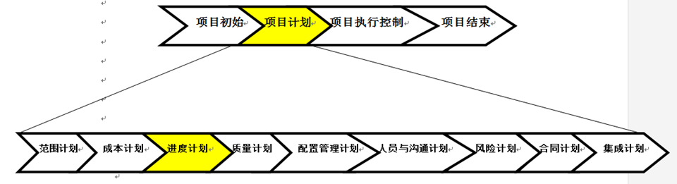

1. 什么叫项目？有哪些主要特征？与日常运作的区别
2. 完成项目的目标有哪些主要约束？如何考虑他们之间的关系
3. 软件项目有哪些特殊性？
4. 项目生命周期的阶段有哪些？各阶段的主要任务
5. 项目生命周期的特征，并简要描述。
6. 项目生命周期阶段与项目管理工作过程有什么关系？
7. 按照PMBOK项目管理的主要内容有哪些？（详细）
8. 软件生命周期有哪几个阶段？每个阶段的主要任务。
9. 项目管理的三要素和四要素说。如何理解
10. 组织结构按面向功能到面向项目的程度划分为哪几类，各有何特点？
11. 什么是软件的综合管理？其实现目标是什么
12. 什么是项目管理计划？什么作用？
13. 什么是产品范围？什么是项目范围？有什么联系？
14. 什么叫范围管理？什么作用？
15. 如何评价软件的范围？
16. SMART（不能只看概念）
17. WBS方法（同上）
18. 网络图画法
19. 关键路径法
20. 面向功能点法
21. COCOMO方法
22. 软件成本有哪些？
23. 成本控制的原则是什么？
24. 风险管理中的风险有哪几类？
25. 什么是风险管理？有什么意义？

# 软件项目管理

## 一 项目与项目计划

### 1.1 项目与软件项目的定义

#### 项目定义

是为了创造一个唯一的产品或提供一个唯一的服务而进行的**临时性**的努力

#### 项目特征

目标性、临时性、独特性、资源约束性、不确定性

#### 项目管理与日常工作的区别：

| **比较项**  | **项目**       | **运营**   |
| -------- | ------------ |:--------:|
| **负责人**  | **项目经理**     | **职能经理** |
| **实施组织** | **项目组**      | **部门**   |
| **时限性**  | **一次性**      | **持续不断** |
| **目标**   | **独特性**      | **重复性**  |
| **目的**   | **实现目标结束项目** | **维持运营** |
| **管理追求** | **效果**       | **效率**   |


#### 项目目标实现的制约因素

衡量项目是否成功，应该看该项目是否在工程允许范围内按照成本预算和进度计划，生产出客户满意的产品

四因素（约束性要素）：

* 项目范围

* 成本

* 进度计划

* 客户满意度

#### 软件项目的特殊性

除具有项目的基本特征之外：

* 抽象性  软件是逻辑实体

* 复杂性

* 经验在软件项目中起很大作用

* 变更是软件项目中常见现象，需求，设计，技术，社会

* 项目的独特性和临时性决定项目是渐进明细的

* 目前，软件项目的开发远没有其他领域的项目规范

### 1.2 项目管理

指在项目活动中运用专门的知识、技能、工具和方法，使项目能够实现或超过项目干系人的需要和期望。

项目干系人：stakeholder，指参与项目和受项目活动影响的人，包括项目发起人、项目组、协助人员、客户、使用者、供应商，甚至是项目的反对者

一定主体，为实现其目标，利用各种有效的手段，对执行中的项目周期的各阶段工作进行计划，组织，协调，指挥，控制，以取得良好经济效益的各项活动总和。

软件项目管理特征：

* 软件是纯知识产品，其开发进度和质量很难估计和度量，生产效率也难以预测和保障。需求在开始难以明确，与过早签订合同是矛盾的

* 周期长，复杂度高，变数多

* 软件需要满足一群人的期望，其对项目的关注点不同，利益也不同

* 软件项目管理的目的是让软件项目能在控制之下，以预定成本，按质完成

### 1.3 项目管理知识体系

**项目管理专业人员-PMP**(project management professional)：是美国项目管理学会(Project Management Institute PMI)开发并负责组织实施的一种专业资格认证

**项目管理知识体系-PMBOK**(Project Management Body Of Knowledge，PMBOK)，包含9个知识领域，5个标准化过程组，39个模块


**知识领域**：指项目经理必须具备的一些重要的知识和能力

* **四大核心知识领域**：范围、时间、成本、质量

* **四大辅助知识领域**：人力资源、沟通、风险、采购

* **项目整体管理**

5个标准化过程组


PMBOK的5个标准模块、9个知识领域、39个模块之间的关系：


### 1.4 过程管理与项目管理

从做过的项目中总结出的一些完善的过程，称为最佳实践。**软件过程管理**就是对最佳实践进行有效积累，形成可重复的过程，使最佳实践可以在机构内共享。


过程管理的内容包括过程定义和过程改进

* 过程定义：对最佳实践（比如写注释）进行总结，形成一套稳定的可重复的软件过程

* 过程改进：根据实践中对过程的使用情况，进行优化

关系：

* 项目管理用于保证项目的成功
* 过程管理用于管理最佳实践
* 紧密结合：过程管理的成果即软件过程可以在项目管理中辅助于项目管理工作

## 二 项目确立

生存期模型

## 三 项目范围管理

**项目范围管理**：项目范围管理是指对项目包括什么与不包括什么的定义与控制过程。

* **产品范围（Product Scope）**：根据产品的需求确定产品范围的完成情况，即一个产品或一项服务应该包含的**特征和功能**
  
    产品范围——某项产品，服务或成果所具备的特性或功能。

* **项目范围（Project Scope）**：根据项目计划来确定项目范围的产成情况，即为了交付具有特定特征和功能的产品所必须要做的**工作**
  
    项目范围——为交付具有特定特性的产品，服务或成果说必须完成的工作


项目范围管理的基本思路就是首先明确要做什么，然后利用分解技术将项目工作细化，核实范围并在全过程对范围的变化进行控制。**核心是工作分解结构（Work Breakdown Structure ，WBS）**。

项目范围管理内容：

* **范围规划(Scope Planning)**：制定项目范围管理计划，记载如何确定、核实与控制项目范围，以及如何制定与定义工作分解结构。
  
    
  
    **范围管理计划**是项目管理团队确定、记载、核实、管理和控制项目范围的指南。内容有：**编制详细项目范围说明书**；制作工作分解结构；确定如何维持与批准工作分解结构；如何正式验收项目已完成可交付成果；控制详细项目范围说明书变更请求。
  
    **项目范围说明书**的编制，对项目成功至关重要。应该根据项目启动过程中记载的主要可交付成果、假设条件和制约因素，来编制详细项目范围说明书

* **收集需求**
  
    需求定义：软件需求是指用户对软件功能和性能的要求
    需求类型
  
  * 功能需求：系统必须执行的功能
  * 非功能需求：对实际使用环境所做的要求，如性能要求，可靠性，安全性
  * 非功能需求比功能需求要求更严格，更不易满足

* **范围定义(Scope Definition)**：制定详细的项目范围说明书，作为将来项目决策的依据。
  
    
  
    **工作分解结构WBS**是范围定义过程的主要输出，用于将详细范围说明书的内容分解为相互独立、内容单一的工作包。
  
    **项目范围说明书**详细描述项目的可交付成果，以及为提交这些可交付成果而必须开展的工作：
  
  1. 项目名称及描述：项目要要解决的问题、背景等
  
  2. 项目论证情况
  
  3. 项目目的：为配置资源、衡量利弊关系提供依据
  
  4. **项目目标**：项目目标是项目预期的结果或最终产品，应明确具体，并尽量定量化。
     
      项目目标遵循的原则——SMART
     
      
     
      **项目目标三要素：时间、成本、质量。**例子：
     
      
  
  5. 项目产品或服务的描述：产品或服务的描述在项目的早期一般都不很详细，而在后续阶段随着产品或服务特性的逐步详尽而细化
  
  6. 可交付结果清单：项目完成后以及在执行过程中的子产品的总和，它们各自得到完整并满意的完成后，才标志着项目的完成
  
  7. 制约因素：项目是否受到特别的限制来制约项目经理的各种选择。
  
  8. 假设前提：指为了制定项目计划，对那些暂时无法确定或以后极有可能变化的因素做出某些假设。

* **制作工作分解结构(Creat WBS)**：将项目大的可交付成果与项目工作划分为较小和更易管理的组成部分。

* **范围核实(Scope Verification)**：正式验收已经完成的项目可交付成果。
  
    

* **范围控制(Scope Control)**：控制项目范围的变更。
  
    范围变更就是对原先已经达成一致的工作分解结构中定义的项目范围所做的任何修改。
  
  * 范围蔓延 – 客户提出新需求，超出了范围基准
  
  * 范围镀金 – 客户没有提新需求，项目自己做了额外客户不需要工作
    
    项目范围控制关心的是对造成项目范围变更的因素施加影响，并控制这些变更造成的后果。

## 四 软件需求

### 4.1 软件需求定义

软件需求：需求是指用户对软件的功能和性能的要求。

软件需求包含三个层次

* 业务需求：组织机构或客户对系统，产品高层次的目标要求，由管理人员或市场分析人员确定

* 用户需求：用户通过使用本软件产品必须完成的任务，用户协助提供

* 功能需求：开发人员必须实现的软件功能

最后确定软件需求规格，他们的关系如下：


### 4.2 软件需求管理过程

80年代中期，形成了软件工程的子领域——需求工程

需求工程：指应用已证实有效的技术、方法进行需求分析，确定客户需求，帮助分析人员理解问题并定义目标系统的所有外部特征的一门学科。


* **需求获取**：指通过与用户的交流，对现有系统的观察及对任务进行分析，从而开发、捕获和修订用户的需求。

* **需求分析**：（也称需求建模）为最终用户所看到的系统建立一个概念模型，是对需求的抽象描述。
  
    
  
    需求分析工作完成的一个基本标志是形成了一份完整的、规范的需求规格说明书(SRS）

* **需求规格**：使用户和软件开发者双方对软件的初始规定有一个共同理解，使之成为整个开发工作的基础

* **需求验证**：审查需求文档、依据需求文档编写测试用例、编写用户手册、确定产品验收合格的标准
  
    需求验证的内容：有效性检查、一致性检查、完备性检查

* **需求变更管理**：
  
  1. 确定需求变更控制过程
  
  2. 建立变更控制委员会(SCCB)
  
  3. 进行需求变更影响分析
  
  4. 跟踪所有受需求变更影响的工作产品
  
  5. 建立需求基准版本和需求控制版本文档
  
  6. 维护需求变更的历史记录
  
  7. 跟踪每项需求的状态
  
  8. 衡量需求稳定性

### 4.3 需求建模基本方法

#### 4.3.1 原型方法


原型法的理念是指在获取一组基本需求以后，快速地构造出一个能够反映用户需求的初始系统原型。让用户看到概貌，然后不断对需求补充、细化。

#### 4.3.2 结构化分析法

面向数据流的方法、是一种自顶向下逐步求精的分析方法、根据软件内部数据传递、变换的关系进行分析的。

* 数据流图(DFD)：DFD 是一种描述软件系统逻辑模型的图形符号，利用过程、实体、数据流和数据存储四种基本元素。
  
    

* 数据字典(DD)：是数据描述的集合，通常配合DFD使用，用来描述数据流图中出现的各种数据和加工，包括数据项（数据元素）、数据流（数据项组成的数据流）、数据文件（数据文件的存储）...

* 系统流程图

其他方法

面向对象的用例分析法：UML

功能列表法

## 五 软件项目任务分解


### 5.1 任务分解定义

将一个项目分解为更多的工作细目或者子项目，使项目变得更小、更易管理、更易操作。

任务分解的结果就是：**WBS（ Work Breakdown Structure:任务分解结构）**，其特点：

* WBS是对项目由粗到细的分解过程。

* 面向交付成果的

* WBS它组织并定义了整个项目范围


**WBS形式**：图表形式与清单形式

**工作包**：WBS的最低层次的可交付成果，是WBS的最小元素。工作包应当由唯一主体负责，可以分配给另外一位项目经理通过子项目的方式完成。


### 5.2 任务分解方法

* **模板参照**：
  
    

* **类比**：类似的项目作为参考进行开发WBS

* **自顶向下**：采用推理演绎方法，因为它沿着从一般到特殊的方向进行，从项目的大局着手，然后逐步分解子细目，将项 目变为更细、更完善的部分。需要有更多的逻辑和结构，它也是创建WBS最好的方法。
  
    

* **自底向上**：从特殊向一般方向进行，首先定义项目的一些特定任务，然后将这些任务组织起来。形成更高级别的WBS层。
  
    

### 5.3 任务分解的基本步骤

1. 确认并分解项目的组成要素(WBS编号)

2. 确定分解标准：分解标准应当统一
   
    
   
    
   
    分解建议：
   
    最低层是可控的和可管理的，但是不必要的过细
   
    每个Work package必须有一个提交物
   
    定义任务完成的标准

3. 确定分解是否详细

4. 确定项目交付成果（可以编制WBS字典）

5. 验证分解的正确性：正确后建立一套编号系统

**WBS字典**：WBS具体的工作要素通常收集在WBS字典中，可以包括工作包的阐述、进度表的日期、成本预算、员工分配...


## 六 成本计划


从软件生命周期构成的两阶段即开发阶段和维护阶段看，软件的成本由**开发成本和维护成本**构成：  

1. 开发成本由软件开发成本、硬件成本和其他成本组成，包括了系统软件的分析/设计费用、实施费用及系统切换等方面的费用；

2. 维护成本由运行费用（包含人工费、材料费、固定资产折旧费、专有技术及技术资料购置费）、管理费（包含审计费、系统服务费、行政管理费）及维护费（包含纠错性维护费用及适应性维护费用）。

### 6.1 估算过程概念

软件项目规模即工作量，其单位：

* LOC(Lines of Code) 代码行：源代码长度的测量

* FP(Function Point) 功能点：用系统的功能数量来测量

* 人月

* 人天

* 人年

例如，一个软件项目的规模是20人月，而某企业的人力成本是3万元/人月，成本是20*3=60万元

项目成本估算过程：

* 依据：工作分解结构、资源要求、活动持续时间估计、历史信息、财务规范等。

* 方法：经验估算法、因素估算法、WBS全面详细估算法、数学模型法等。

* 结果：经过成本估算，最终产生成本估算表、估算的详细依据、成本管理和控制计划等。

### 6.2 估算方法

1.代码行估算法

2.功能点估算法

3.用例点估算法

4.类比 (自顶向下)估算法

5.自下而上估算法

6.参数估算法

7.专家估算法

#### 6.2.1 代码行估算

**代码行LOC**(Lines of Code)是衡量软件项目规模最常用的概念，指所有的可执行的源代码行数，包括可交付的工作控制语言语句、数据定义、数据类型声明、等价声明、输入/输出格式声明等。

>  例如，某软件公司统计发现该公司每一万行C语言源代码形成的源文件（.c和.h文件）约为250K。某项目的源文件大小为3.75M，则可估计该项目源代码大约为15万行，该项目累计投入工作量为240人月，每人月费用为10000元（人均工资、福利、办公费用公滩等）。则该项目中1LOC的价值为：（240×10000）/150000＝16元/L。

优点：代码是所有软件开发项目都有的“产品”，而且很容易计算代码行数。

缺点：

1. 对代码行没有公认的可接受的标准定义

2. 代码行数量依赖于所用的编程语言和个人的编程风格.

3. 在项目早期,需求不稳定、设计不成熟、实现不确定的情况下很难准确地估算代码量.

4. 代码行强调编码的工作量,只是项目实现阶段的一部分

#### 6.2.2 功能点估算

面向功能点（FP）的度量是对程序规模的一个综合量度，经常用于项目早期阶段。功能点估计法要评估产品所需要的内部基本功能和外部功能。然后根据技术复杂度因子（权）对它们进行量化，产生产品规模的最终结果。

功能点分析中，系统分为5个组件：

* 外部输入(External Inputs EI)：给软件提供面向应用的数据的项（如屏幕、表单、对话框、控件，文件等）；在这个过程中，数据穿越外部边界进入到系统内部。
  
  

* 外部输出(External Outputs EO)：向用户提供(经过处理的)面向应用的信息，例如，报表和出错信息等
  
  

* 外部查询(External Inquiry EQ)：外部查询是一个输入引出一个即时的简单输出。没有处理过程。
  
  

* 外部接口文件(External Interface Files EIF)：外部接口文件是用户可以识别的一组逻辑相关数据，这组数据只能被引用。用这些接口把信息传送给另一个系统。

* 内部逻辑文件(Internal Logical Files)：用户可以识别的一组逻辑相关的数据，而且完全存在于应用的边界之内，并且通过外部输入维护，是逻辑主文件的数目
  
  

**功能点估算步骤**：

1. 确定应用程序必须包含的功能

2. 对每一项功能，通过计算4类系统外部行为或事务以及一类内部逻辑文件的数目来估算由一组需求所表达的功能点数目。（上文的5类组件）

3. 对5类功能计数项中的每一类功能计数项按其复杂性的不同分为简单（低）、一般（中）和复杂（高）3个级别。n产品中所有功能计数项加权的总和，就形成了该产品的未调整功能点计数（UFC）
   
   **复杂度权重因素：**
   
   | 项      | 简单(低) | 一般（中） | 复杂（高） |
   | ------ | ----- | ----- |:-----:|
   | 外部输入   | 3     | 4     | 6     |
   | 外部输出   | 4     | 5     | 7     |
   | 外部查询   | 3     | 4     | 6     |
   | 外部接口文件 | 5     | 7     | 10    |
   | 内部逻辑文件 | 7     | 10    | 15    |
   
   **功能点系数**
   
   
   
   **UFC结果：UFC=301**
   
   

4. 计算项目中14个技术复杂度因子（TCF）。表10-4是14个技术复杂度因子，每个因子的取值范围是0~5。
   
   
   
   

5. 调整所计算的功能点**FP = UFC(未调整功能点计数) * TCF(调整系数)** 其中：调整系数$TCF=0.65+0.01×\sum Fi$
   
   常数和参数的加权因子是根据经验确定的，调整系数一般在0.65~1.35之间变化。
   
   ```unrealscript
   UFC=45
   TCF=0.65+0.01(14*3)=1.07
   FP=UFC*TCF=45*1.07=48
   ```

功能点计算公式的含义是：如果对应用程序完全没有特殊的功能要求（即综合特征总值=0），那么功能点数应该比未调整的（原有的）点数降低35%（这也就是“0.65”的含义）。否则，除了降低35%之外，功能点数还应该比未调整的点数增加1%的综合特征总值。

功能点可以按照一定的条件转换为软件代码行（LOC）。下表就是一个AVC转换表，它是针对各种语言的转换率，这个表是根据业界的经验研究得出的。LOC=AVC×功能点的数量

| 语言          | 代码行/FP |
| ----------- | ------ |
| Assembly    | 320    |
| C           | 150    |
| COBOL       | 105    |
| FORTRAN     | 105    |
| PASCAL      | 91     |
| ADA         | 71     |
| PL/1        | 65     |
| PROLOG/LISP | 64     |
| SMALLTALK   | 21     |
| SPREADSHEET | 6      |

#### 6.2.3 用例点估算法


* **计算未调整的角色的权值UAW(Unadjusted
  Actor Weight)**：
  
  

* **计算未调整的用例的权值UUCW(Unadjusted
  User Case Weight)** ：
  
  

* **计算未调整的用例点UUCP =UAW+UUCW**：
  
  

* **计算技术和环境因子TEF（TCF与ECF）**：
  
  
  
  

* **计算调整的用例点**：UCP=UUCP×TCF×ECF=110×1.02×0.785 = 88

* **计算工作量**：Effort=UCP×PF，PF是Productivity Factor，是项目生产率，其默认值为20

#### 6.2.4 类比(自顶向下)估算法

> 通常在项目的初期或信息不足时进行，此时只确定了初步的工作分解结构，分解层次少，估算精度较差。有两种情况可以使用这种方法：其一是以前完成的项目与新项目非常相似，其二是项目成本估算专家或小组具有必需的专业技能。

**自上而下的成本估算**实际上是以项目成本总体为估算对象，在收集上层和中层管理人员的经验判断，以及可以获得的关于以往类似项目的历史数据的基础上，将成本从工作分解结构的上部向下部依次分配、传递，直至WBS的最底层。

类比估算中，需要评价不同项目间的相似程度。两种常用求距离方式来度量差距：

* 不加权的欧氏距离
  
  

* 加权的欧氏距离
  
  


对于表中P0工作量的估算：

* 可以取最相似的项目工作量

* 取比较相似的几个项目的工作量的平均值

* 利用项目规模进行比例调整：Size(P0) / Size(P1) = Effort(P0) / Effort(P1)

#### 6.2.5 自下而上估算法

利用任务分解图(WBS)，对各个具体工作包进行详细的成本估算，然后将结果累加起来得出项目总成本。

特点：相对比较准确，它的准确度来源于每个任务的估算情况；花费时间


#### 6.2.6 参数估算法COCOMO/Walston-Felix

也称为算法模型或经验导出模型，是一种使用项目特性参数建立数学模型来估算成本的方法，是通过大量的项目数据进行数学分析导出的模型，是一种统计技术。

基于回归分析的模型分为两类

* 静态单变量模型：$E=a+b*S^c$
  
  E：以人月表示的工作量，a,b,c：经验导出的系数，S：主要的输入参数(通常是LOC,FP等)

* 动态多变量模型

下面介绍两个静态单变量模型：

##### 6.2.6.1 Walston-Felix模型


> 采用java 完成项目，估计有366功能点，则
> 
> L = 366×46 = 16386行 = 16.386KLOC
> 
> E ＝ 5.2×(KLOC)0.91 ＝ 5.2×16.386 0.91＝ 66人月
> 
> DOC =49× (KLOC)1.01 ＝ 49×16.386 1.01 ＝ 826页

##### 6.2.6.2 COCOMO(Constructive Cost model)

模型发展：

* COCOMO 81(最初)

* COCOMO II(20世纪90年代)

* 模型系列

将开发所需要的工作量表示为KLOC软件规模和一系列成本因子的函数，基本估算公式：


* A可以校准的常量;

* S为KLOC软件规模;

* E为规模的指数,说明不同规模软件具有的相对规模经济和不经济性;

* EM为工作量乘数,反映某个项目特征对完成项目开发所需工作量的影响程度;

* n为描述软件项目特征的成本驱动因子的个数

###### COCOMO 81

COCOMO 81项目类型

* 有机: Organic(组织)，
  
  * 各类应用程序，例如数据处理、科学计算
    等
  
  * 受硬件的约束比较小，程序的规模不是很大

* 半有机: Semidetached（半分离）
  
  * 各类实用程序，介于上述两种软件之间，例如编译器（程序）
  
  * 规模和复杂度都属于中等或者更高

* 嵌入式: Embedded
  
  * 系统程序，例如实时处理、控制程序等
  
  * 紧密联系的硬件、软件和操作的限制条件下运行，软件规模任意

COCOMO 81模型级别：

* **基本COCOMO**：相关信息极少情况下，静态单变量模型，它用一个以已估算出来的源代码行数为自变量的函数来计算软件开发工作量。
  
  
  
  
  
  > 一个33.3 KLOC的软件开发项目，属于中等规模、半有机型的项目，采用基本COCOMO：
  > 
  > a=3.0，b=1.12。
  > 
  > E = 3.0＊L ^1.12 = 3.0＊33.3 ^1.12 = 152 PM

* **中等COCOMO**：需求确定之后使用，在LOC为自变量函数计算软件开发工作量的基础上，再用涉及产品、硬件、人员、项目等方面属性的影响因素来调整工作量的估算。
  
  
  
  | 软件类型  | a   | b    | c   | d    |
  | ----- | --- | ---- | --- | ---- |
  | 组织模式  | 3.2 | 1.05 | 2.5 | 0.38 |
  | 半分离模式 | 3.0 | 1.12 | 2.5 | 0.35 |
  | 嵌入模式  | 2.8 | 1.2  | 2.5 | 0.32 |
  
  
  
  > 例：一个 10 KLOC 嵌入式软件产品，要完成在商业微处理器上实现通信处理功能，这里使用中间 COCOMO 模型估计开发工作量和进度。
  > 
  > 工作量调整因子EAF ＝ 1.07
  > 
  > 工作量  ＝ 2.8 ×（ 10 ） 1.20 × 1.07 ＝ 2.8 × 15.85 × 1.07 ＝ 47 （人月）
  > 
  > 开发时间＝ 2.5 ×（ 47 ） 0.32 ＝ 2.5 × 3.43 ＝ 8.58 （月）

* **高级COCOMO**：高级COCOMO模型的工作量及进度估算公式与中级COCOMO模型一致，但高级COCOMO
  模型引入了两种主要功能：
  
  * 阶段敏感工作权数：某些阶段（设计、编码、调试）比其他阶段有关因素的影响可能更大。高级COCOMO 模型为每个因素提供了一个“阶段敏感工作权数”。
  
  * 三层产品分级结构：3个产品层次是模块、子系统和系统。
  
  下表为AEXP（应用经验因子）在不同阶段的作用是不同的实例：AEXP在需求设计阶段影响最大因此取值要大，在后期作用降低
  
  

###### COCOMO II

COCOMO II 给出3个层次的软件开发工作量估算模型，在估算工作量时对软件细节考虑的详尽程度增加：

* 应用组装模型---规划阶段

* 早期设计模型---设计阶段

* 后体系结构模型---开发阶段


#### 6.2.7 专家估算法

由多位专家进行成本估算，一个专家可能会有偏见，最好由多位专家进行估算，取得多个估算值,最后得出综合的估算值。

**Deiphi 德尔菲专家估算法**步骤：

1. 专家以无记名对该软件给出3个规模的估算值
   
   * 最小ai
   
   * 最可能的mi
   
   * 最大bi

2. 组织者计算每位专家的Ei=(ai+4mi+bi)/6

3. 如果各个专家的估算差异超出规定的范围（例如：15%），则需重复上述过程

4. 最终可以获得一个多数专家共识的软件规模：E=E1+E2+…En/n（N:表示N
   个专家）

实际软件估算中是一种自下而上和参数法的结合模型,步骤如下:

1. 对任务进行分解:1,2,…,I,…n

2. 估算每个工作包的成本Ei，有两种方法：
   
   * 直接估算成本Ei
     
     开发（工作量）规模：Scale(Dev) (单位：人月)
     
     管理、质量（工作量）规模：Scale(Mgn)=a* Scale(Dev)（任务中不包含质量，管理任务时）[a为比例系数：例如：20%--25%]
     
     直接成本＝ Scale(Dev) ＋ a* Scale(Dev)
   
   * 先估算规模Qi，然后估算成本Ei= Qi *人力成本参数

3. 直接成本=E1+E2+……+Ei+……+ En

4. 间接成本估算
   
   * 按照企业模型直接估算：
   
   * 简易算法（没有成熟企业模型） 间接成本=直接成本*间接成本系数。例如：间接成本系数=0.3

5. 项目总估算成本=直接成本+间接成本
   
   =直接成本+直接成本*间接成本系数
   
   =直接成本(1+间接成本系数)
   
   =规模*人力成本参数（1+间接成本系数）

### 6.3 成本预算

成本预算是将项目的总成本按照项目的进度分摊到各个工作单元中去。

成本预算的目的是产生**成本基线**，作为度量项目成本性能的基础，成本基线是每个时间阶段内的成本，是项目管理者度量或监控项目的依据。


# 七 进度计划



### 7.1 进度管理基本概念

**进度管理**是根据WBS分解出主要的任务（活动）确立任务（活动）之间的关联关系；然后估计每个任务（活动）需要的资源、时间；最后编制出项目的进度计划。

**进度**是对执行的活动和里程碑制定的工作计划日期表

**任务**定义是面向活动的，是对WBS做进一步分解的结果


软件项目进度管理的图示有很多：

* 网络图  network diagramming：展示项目中各个活动以及活动之间的逻辑关系
  
  * 节点法/单代号网络图 PDM (Precedence Diagramming Method)
    
    
  
  * 箭线法/双代号网络图 ADM (Arrow Diagramming Method)：双代号表示网络图中两个代号唯一确定一个任务
    
    
    
    

* 甘特图  Gantt图：显示基本的任务信息，可以查看任务的工期、开始时间和结束时间以及资源的信息。只有时标，没有活动的逻辑关系
  
  
  
  * 棒状甘特图
  
  * 三角形甘特图

* 里程碑图：是由一系列的里程碑事件组成的，里程碑图显示项目进展中的重大工作完成，里程碑不同于活动，**活动是需要消耗资源的，里程碑仅仅表示事件的标记。**

* 资源图
  
  

### 7.2 任务历时估算

任务历时估计是估计任务的持续时间，而一个项目往往包含多个任务，所以需要分别估算项目各个活动所需要的时间。

#### 7.2.1 定额估算法

较的简单，容易计算。适合项目的规模比较小，比如，小于10000LOC（代码行）或者说小于6个月的项目


#### 7.2.2 经验导出模型

经验导出模型：$D=a*E^b$

* D:进度(以月单位)

* E:工作量(以人月单位)

* a:2-4之间

* b:1/3左右

* a、b是依赖于项目的自然属性

    其中IBM模型/基本COCOMO模型：$D=2.4*E^{b}$，

| 有机  | 0.38 |
| --- | ---- |
| 半有机 | 0.35 |
| 嵌入式 | 0.32 |

#### 7.2.3 工程评估评审技术

利用网络顺序图的逻辑关系和加权算法估算任务历时。加权算法是基于对某项任务的乐观，悲观以及最可能的概率时间估计

采用加权平均得到期望值 **PERT历时= (O+4m+P)/ 6**

* O是最小估算值:乐观(Optimistic Time)

* P是最大估算值:悲观(Pessimistic Time)

* M是最可能估算(Most Likely Time)

同时引入标准差与方差的概念，表示历时估计的可行度或者项目完成的概念：

$$
\delta = \frac{P-O}{6} \\
\delta^2 = (\frac{P-O}{6})^2
$$


项目完成时间分布满足**正态分布**，根据路径的总PERT估计值与标准差画出图形：


例如在14.57天内完成的概率？$14.57 = E+\delta$，概率 = 50%+68.3%/2 = 84.2%

#### 7.2.4 Jones的一阶估算准则

基于估算项目功能点，从幂次表中选择合适的幂次将功能点升幂：例如，一个商业软件的功能点FP=350，若一个平均水平的软件公司来承担，粗略的进度估算为$ 350^{0.43}=12$月。一阶幂次表如下：

| 软件类型   | 最优级  | 平均   | 最差级  |
| ------ | ---- | ---- | ---- |
| 系统软件   | 0.43 | 0.45 | 0.48 |
| 商业软件   | 0.41 | 0.43 | 0.46 |
| 封装商品软件 | 0.39 | 0.42 | 0.45 |

### 7.3 进度计划编排

进度计划编制是决定项目开始和结束日期的活动。常用方法有：

* 关键路径法  CPM Critical Path Method  正推法/逆推法

* 时间压缩法  应急法/平行作业法

* 资源平衡

* 管理预留

* 敏捷计划

#### 7.3.1 关键路径法*

**关键路径是网络图中最长的路径**，根据指定的网络图逻辑关系进行的单一的历时估算。计算每一个活动的单一的、确定的最早和最迟开始和完成日期；计算网络图中最长的路径。以便确定项目完成时间估计。

* **最早开始时间(Early Start, ES)**：表示一项任务（活动）的最早可以开始执行的时间

* **最晚开始时间(Late Start, LS)**：表示一项任务（活动）的最晚可以开始执行的时间

* **最早完成时间(Early Finish, EF)**：表示一项任务（活动）的最早可以完成的时间

* **最晚完成时间(Late Finish, LF)**：表示一项任务（活动）的最晚可以完成的时间

进度编制相关术语：

* **超前(Lead)**：表示两个任务的逻辑关系所允许的提前后置任务的时间

* **滞后(Lag)**：表示两个任务的逻辑关系所允许的推迟后置任务的时间

* **浮动(Float)**：表示一个任务的机动性，是其在不影响项目完成的情况下可以推迟的时间量

* **自由浮动(Free Float, FF)**：在不影响后置任务最早开始时间，本任务可以延迟的时间。
  
  **FF=ES(后置任务)-EF-lag**

* **总浮动(Total Float, TF)**：表示在不影响项目最早完成时间，本任务可以延迟的时间。
  
  **TF=LS(当前任务)-ES(当前任务)或TF=LF-EF**
  
  


**关键路径(Critical Path)**：时间浮动为0（Float=0）的路径

* 网络图中最长的路径

* 关键路径是决定项目完成的最短时间

* 关键路径上的任何活动延迟，都会导致整个项目完成时间的延迟

* 关键路径可能不止一条

**关键路径法——正推法**：按照时间顺序计算各个任务（活动）的最早开始时间(ES)和最早完成时间(EF)的方法：

* 确定项目的开始时间

* 从左到右，从上到下进行任务编排

* 计算每个任务的最早开始时间ES和最早完成时间EF：
  
  * 网络图中第一个任务的最早开始时间是项目的开始时间
  
  * ES+Duration=EF
  
  * EF+Lag=ES(后置)
  
  * **当一个任务有多个前置任务时，选择前置任务中最大的EF加上Lag作为其ES**
  
  

**关键路径法——逆推法**：按照时间顺序计算各个任务（活动）的最晚开始时间(LS)和最晚完成时间(LF)的方法

* 确定项目的结束时间

* 从右到左，从上到下进行任务编排

* 计算每个任务的最晚开始时间LS和最晚完成时间LF：
  
  * 网络图中最后一个任务的最晚完成时间是项目的结束时间
  
  * LF-Duration=LS
  
  * LS-Lag=LF(p)
  
  * **当一个任务有多个后置任务时，选择其后置任务中最小LS减Lag作为其LF**
  
  因此计算出关键路径为：A->C->G->H

#### 7.3.2 时间压缩法*

##### 7.3.2.1 应急法

时间成本平衡方法是一种线性关系方法，进度压缩与成本的增长是成比例的。压缩进度使得成本增加


$$
单位进度压缩的成本=\frac{可压缩成本-正常成本}{正常进度-可压缩进度}
$$


计算单位进度压缩成本：

| 任务单位压缩成本  | A   | B   | C   | D   |
| --------- | --- | --- | --- | --- |
| 压缩成本(万/周) | 0.6 | 1   | 0.5 | 0.6 |

压缩到17周：20+0.5(C压缩一周)

实际中，进度压缩与费用的上涨不是总能呈现正比关系，如果所示


##### 7.3.2.2 平行作业法

又称为快速跟进 (Fast Tracking)法

应急法不改变活动间的逻辑关系。平行作业法则可改变活动间的逻辑关系，并行开展某些活动。


#### 7.3.3 资源平衡法

资源优化配置，形成最有效的利用资源，使资源闲置的时间最小化

#### 7.3.4 管理预留

管理预留是一项加在项目末端的人为任务，不是加在每一个任务间隔上，而是给项目增加一个储备时间

通常是所有任务所需时间的10%-15%

当某项任务超时，则可以使用关键路径末端的管理预留


### 7.4 项目进度模型

软件项目进度问题（Software Project Scheduling Problem，SPSP）模型是在给定的项目任务工作量及其关系和资源限制下，对项目确定合适的人员安排，以保证项目的时间最短、成本最小


## 八 质量计划


**质量**是产品或服务满足明确和隐含需要能力的性能特性的总体。

**软件项目的质量管理**：保证项目满足其目标要求所需要的过程

### 8.1 软件质量计划

确定项目应达到的质量标准(目标)，

确定项目目标，根据wbs分解目的到工作包，并按职责分工将工作包的质量目标落实到每个小组成员，可建立项目的质量模型，以此确定项目的质量目标，或质量标准


### 8.2 软件质量保证

**质量保证**：为了提供信用，证明项目将会达到有关质量标准而开展的有计划，有组织的工作活动

质量保证活动-审计（ Audit ）

* 审计(Audit) 是对过程或者产品的一次独立评估。将审核的主体与为该主体以前建立的一组规程和标准进行比较

* 目的是确保真正的遵循了这一个过程，产生了合适的文档和精确反映实际项目的报告

* 可以预先规划的，也可以是临时决定的。

### 8.3 软件质量控制

**质量控制**：确定项目结果与质量标准是否相符，同时确定不符的原因和消除方法，控制产品的质量，及时纠正缺陷的过程

评审（面向人的过程）和测试（运行软件）可以检测到缺陷

一般由开发人员实施，是直接对项目工作结果的质量进行把关，属于检查职能

## 九 配置管理计划


### 9.1 软件项目配置管理基本概念

**软件配置管理**：是一套管理软件开发和维护以及其中各种中间软件产品的方法和规则，同时是提高软件质量的重要手段，它帮助开发团队对软件开发过程进行有效的变更控制，高效地开发高质量的软件。

> 中间产品：代码、技术文档、产品文档、管理文档、数据、脚本、执行文件、安装文件、配置文件甚至一些参数等，且软件的一些不同版本

**SCI(software configration item)**：是项目定义其受控于软件配置管理的项


**基线**：是一个或者一些配置项的集合，它们的内容和状态已经通过技术的复审，并在生存期的某个阶段被接受了

### 9.2 软件项目配置管理过程

1. 配置项标识、跟踪：将软件项目中需要进行控制的部分拆分成SCI，建立唯一的标识，建立相互间的对应关系，进行系统的跟踪和版本控制。
   
   
   
   对应关系：
   
   

2. 配置管理环境建立：配置管理环境是为了更好地进行软件配置管理的系统环境，最重要的是 建立配置管理库，简称配置库

3. 基线变更管理过程

4. 配置管理审计

5. 配置状态统计

## 十 人员与沟通计划


团队组织结构：

1. **职能型**：职能型组织结构是一种传统的、松散的项目组织结构，它最初的出现是社会化大生产，专业化分工的结果。
   
   在这种类型的组织结构中，高层管理者处于组织结构的最顶层，中、低层管理者逐步向下分布，公司按照各种管理职能划分为生产、财务、营销、人事和研发等若干职能部门
   
   
   
   职能型组织结构主要承担的是**内部项目**，很少承担外部项目。当公司开展项目时，由各职能部门的职员承担相应的项目任务，通常情况下他们都是兼职的，因为这些职员在完成一定项目任务的同时，还要完成其所属职能部门的任务。
   
   优点：
   
   1. 可以充分发挥职能部门的资源集中优势
   
   2. 部门的专家可以同时为部门内不同项目使用
   
   3. 便于相互交流 , 相互支援
   
   4. 可以随时增派人员
   
   5. 可以将项目和本部门的职能工作融为一体
   
   缺点：
   
   1. 项目和部门利益发生冲突，职能部门更重视本部门的目标,会忽视项目目标
   
   2. 资源平衡会出现问题
   
   3. 权利分割不利于各个职能部门的交流和团结协作
   
   4. 行政隶属关系使得项目经理没有充分的权利

2. **项目型**：项目型组织结构的部门是按照项目来设置的，每个部门相当于一个微型的职能型组织，每个部门都有自己的项目经理及其下属的职能部门
   
   
   
   项目经理对自己的部门全权负责，对项目成员有着直接的管理权力。所有的项目成员都是专职的，当一个项目结束时，团队通常就解散了，团队中的成员可能会被分配到新的项目中去。如果没有新的项目，他们就有可能被解雇了。
   
   项目式组织结构由于重复设置，成本较高，所以常在那些投资额很大、时间跨度很长的大型项目中使用。
   
   优点：
   
   1. 通常都是专职人员。有利于项目组织的统一指挥和管理
   
   2. 每个部门都是基于项目而组建的，他们的首要目标就是圆满地完成项目的任务，项目成员都能够明确理解并致力于项目目标
   
   3. n项目经理享有最大限度的决策管理自主权，在进度、成本和质量方面的控制较为灵活，可以统一协调整个组织的管理工作，而且对客户的需求和公司高层的意图可以做出快捷的响应，从而保证了项目的成功实施。
   
   缺点：
   
   1. 每个独立的项目组织都设有自己的职能部门，不能形成资源共享，同时由于项目各阶段的工作重点不同，而项目组之间的人力资源又不能相互协调，这样会使项目组成员的工作出现忙闲不均的现象，影响了员工的工作积极性，也造成了人力资源的浪费，管理成本较高，资源配置效率低下；
   
   2. 不同的项目团队很难共享知识，不利于项目团队成员技术水平的提高
   
   3. 项目成员缺乏一种事业上的保障，项目一旦结束，项目团队成员就有可能失去工作，由于他们往往会担心项目结束后的生计，因此项目的收尾工作就可能会被推迟。

3. **矩阵型**：矩阵型组织结构是一个混合体，它在职能型组织的垂直层次结构中叠加了项目型组织的水平结构，兼有职能型组织结构和项目型组织结构的特征
   
   
   
   根据项目组织中项目经理和职能部门经理责权利的大小，又可以将矩阵型组织结构分为弱矩阵式、平衡矩阵式和强矩阵式三种形式
   
   
   
   优点：
   
   1. 专职的项目经理负责整个项目 , 以项目为中心,
   
   2. 公司的多个项目可以共享各个职能部门的资源
   
   3. 即利于项目目标的实现,又利于公司目标方针的贯彻
   
   4. 项目成员的顾虑减少了
   
   缺点：
   
   1. 容易引起职能经理和项目经理权力的冲突
   
   2. 资源共享也能引起项目之间的冲突

总结：

* 一般来说，职能型组织结构适用于不确定性程度较低、所用技术标准规范、持续时间较短的小型项目，而不适用于环境变化较大、技术创新性很强的大型项目。

* 项目型组织结构适用于环境的快速变化的项目

* 矩阵型组织结构融合了上述两种组织结构的优点，在充分利用公司的资源上具有更大的优越性，适用于技术复杂、风险程度较大的大型项目。
