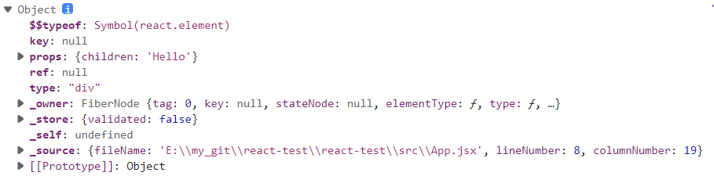

# 1 JSX简介

JSX（JavaScript XML） 是一个 JavaScript 的语法扩展，它具有 JavaScript 的全部功能。它看起来像是一种模板语言，实际上 JSX 并不是模板语言，而是对 JavaScript 语言的扩展。**JSX 基于 JavaScript 语言，所以它具备 JS 的全部能力（JS 能做的 JSX 都可以做，比如表达式计算），但又新增了某些能力（JS 不能做的 JSX 也可以做，比如自定义组件）。**

# 2 JSX本质

在React官网中有这样的解释：

**实际上，JSX 仅仅只是 `React.createElement(component, props, ...children)` 函数的语法糖。**如下 JSX 代码：

```jsx
<MyButton color="blue" shadowSize={2}>
  Click Me
</MyButton>
```

会编译为：

```js
React.createElement(
  MyButton,
  {color: 'blue', shadowSize: 2},
  'Click Me'
)
```

而返回的Element是React元素，是构成 React 应用的最小砖块。以`<div>Hello</div>`为例：



先忽略掉一些`ref/key`之类的属性，这个时候来看我们发现它其实就是一个`js`对象，记录了`type`表示元素类型。`props`表示元素的接受的`prop`,注意这里会将`jsx`内部标签内容插入到`props`的`children`属性中。

> 需要注意的是这里的`children`属性，如果内部标签元素存在多个子元素时候。`children`会是一个数组。因为这里仅仅只有文本节点，所以只有一个`Hello`。

# 3 JSX语法

jsx中`()`可以用来换行，即括号内的内容是可以在新的一行书写。

jsx语句中有三个核心的概念：标签名、props、子元素。对JSX语法的介绍也主要分为这三部分进行：

## 3.1 标签名

标签名指的是`<div>`中的div，在jsx中指定了 React 元素的类型：

* 大写字母开头的 JSX 标签意味着它们是 React 组件。这些标签会被编译为对命名变量的直接引用

* 小写字母表示HTML的原始标签

* 如果你确实需要一个以小写字母开头的组件，则在 JSX 中使用它之前，必须将它赋值给一个大写字母开头的变量。
  
  ```react
  import React from 'react';
  
  // Hello变量
  function Hello(props) {  
    return <div>Hello {props.toWhat}</div>;
  }
  
  function HelloWorld() {
    // 正确！React 知道 <Hello /> 是一个组件，因为它是大写字母开头的：  
    return <Hello toWhat="World" />;
   }
  ```

* 你不能将表达式作为 React 元素类型。如果你想通过通用表达式来（动态）决定元素类型，你需要首先将它赋值给大写字母开头的变量。这通常用于根据 prop 来渲染不同组件的情况下
  
  ```react
  import React from 'react';
  import { PhotoStory, VideoStory } from './stories';
  
  const components = {
    photo: PhotoStory,
    video: VideoStory
  };
  
  function Story(props) {
    // 正确！JSX 类型可以是大写字母开头的变量。  
      const SpecificStory = components[props.storyType];  
      return <SpecificStory story={props.story} />;
  }
  ```

::: tip

由于这些标签会被编译为对命名变量的直接引用，当你使用 JSX `<Foo />` 表达式时，`Foo` 必须包含在作用域内。同时由于 JSX 会编译为 `React.createElement` 调用形式，所以 `React` 库也必须包含在 JSX 代码作用域内。

:::

在 JSX 中，你也可以使用点语法来引用一个 React 组件。当你在一个模块中导出许多 React 组件时，这会非常方便。例如，如果 `MyComponents.DatePicker` 是一个组件，你可以在 JSX 中直接使用：

```react
import React from 'react';

const MyComponents = {
  DatePicker: function DatePicker(props) {
    return <div>Imagine a {props.color} datepicker here.</div>;
  }
}

function BlueDatePicker() {
  return <MyComponents.DatePicker color="blue" />;}
```

## 3.2 props

JSX中指定props的方式主要有以下几种：

1. **字符串字面量**：你可以将字符串字面量赋值给 prop，它的值是未转义的。
   
   ```react
   <MyComponent message="<3" />
   
   <MyComponent message={'<3'} />
   ```

2. **JavaScript 表达式**：你可以把包裹在 `{}` 中的 JavaScript 表达式作为一个 prop 传递给 JSX 元素。例如，如下的 JSX：
   
    `if` 语句以及 `for` 循环不是 JavaScript 表达式，所以不能在 JSX 中直接使用。但是，你可以用在 JSX 以外的代码中。比如：
   
   ```react
   function NumberDescriber(props) {
     let description;
     if (props.number % 2 == 0) {    
     description = <strong>even</strong>;  
     } else {    
     description = <i>odd</i>;  
     }  
     return <div>{props.number} is an {description} number</div>;
   }
   ```
   
    ::: warning
   
    因为 JSX 语法上更接近 JavaScript 而不是 HTML，所以 React DOM 使用 `camelCase`（小驼峰命名）来定义属性的名称，而不使用 HTML 属性名称的命名约定。
   
    例如，JSX 里的 `class` 变成了 [`className`](https://developer.mozilla.org/en-US/docs/Web/API/Element/className)，而 `tabindex` 则变为 [`tabIndex`](https://developer.mozilla.org/en-US/docs/Web/API/HTMLElement/tabIndex)。
   
    :::

3. **解构对象**：使用展开运算符 `...` 来在 JSX 中传递整个 props 对象。
   
    以下两个组件是等价的：
   
   ```react
   function App1() {
     return <Greeting firstName="Ben" lastName="Hector" />;
   }
   
   function App2() {
     const props = {firstName: 'Ben', lastName: 'Hector'};
     return <Greeting {...props} />;
   }
   ```
   
    你还可以选择只保留当前组件需要接收的 props，并使用展开运算符将其他 props 传递下去。
   
   ```react
   const Button = props => {
     const { kind, ...other } = props;  const className = kind === "primary" ? "PrimaryButton" : "SecondaryButton";
     return <button className={className} {...other} />;
   };
   
   const App = () => {
     return (
       <div>
         <Button kind="primary" onClick={() => console.log("clicked!")}>
           Hello World!
         </Button>
       </div>
     );
   };
   ```

4. **默认值**：prop默认值是 `true`。

## 3.3 子元素

包含在开始和结束标签之间的 JSX 表达式内容将作为特定属性 `props.children` 传递给外层组件。有几种不同的方法来传递子元素：

### 字符串字面量

你可以将字符串放在开始和结束标签之间，此时 `props.children` 就只是该字符串。这对于很多内置的 HTML 元素很有用。例如：

```react
<MyComponent>Hello world!</MyComponent>
```

`MyComponent` 中的 `props.children` 是一个简单的未转义字符串 `"Hello world!"`。

JSX 会移除行首尾的空格以及空行。与标签相邻的空行均会被删除，文本字符串之间的新行会被压缩为一个空格。因此以下的几种方式都是等价的：

```html
<div>Hello World</div>

<div>
  Hello
  World
</div>
```

### JSX 子元素

子元素允许由多个 JSX 元素组成。你可以将不同类型的子元素混合在一起，因此你可以将字符串字面量与 JSX 子元素一起使用。这对于嵌套组件非常有用：

```react
<MyContainer>
   Here is a list:
  <MyFirstComponent />
  <MySecondComponent />
</MyContainer>
```

React 组件也能够返回存储在数组中的一组元素：

```react
render() {
  // 不需要用额外的元素包裹列表元素！
  return [
    // 不要忘记设置 key :)
    <li key="A">First item</li>,
    <li key="B">Second item</li>,
    <li key="C">Third item</li>,
  ];
}
```

### JavaScript 表达式作为子元素

JavaScript 表达式可以被包裹在 `{}` 中作为子元素。这对于展示任意长度的列表非常有用。例如，渲染 HTML 列表：

```react
function Item(props) {
  return <li>{props.message}</li>;
}

function TodoList() {
  const todos = ['finish doc', 'submit pr', 'nag dan to review'];
  return (
    <ul>
      {todos.map((message) => <Item key={message} message={message} />)}    
    </ul>
  );
}
```

JavaScript 表达式也可以和其他类型的子元素组合。这种做法可以方便地替代模板字符串：

```react
function Hello(props) {
  return <div>Hello {props.addressee}!</div>;
}
```

### 函数作为子元素

通常，JSX 中的 JavaScript 表达式将会被计算为字符串、React 元素或者是列表。不过，`props.children` 和其他 prop 一样，它可以传递任意类型的数据，而不仅仅是 React 已知的可渲染类型。例如，如果你有一个自定义组件，你可以把回调函数作为 `props.children` 进行传递：

```react
// 调用子元素回调 numTimes 次，来重复生成组件
function Repeat(props) {
  let items = [];
  for (let i = 0; i < props.numTimes; i++) { 
      items.push(props.children(i));//调用子元素的函数
  }
  return <div>{items}</div>;
}

function ListOfTenThings() {
  return (
    <Repeat numTimes={10}>
      {(index) => <div key={index}>This is item {index} in the list</div>}    
    </Repeat>// 子元素是一个函数
  );
}
```

你可以将任何东西作为子元素传递给自定义组件，只要确保在该组件渲染之前能够被转换成 React 理解的对象。

### 布尔类型、Null 以及 Undefined 将会忽略

`false`, `null`, `undefined`, and `true` 是合法的子元素。但它们并不会被渲染。以下的 JSX 表达式渲染结果相同：

```html
<div/>
<div></div>
<div>{false}</div>
<div>{null}</div>
<div>{undefined}</div>
<div>{true}</div>
```

这有助于依据特定条件来渲染其他的 React 元素。例如，在以下 JSX 中，仅当 `showHeader` 为 `true` 时，才会渲染 `<Header />` 组件：

```react
<div>
  {showHeader && <Header />}  <Content />
</div>
```

值得注意的是有一些 [“falsy” 值](https://developer.mozilla.org/en-US/docs/Glossary/Falsy)，如数字 `0`，仍然会被 React 渲染。因此需要确保 `&&` 之前的表达式总是布尔值：

```react
<div>
  {props.messages.length > 0 &&  <MessageList messages={props.messages} />}
</div>
```

反之，如果你想渲染 `false`、`true`、`null`、`undefined` 等值，你需要先将它们[转换为字符串](https://developer.mozilla.org/en-US/docs/Web/JavaScript/Reference/Global_Objects/String#String_conversion)：

```react
<div>
  My JavaScript variable is {String(myVariable)}.
</div>
```
