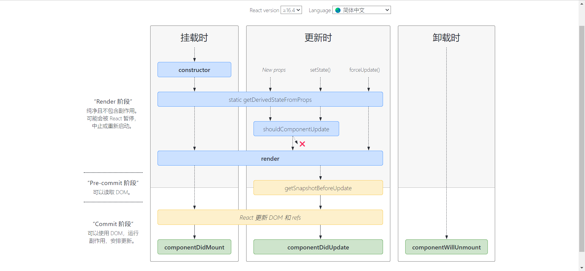

组件，从概念上类似于 JavaScript 函数。它接受任意的入参（即 “props”），并返回用于描述页面展示内容的 React 元素。

# 1 组件生命周期

React v16.4后的生命周期如图所示



> 一张v17之前与之后的对比图：
> 
> 
> 
> *红色为 React 17 已经废弃的生命周期钩子，绿色为新增的生命周期钩子*

根据阶段可以将生命周期的API分为三个阶段：

* render：纯净且不包含副作用。可能会被 React 暂停，中止或重新启动。

* pre-render：可以读取 DOM。

* commit：可以使用 DOM，运行副作用，安排更新。

## 1.1 Render API

* `constructor`：该方法只会执行一次，调用该方法会返回一个组件实例。
  
  * 初始化阶段执行，可直接对 `this.state` 赋值。其他生命周期函数中只能通过 `this.setState` 修改 state，不能直接为 `this.state` 赋值。
  
  * 如果不初始化 state 或不进行方法绑定，则不需要为 React 组件实现构造函数。
  
  * 在为 React.Component 子类实现构造函数时，应在其他语句之前调用 `super(props)`。
  
  * **避免将 props 的值复制给 state！这是一个常见的错误，如此做毫无必要（你可以直接使用 `this.props.color`）：**
    
    ```js
    constructor(props) {
     super(props);
     // 不要这样做
     this.state = { color: props.color };
    }
    ```

* `getDerivedStateFromProps(不常用)`：
  
  它是一个**静态方法**，接收 props 和 state 两个参数。它会在调用 render 方法之前被调用，不管是在初始挂载时还是在后续组件更新时都会被调用。
  
  它的调用时机和 `componentWillMount、componentWillUpdate、componentWillReceiveProps `一样都是在 render 方法被调用之前，它可以作为 `componentWillMount、componentWillUpdate 和 componentWillReceiveProps` 的替代方案。
  
  当然，它的作用不止如此，它可以返回一个对象，用来更新 state，就像它的名字一样，从 props 中获取衍生的 state。如果不需要更新 state 则可以返回 null。
  
  这个生命周期函数是**类的静态方法**，并不是原型中的方法，所以在其内部使用 this 访问到的不是组件实例。

* `shouldComponentUpdate`：
  
  **在组件准备更新之前调用，但是首次渲染或者使用 forceUpdate 函数时不会被调用。判断 React 组件的输出是否受当前 state 或 props 更改的影响。**
  
  默认情况下，当组件的 props 或者 state 变化时，都会导致组件更新。它在 render 方法之前执行，如果它的返回值为 false，则不会更新组件，也不会执行后面的 render 方法。
  
  它接收两个参数，nextProps 和 nextState，即下一次更新的 props 和下一次更新的 state。我们可以将 `this.props` 和 nextProps 比较，以及将 `this.state` 与 nextState 比较，并返回 false，让组件跳过更新。不过注意：它并不会阻止子组件因为 state 改变而导致的更新。
  
  此方法仅作为性能优化的方式而存在。不要依靠此方法来“阻止”渲染，因为这可能会产生 bug。你应该考虑使用内置的 PureComponent组件，而不是手动编写 `shouldComponentUpdate()`。`PureComponent` 会对 props 和 state 进行浅层比较，并减少了跳过必要更新的可能性。

* `render`：是 class 组件中唯一必须实现的方法。
  
  当 `render` 被调用时，它会检查 `this.props` 和 `this.state` 的变化并返回以下类型之一：
  
  - **React 元素**。通常通过 JSX 创建。例如，`<div />` 会被 React 渲染为 DOM 节点，`<MyComponent />` 会被 React 渲染为自定义组件，无论是 `<div />` 还是 `<MyComponent />` 均为 React 元素。
  - **数组或 fragments**。 使得 render 方法可以返回多个元素。[fragments](https://zh-hans.reactjs.org/docs/fragments.html) 
  - **Portals**。可以渲染子节点到不同的 DOM 子树中。[portals](https://zh-hans.reactjs.org/docs/portals.html)
  - **字符串或数值类型**。它们在 DOM 中会被渲染为文本节点。
  - **布尔类型或 `null`**。什么都不渲染。（主要用于支持返回 `test && <Child />` 的模式，其中 test 为布尔类型。)
  
  `render()` 函数应该为纯函数，这意味着在不修改组件 state 的情况下，每次调用时都返回相同的结果，并且它不会直接与浏览器交互。如需与浏览器进行交互，请在 `componentDidMount()` 或其他生命周期方法中执行你的操作。保持 `render()` 为纯函数，可以使组件更容易思考。

## 1.2 commit API

commit 阶段在首次渲染时会执行 componentDidMount，在组件更新时会执行 getSnapshotBeforeUpdate 和 componentDidUpdate。

* `getSnapshotBeforeUpdate`：此生命周期函数在最近一次渲染提交至 DOM 树之前执行，此时 DOM 树还未改变，我们可以在这里获取 DOM 改变前的信息，例如：更新前 DOM 的滚动位置。
  
  它接收两个参数，分别是：`prevProps、prevState`，上一个状态的 props 和上一个状态的 state。**它的返回值将会传递给 componentDidUpdate 生命周期钩子的第三个参数**
  
  使用场景：需要获取更新前 DOM 的信息时。例如：需要以特殊方式处理滚动位置的聊天线程等。

* `componentDidMount`：该生命周期方法会在组件挂载之后执行，也只会执行一次，也就是将组件对应的 DOM 插入 DOM 树中之后调用。它会在浏览器更新视图之前调用，**如果在 componentDidMount 中直接调用`this.setState`，它会触发额外的渲染，会再一次调用 render 函数，但是浏览器中视图的更新只会执行一次。**
  
  使用场景：依赖于 DOM 的初始化操作应该放在这里，此外，我们一般在这个生命周期方法实例化网络请求、添加订阅等。

* `componentDidUpdate`：在组件更新后立即调用，首次渲染不会调用该方法。**可以在这个生命周期中直接调用 `this.setState`，但是必须包裹在一个条件语句中，否则会导致死循环。**
  
  componentDidUpdate 接收三个参数，分别是 `prevProps、prevState、snapshot`，即：前一个状态的 props，前一个状态的 state、`getSnapshotBeforeUpdate` 的返回值。
  
  使用场景：在这个生命周期方法中，可以对 DOM 进行操作或者进行网络请求。

* `componentWillUnmount`：这个生命周期函数会在组件卸载以及销毁之前调用。**不应调用 `setState()`**，因为该组件将永远不会重新渲染。
  
  使用场景：通常用来执行组件的清理操作，例如，清除 timer，取消网络请求或清除在 `componentDidMount()` 中创建的订阅等。

# 2 类组件

类组件是基于ES6的class来定义的通过继承`React.Component` 得来的 React 组件。类组件提供了所有的生命周期的实例方法以及一些额外的 API：

- setState()：
  
  `setState()` 将对组件 state 的更改排入队列，并通知 React 需要使用更新后的 state 重新渲染此组件及其子组件。这是用于更新用户界面以响应事件处理器和处理服务器数据的主要方式
  
  > 应该将 `setState()` 视为**请求**而不是立即更新组件的命令。`setState()` 并不总是立即更新组件。它会批量推迟更新。这使得在调用 `setState()` 后立即读取 `this.state` 成为了隐患。为了消除隐患，请使用 `componentDidUpdate` 或者 `setState` 的回调函数（`setState(updater, callback)`），这两种方式都可以保证在应用更新后触发。
  
  `setState()`有两个参数：
  
  参数一为带有形式参数的 `updater` 函数或对象：
  
  ```js
  //函数方式根据 props.step 来增加 state
  this.setState((state, props) => {
    return {counter: state.counter + props.step};
  });
  
  //stateChange 会将传入的对象浅层合并到新的 state 中，例如，调整购物车商品数：
  this.setState({quantity: 2})
  ```
  
  **如果后续状态取决于当前状态，我们建议使用 updater 函数的形式代替对象形式**：

- forceUpdate()：
  
  默认情况下，当组件的 state 或 props 发生变化时，组件将重新渲染。如果 `render()` 方法依赖于其他数据，则可以调用 `forceUpdate()` 强制让组件重新渲染。通常你应该避免使用 `forceUpdate()`，尽量在 `render()` 中使用 `this.props` 和 `this.state`。
  
  调用 `forceUpdate()` 将致使组件调用 `render()` 方法，此操作会跳过该组件的 `shouldComponentUpdate()`。但其子组件会触发正常的生命周期方法，包括 `shouldComponentUpdate()` 方法。如果标记发生变化，React 仍将只更新 DOM。

class 属性

- defaultProps：
  
  `defaultProps` 可以为 Class 组件添加默认 props。这一般用于 props 未赋值，但又不能为 `null` 的情况。例如：
  
  ```js
  class CustomButton extends React.Component {
    // ...
  }
  
  CustomButton.defaultProps = {
    color: 'blue'
  };
  ```

- displayName：`displayName` 字符串多用于调试消息。如果调试时需要显示不同的名称或创建高阶组件

实例属性

- props：组件标签上的属性对象，需特别注意，`this.props.children` 是一个特殊的 prop，通常由 JSX 表达式中的子组件组成，而非组件本身定义。
- state：组件中的 state 包含了随时可能发生变化的数据。state 由用户自定义，它是一个普通 JavaScript 对象。如果某些值未用于渲染或数据流（例如，计时器 ID），则不必将其设置为 state。此类值可以在组件实例上定义。永远不要直接改变 `this.state`

## 纯组件

类组件分为普通类组件(React.Component)以及纯类组件(React.PureComponent)。

```js
// Component
class Welcome extends React.Component {
    render() {
        return <h1>Hello, {this.props.name}</h1>;
    }
}
```

```js
// PureComponent
class Welcome extends React.PureComponent {
    render() {
        return <h1>Hello, {this.props.name}</h1>;
    }
}
```

`React.Component`和`React.PureComponent`区别  

先了解下React生命周期函数shouldComponentUpdate，这个函数返回一个布尔值，如果返回true，那么当props或state改变的时候进行更新；如果返回false，当props或state改变的时候不更新，默认返回true。这里的更新不更新，其实说的是执不执行`render`函数，如果不执行render函数，那该组件和其子组件都不会重新渲染。  

区别：

- 1、继承PureComponent时，不能再重写shouldComponentUpdate  

- 2、React.PureComponent基于shouldComponentUpdate做了一些优化，通过prop和state的浅比较来实现shouldComponentUpdate，也就是说，如果是引用类型的数据，只会比较是不是同一个地址，而不会比较具体这个地址存的数据是否完全一致。  

因此：仅在你的 props 和 state 较为简单时，才使用 `React.PureComponent`，或者在深层数据结构发生变化时调用 [`forceUpdate()`](https://zh-hans.reactjs.org/docs/react-component.html#forceupdate) 来确保组件被正确地更新。此外，`React.PureComponent` 中的 `shouldComponentUpdate()` 将跳过所有子组件树的 prop 更新。因此，请确保所有子组件也都是“纯”的组件。

```js
class ListOfWords extends React.PureComponent {
 render() {
     return <div>PureComponent渲染结果:{this.props.words.join(',')}</div>;
 }
}
class WordAdder extends React.Component {
 constructor(props) {
     super(props);
     this.state = {
         words: ['marklar']
     };
     this.handleClick = this.handleClick.bind(this);
 }
 handleClick() {
     // This section is bad style and causes a bug
     const words = this.state.words;
     words.push('marklar');
     this.setState({words: words});
 }
 render() {
    // slice() 方法返回一个新的数组对象
     return (
         <div>
            <button onClick={this.handleClick}>click</button>
            <div>Component渲染结果:{this.state.words.join(',')}</div>
             <ListOfWords words={this.state.words} />
             <ListOfWords words={this.state.words.slice(0)} />
         </div>
     );
 }
}
ReactDOM.render(
  <WordAdder />,
  document.getElementById('root')
);
```

# 3 函数组件初步

早期并没有 React-Hooks 的加持，函数组件内部无法定义和维护 state，因此它还有一个别名叫“无状态组件”。以下是一个典型的函数组件：

```js
function DemoFunction(props) {
  const { text } = props
  return (
    <div className="demoFunction">
      <p>{`function 组件所接收到的来自外界的文本内容是：[${text}]`}</p>
    </div>
  );
}
```

特点：

- 只负责接收 props，渲染 DOM
- 没有 state
- 返回了一个 React 元素
- 不能访问生命周期方法
- 不需要显示声明 this 关键字：在 ES6 的类声明中往往需要将函数的 this 关键字绑定到当前作用域，而因为函数式声明的特性，我们不需要再强制绑定。

# 参考

[React（二）：类组件、函数式组件 - 掘金](https://juejin.cn/post/6844903735043293191)

[React 生命周期详解 - 掘金 (juejin.cn)](https://juejin.cn/post/7096137407409422344)
