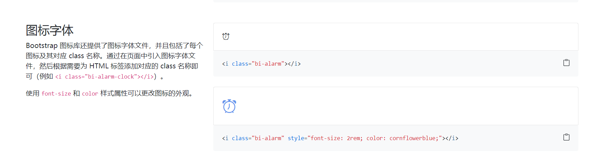
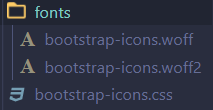

为了组件库的整体性，考虑编写一个通用的icon组件用于方便的引入图标，同时引入一个开源的图标库作为组件库的图标来源。

开源图标库的选择方面我选择的是bootstrap-icon，主要在后期打包时在public文件夹下的图标无法打包，想要在组件库中引入必须将每个svg图标编写为vue组件，再导入。这样的作法对于庞大的svg图标库显然非常麻烦。

bootstrap-icon有个非常方便的特性——它可以通过字体的形式导入，只需要提供class名，这样就可以解决通用icon组件的问题而不需要为了每个图标编写一个组件。



我们只需要下载bootstrap-icon的字体图标文件，导入到组件中即可：



## 主要代码

icon.vue：

```vue
<template>
  <i :class="[`bi-${name}`]" :style="style" v-bind="$attrs">
    <!-- <slot></slot> -->
  </i>
</template>

<script lang='ts'>
import {defineComponent,computed, CSSProperties} from 'vue'
import { iconProps } from './icon'
import './bootstrap-icons.css'

export default defineComponent({
  name:'scene-icon',
  props: iconProps,
  setup(props,ctx){
    // 图标的样式
    const style = computed<CSSProperties>(() => {
      if (!props.size && !props.color) return {}
      return {
        fontSize: typeof props.size === 'number'?props.size+'px':props.size,
        color: props.color,
      }
    })

    return {
      style
    }
  }
})
</script>
```

icon.ts：

```typescript
export const iconProps = {
    name:{
        type: String,
    },
    size:{
        type: [String,Number],
        validate(value:string | number){
            if(typeof value === 'number')
                return value > 0
            else
                return true
        }
    },
    color:{
        type: String,
    }
}
```
