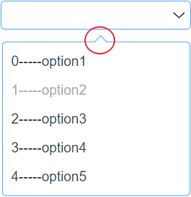
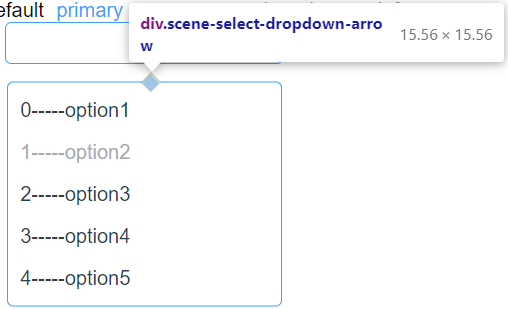

HTML原生的select组件虽然功能尚可，但是缺乏扩展与美化的方法，因此需要自己使用其他基本组件组合一个Select组件出来，本篇记录自己完成select组件的全过程，分为单选与多选两个模块：

## 单选

定义select的props如下：

```typescript
import { isString, isBooleanArray } from "../../core/utils/typeAssert"

export const selectProps = {
    modelValue:{//选择器绑定的值
        type:[String,Number,Boolean,Array],
        required: true,
    },
    options:{// 选择器的选项
        type: Array,
        required: true,
        validator(value: string[]){
            return value.length>0
        }
    },
    disabledOptions:{
        type: Array,
        default:[],
        validator(value: boolean[]){
            return isBooleanArray(value)
        }
    },
    name:{//随表单一起提交的原生的name属性
        type: String,
        required: true,
    },
    disabled:{//选项有禁用状态
        type: Boolean,
        default: false
    },
    placeholder:{
        type: String,
        default: 'Select',
    },
    multiple:{// 是否多选
        type: Boolean,
        default: false
    },
    multipleLimit:{// 多选的最大选择数
        type: Number,
        default: 0
    },
    collapseTags:{// 多选时是否将选中值按文字的形式展示
        type: Boolean,
        default: false
    }
}


export const selectEmits = {
    change: (val: string) => isString(val),
    blur: (e: FocusEvent) => e instanceof FocusEvent,
    focus: (e: FocusEvent) => e instanceof FocusEvent,
    'update:modelValue': (val: string | string[]) => true
}
```

基本的单选框的HTML结构设计如下：最外层是组件的div，用一个只读的输入框展示选项，左边还有一个svg图标，这两个组成选择器的主体。

接下来隐藏两个列方向排列的div，其中第一个用来画三角形，另一个作为选项的展示区域，v-for循环插入插槽

```html
<div>
        <!-- 单选输入框 -->
        <input id="scene-select-input" type="text" readonly/>
    	<!-- 箭头图标 -->
        
        <!-- 选择器的隐藏部分 -->
        <div class="scene-select-dropdown-arrow"></div>
        <div class="scene-select-dropdown-menu">
            <div>
                <!-- 作用域插槽，对外暴露 option 与 index -->
                <slot></slot>
            </div>
        </div>
</div>
```

### 箭头的旋转用CSS实现

该效果是当用户点击选择器是选择器左边的箭头旋转180°，选择器失去焦点时箭头恢复。

根据模板里的class与id，`#scene-select-input:focus+#scene-select-icon`表示当id为scene-select-input的元素获取焦点时，+表示相邻的id为scene-select-icon的元素旋转180°。同时设置transition规定动画的事件与曲线即可。

```css
/* 选择器的按钮 */
#scene-select-icon{
    width: calc(10% - 4px); /** 22px - 4px */
    height: calc(100% - 4px); /** 32px -4px  */
    margin-right: 4px;
    transition: transform 0.5s ease;
}

#scene-select-input:focus+#scene-select-icon{
    transform: rotate(180deg);
}
```

### 作用域插槽实现插入HTML模板 

利用作用域插槽暴漏一些数据给最外层作用域可以实现用户自定义选项模板。Vue3官方的作用域插槽的教程：[插槽 | Vue.js (vuejs.org)](https://v3.cn.vuejs.org/guide/component-slots.html)

从组件的props.options获取所有的选项，在slot插槽中申明option与index两个属性

```html
<div class="scene-select-dropdown-menu" ref="menu">
            <div v-for="(option,index) of options" :key="index" class="scene-select-dropdown-menu-option">
                <!-- 作用域插槽，对外暴露 option 与 index -->
                <slot :option="option" :index="index"></slot>
            </div>
</div>
```

这样在使用组件时，只要使用v-slot="slotProps"命令，就可以在模板内取得option与index的值：

```html
<s-select :options="options">
      <template v-slot="slotProps">
        <span>
          {{slotProps.index}}-----{{slotProps.option}}
        </span>
      </template>
</s-select>
```

### 三角指向区域的制作

三角形的指向区域如下图所示



实现该效果的方法为，将一个正方形的div旋转45°，同时设置该div的z-index大于选项菜单的div，达到遮盖边框的效果，如下图所示：



```css
/* 选择器的箭头 */
.scene-select-dropdown-arrow{
    width: 10px;
    height: 10px;
    background: white;
    border-top: var(--scene-border-size) solid var(--scene-border-color-light);
    border-right: var(--scene-border-size) solid var(--scene-border-color-light);
    transform: rotate(-45deg);
    z-index: var(--scene-index-advanced);
}
/* 选择器的选项区域 */
.scene-select-dropdown-menu{
    background: white;
    width: 220px; /** 220px - 1px * 2  */
    height: 190px; /** 190px - 5px*2 - 1px*2 */
    box-sizing: border-box;
    z-index: var(--scene-index-heighter);
    border: var(--scene-border-size) solid var(--scene-border-color-light);
    box-shadow: var(--scene-box-shadow);
    border-radius: var(--scene-border-radius);
}
```

### 选项菜单的位置

对于下拉的选项菜单，采用绝对布局更加方便，因为绝对布局**元素会被移出正常文档流，并不为元素预留空间**，通过指定元素相对于最近的非 static 定位祖先元素的偏移，来确定元素位置。通过设定最外层div的position:relative设置该元素为position:absolute的元素的相对位置元素。

再通过top=选择器主体的高来定位元素到选择器正下方。

```css
/* 选择器的箭头 */
.scene-select-dropdown-arrow{
	position: absolute;
    width: 10px;
    height: 10px;
    top: calc(100%);
    left: calc(50%);
}
/* 选择器的选项区域 */
.scene-select-dropdown-menu{
	position: absolute;
    z-index: var(--scene-index-heighter);
    top: calc(100% + 5px);
    left: -3px;
}
```

### 实现淡入淡出

查阅资料，主要有三种可以配合transition属性实现淡入淡出的CSS样式变化，各有优缺点：

1. display none➡️display:block：没有动画效果，隐藏后无法点击
2. opacity=0➡️opacity=1 + translateY：有动画效果，隐藏后可点击
3. opacity=0 visiavility=hidden➡️opacity=1 visiability=visible + translateY ：有动画效果，隐藏后无法点击

因此采用第三种方法

```css
/* 选择器的箭头 */
.scene-select-dropdown-arrow{
    visibility: hidden;
    transition: all 0.5s ease;
}
/* 选择器的选项区域 */
.scene-select-dropdown-menu{
    visibility: hidden; /** 占用空间但点击无效 */
    transition: all 0.5s ease;
}
/* 点击获取焦点显示选项 */
#scene-select-input:focus~.scene-select-dropdown-menu{
    opacity: 1;
    transform: translateY(10px);
    visibility:visible
}
#scene-select-input:focus~.scene-select-dropdown-arrow{
    opacity: 1;
    transform: translateY(10px) rotate(-45deg) ;
    visibility:visible
}
#scene-select-input:focus+#scene-select-icon{
    transform: rotate(180deg);
}
```

### 选中样式保存

给每个选项绑定一个mousedown事件，当点击时，利用DOM Element的setAttribute给选中的div添加一个selected="true"的属性

```typescript
const handleSelect = ()=>{
        // 每一个选项的div集合
        let optionColleaction: HTMLCollection = menu.value!.children //非空断言
        if(optionColleaction.length > 0 ){
            // 存在选项 给每个选项注册click监听器
            for(let i=0;i<optionColleaction?.length;i++){
                //每个选项的div 绑定点击事件，点击时切换v-model值
                optionColleaction.item(i)?.addEventListener('mousedown',(e:Event)=>{
                    if(props.options && (props.disabledOptions.length === 0 || !props.disabledOptions[i])){
                        // 给当前选项div设置selected 
                        optionColleaction.item(i)?.setAttribute('selected','true')
                    }  
                })
            }
        }
})
```

对于设置的selected="true"的属性的div设置单独的css样式

```css
/* 选中 */
.scene-select-dropdown-menu-option[selected="true"]{
    color:#409EFF
}
```

### disabld项实现

在组件挂载完成时检查props中的disabledOptions数组，给对应的选项的div设置disabled属性

```typescript
onMounted(()=>{
        // 每一个选项的div集合
        let optionColleaction: HTMLCollection = menu.value!.children //非空断言
        
        if(optionColleaction.length > 0 ){
            // 检查disabledOptions
            if(props.disabledOptions.length > 0){
                // 需要给某些项选设置disabled属性
                props.disabledOptions.forEach((item,index)=>{
                    if(item){
                        // 设置样式
                        optionColleaction.item(index)?.setAttribute('disabled','true') 
                    }
                        
                })
            }
        }
})
```

针对被禁用的项，设置css样式：

```css
/* 被禁用 */
.scene-select-dropdown-menu-option[disabled="true"]{
    cursor:not-allowed;
    color:#a8abb2;
}
```

### 源码

到目前位置我们已经实现了单选的功能，完整源码如下，下一节实现多选时要进行对比：

```vue
<template>
    <div class="scene-select"
        :disabled="disabled"
        :multiple="multiple"
        :multiple-limit="multipleLimit"
        :collapseTags="collapseTags"
    >
        <!-- 单选输入框 -->
        <input id="scene-select-input" type="text" readonly
            ref="input"
            v-model="modelValue"
            :name="name"
            :placeholder="placeholder"
            @focus="handleFocus"
            @blur="handleBlur"
        />
        
            <!-- 选择器的隐藏部分 -->
        <div class="scene-select-dropdown-arrow"></div>
        <div class="scene-select-dropdown-menu" ref="menu">
            <div v-for="(option,index) of options" :key="index" class="scene-select-dropdown-menu-option">
                <!-- 作用域插槽，对外暴露 option 与 index -->
                <slot :option="option" :index="index"></slot>
            </div>
        </div>
    </div>
</template>

<script lang='ts'>
import {defineComponent, onMounted, reactive, ref, toRefs} from 'vue'
import {selectProps, selectEmits} from './select'


export default defineComponent({
  name:'scene-select',
  props:selectProps,
  emits:selectEmits,
  setup(props,{emit,attrs,slots,expose}){
    // 选择器的选择区域 html引用
    const menu = ref<HTMLElement>()
    // input html引用
    const input = ref<HTMLInputElement>()
    
    // 清除选项div上的select伪类
    const clearSelectSign = ()=>{
        // 每一个选项的div集合
        let optionColleaction: HTMLCollection = menu.value!.children //非空断言

        if(optionColleaction.length > 0 ){
            for(let i=0;i<optionColleaction?.length;i++){
                optionColleaction.item(i)?.removeAttribute('selected')
            }
        }
    }

    onMounted(()=>{
        // 每一个选项的div集合
        let optionColleaction: HTMLCollection = menu.value!.children //非空断言
        
        if(optionColleaction.length > 0 ){
            // 存在选项 给每个选项注册click监听器
            for(let i=0;i<optionColleaction?.length;i++){
                //每个选项的div 绑定点击事件，点击时切换v-model值
                optionColleaction.item(i)?.addEventListener('mousedown',(e:Event)=>{
                    if(props.options && (props.disabledOptions.length === 0 || !props.disabledOptions[i])){
                        // 清除所有div上的selected attribute
                        clearSelectSign()
                        // 给当前选项div设置selected 
                        optionColleaction.item(i)?.setAttribute('selected','true')
                        emit('change',props.options[i] as string)
                        handleClick(props.options[i] as string)
                    }  
                })
            }

            // 检查disabledOptions
            if(props.disabledOptions.length > 0){
                // 需要给某些项选设置disabled属性
                props.disabledOptions.forEach((item,index)=>{
                    if(item){
                        // 设置样式
                        optionColleaction.item(index)?.setAttribute('disabled','true') 
                    }
                        
                })
            }

        }else{
            // 不存在选项
            let text = document.createTextNode('No Options!')
            let div = document.createElement('div')
            div.setAttribute('class','scene-select-no-options')
            div.appendChild(text)
            menu.value?.appendChild(div)
        }
    })

    // 点击选项的click事件
    const handleClick = (val:string)=>{
        emit('update:modelValue',val)
    }
    // 触发外层绑定Focus事件
    const handleFocus = (event: MouseEvent) => {
        // isOpen.value = true
        emit('focus', event)
    }
    // 触发外层绑定Blur事件
    const handleBlur = (event: MouseEvent) => {
        // setTimeout(()=>{console.log('blur');},1000)
        emit('blur', event)
    }

    // 暴漏给外部的方法
    const focus = () => {
      input.value?.focus?.()
    }
    const blur = () => {
      input.value?.blur?.()
    }

    return{
        menu,
        input,
        focus,
        blur,
        handleFocus,
        handleBlur,
    }
  }
})
</script>
<style scoped>
/* 选择器主体 */
.scene-select{
    display: inline-flex;
    width: 220px;
    height: 32px;
    position: relative; /** 定位该元素是子元素中设置了position：absolute的相对父元素*/
    justify-content: space-between;
    align-items: center;
    border: #409EFF 1px solid;
    border-radius: 5px;
}
/* 选择器的输入框 */
#scene-select-input{
    outline: none;
    border: none;
    width: calc(90% - 10px); /** 198px - 10px*/
    height: calc(100%); /** 32px */
    padding: 0 0 0 10px;
    border-radius: 5px;
}
/* 多选情况下的tag容器 */
#scene-select-multiple-container{
    position: absolute;
    background: #409EFF;

    outline: none;
    border: none;
    width: calc(90% - 20px); /** 198px - 10px*/
    height: calc(100%); /** 32px */
    padding: 0 0 0 10px;
    border-radius: 5px;
    
}
/* 选择器的按钮 */
#scene-select-icon{
    width: calc(10% - 4px); /** 22px - 4px */
    height: calc(100% - 4px); /** 32px -4px  */
    margin-right: 4px;
    transition: transform 0.5s ease;
}
/* 选择器的箭头 */
.scene-select-dropdown-arrow{
    /* display: none; */
    visibility: hidden;
    position: absolute;
    width: 10px;
    height: 10px;
    background: white;
    top: calc(100%);
    left: calc(50%);
    border-top: #409EFF 1px solid;
    border-right: #409EFF 1px solid;
    transform: rotate(-45deg);
    z-index: -1;
    opacity: 0;
    transition: all 0.5s ease;
}
/* 选择器的选项区域 */
.scene-select-dropdown-menu{
    /* display: none; */
    visibility: hidden; /** 占用空间但点击无效 */
    position: absolute;
    width: 218px; /** 200px - 1px * 2  */
    height: 168px; /** 190px - 5px*2 - 1px*2 */
    border:#409EFF 1px solid;
    border-radius: 5px;
    top: calc(100% + 5px);
    padding: 5px 0;
    z-index: -2;
    opacity: 0;
    transition: all 0.5s ease;
}
/* 选择器具体的选项 */
.scene-select-dropdown-menu-option{
    width: calc(100% - 20px);
    height: 20%;
    padding: 0 10px;
    display: flex;
    justify-content: flex-start;
    align-items: center;
    /* 文字溢出处理 */
    overflow: hidden
}
/* 被禁用 */
.scene-select-dropdown-menu-option[disabled="true"]{
    cursor:not-allowed;
    color:#a8abb2;
}
/* 选中 */
.scene-select-dropdown-menu-option[selected="true"]{
    color:#409EFF
}
/* 悬浮 */
.scene-select-dropdown-menu-option:hover{
    background: #f5f7fa;
}
/* 点击获取焦点显示选项 */
#scene-select-input:focus~.scene-select-dropdown-menu{
    opacity: 1;
    transform: translateY(10px);
    visibility:visible
    /* display: block; */
}
#scene-select-input:focus~.scene-select-dropdown-arrow{
    opacity: 1;
    transform: translateY(10px) rotate(-45deg) ;
    visibility:visible
    /* display: block; */
}
#scene-select-input:focus+#scene-select-icon{
    transform: rotate(180deg);
}

/* 没有选项时的提示 */
.scene-select-no-options{
    width: calc(100% - 20px);
    min-height: 100%;
    padding: 0 10px;
    display: flex;
    justify-content: center;
    align-items: center;
}
</style>
```

## 多选

添加多选功能时，需要有一个显示多选结果的区域，该区域分为两个部分，左边显示最后一个选择的选项，右边显示选择的选项数与封顶次数

```html
<template>
    <div class="scene-select">
        <!-- 单选输入框 -->
        <input id="scene-select-input" type="text" readonly/>
        <!-- 多选tag组 -->
        <div id="scene-select-multiple-container"
            v-if="multiple"
            @click="focus"
        >   
            <div v-if="showTags" class="scene-select-multiple-tag">
                <span>{{selectedItems[selectedItems.length-1]}}</span>
                
            </div>
            <div v-if="showTags" class="scene-select-multiple-count">
                <span>+{{selectedItems.length}}/{{multipleLimit}}</span>
            </div>
        </div>
        <!-- 图标  -->
        
        <!-- 选择器的隐藏部分 -->
        <div class="scene-select-dropdown-arrow"></div>
        <div class="scene-select-dropdown-menu" ref="menu">
            <div v-for="(option,index) of options" :key="index" class="scene-select-dropdown-menu-option" :tabindex="-1">
                <div v-if="options.length === 0" class="scene-select-no-options">
                    No Options!
                </div>
                <div v-for="(option,index) of options" :key="index" class="scene-select-dropdown-menu-option" :tabindex="-1" @mousedown="handleSelect(option,index,$event)">
                    {{option}}
                </div> 
            </div>
        </div>
    </div>
</template>
```

### 存储多选结果

在多选的情况下，我们就不能只简单的拿选择的选项来修改modelValue来实现更新，而是需要存储已选择的结果，后期为了正确删除，还需要按选择顺序存储选项的index。

这里我们用两个响应性数组来实现这些功能，同时添加两个计算属性：

```typescript
// 多选的选项容器
let selectedItems = ref<string[]>([]);
// 多选框的选项容器的index
let selectedItemsIndex = ref<number[]>([]);
// 是否展示多选tags组
let showTags = computed(()=>{
    return selectedItems.value.length > 0
})
// 已选择的选项的数目
let selectedCount = computed(()=>{
    return selectedItems.value.length
})
```

设计一个函数实现操作这些数组的功能，命名为handleClick()，其接受三个可选参数：

* val表示选项代表的值
* isMultiple表示是否是多选触发了该函数
* index是一个可选参数，表示选项的索引

单选情况下数组只需要存储一个值，每次添加清空数组再插入；多选分为插入与删除，如果调用函数时有index参数，则为删除，否则为插入。同时触发组件的change事件。

```typescript
// 点击选项的click事件——添加选项到容器中，修改相应性数据
const handleClick = (val: string,isMultiple: boolean,index?: number,)=>{ 
	if(isMultiple){
        // 如果有index 说明容器内没有该选项,添加
        // 反之，移除val
        if(index !== undefined){
            selectedItems.value.push(val)
            selectedItemsIndex.value.push(index)
            emit('update:modelValue',selectedItems.value)
        }else{
            // 获取该项的index
            let index = selectedItems.value.indexOf(val)
            // 从容器中删除该项
            selectedItems.value.splice(index,1)
            selectedItemsIndex.value.splice(index,1)
            emit('update:modelValue',selectedItems.value)
        }
    }else{
        // 如果是单选的点击，清空容器在push
        selectedItems.value.splice(0,selectedItems.value.length)
        selectedItemsIndex.value.splice(0,selectedItemsIndex.value.length)
        selectedItems.value.push(val)
        selectedItemsIndex.value.push(index!)
        emit('update:modelValue',val)
    } 
}
```

### 多选样式保存

单选时主要依靠DOM Element.setAttribute与CSS控制样式，多选时因为选项可以重复点击，因此编写两个函数代表选中与取消选中这两个过程：

```typescript
// 选择器的选择区域 html引用
const menu = ref<HTMLElement>()

// 清除选项div上的select伪类 index: 选项的索引
const clearSelectSign = (index?:number)=>{
// 每一个选项的div集合
let optionColleaction: HTMLCollection = menu.value!.children //非空断言
if(index !== undefined){
        optionColleaction.item(index)?.removeAttribute('selected')
    }else{
        if(optionColleaction.length > 0 ){
            for(let i=0;i<optionColleaction?.length;i++){
                optionColleaction.item(i)?.removeAttribute('selected')
            }
        }
    }
}
// 设置选项div上的select伪类 index: 选项的索引
const setSelectSign = (index: number)=>{
    // 每一个选项的div集合
    let optionColleaction: HTMLCollection = menu.value!.children //非空断言
    optionColleaction.item(index)?.setAttribute('selected','true')
}
```

CSS的样式相较于单选没有变化。

### 展示多选结果以及删除

多选的tag组所在的div的采用绝对布局，宽度与高度都与input相同，遮罩住了原本的input输入框，因此绑定点击事件为input获取焦点，触发下拉菜单。

```css
/* 多选情况下的tag容器 */
#scene-select-multiple-container{
    position: absolute;
    background: white;
    outline: none;
    border: none;
    width: calc(90% - 10px); /** 198px - 10px*/
    min-height: calc(100%); /** 32px */
    padding: 0 0 0 10px;
    border-radius: 5px;

    display: flex;
    flex-wrap: wrap;
    flex-direction: row;
    justify-content: flex-start;
    align-content: center;
    
}
/* 多选情况下的tag */
.scene-select-multiple-tag{
    background: #F0F2F5;
    color: #909399;
    min-width: 70px;
    height: 24px;
    display: inline-flex;
    justify-content: space-between;
    align-items: center;
    padding: 0 5px;
    margin-right: 5px;
    font-size: 12px;
    border-radius: 5px;
}
/** 多选情况下的计数 */
.scene-select-multiple-count{
    background: #F0F2F5;
    color: #909399;
    width: 30px;
    height: 24px;
    display: inline-flex;
    justify-content: center;
    align-items: center;
    padding: 0 5px;
    font-size: 12px;
    border-radius: 5px;
}
```

同时给close按钮添加一个点击事件：

```typescript
// 多选tag组删除按钮的click方法,删除末尾元素
const handleDelete = (e:Event)=>{
    clearSelectSign(selectedItemsIndex.value.pop())
    selectedItems.value.pop()
}
```

### 多选逻辑以及多选数量限制

编写一个函数处理选中的逻辑，通过props.multiple判断选择器组件是否开启多选，对于不同的情况给选项div绑定不同的点击事件。

* 对于多选：每次点击选项先判断是否存在该选项是否存在与数组中，存在则删除该选项，调用`clearSelectSign`清楚样式，同时触发change事件，若不存在，先判断当前已选中选项数是否小于props.multipleLimit再添加样式与插入。
* 对于单选：沿用单选的逻辑

**注意，多选框点击选项后input会失去焦点，下拉菜单会收起，需要使用`e.preventDefault`阻止click的默认行为。**

```typescript
/**
* 处理点击选项的选择事件，分为单选情况与多选情况
* 传入 选项字符串，index，mousedown事件本身
*/
const handleSelect = (option: string,index: number,e: Event)=>{
    let curOptionString:string = option // 当前选项的字符串形式
    // 对于不同的点击事件绑定不同的click函数
    if(props.multiple){
        // 存在选项 并且 没有禁用项或该项不是禁用项
        if(props.options && (props.disabledOptions.length === 0 || !props.disabledOptions[index])){
            // 是否已被选中？
            if(selectedItems.value.includes(curOptionString)){
                clearSelectSign(index)              // 清楚该项的样式
                handleClick(curOptionString,true)   // 移除该选项
                emit('change',curOptionString)      // 触发onChange
            }else{
                // 没有被选中过
                // 当前选择数小于限制
                if(selectedCount.value < props.multipleLimit){
                    setSelectSign(index)                    // 给当前选项div设置selected 
                    handleClick(curOptionString,true,index) // 添加该选项
                    emit('change',curOptionString)          // 触发onChange
                }  
            }
        }
        e.preventDefault()//此事件没有被显式处理，它默认的动作也不应该照常执行。-->不失去焦点
    }else{
        // 单选
        if(props.options && (props.disabledOptions.length === 0 || !props.disabledOptions[index])){
            // 清除所有div上的selected attribute
            clearSelectSign()
            // 给当前选项div设置selected 
            setSelectSign(index)
            // 添加该选项
            handleClick(curOptionString,false,index)
            emit('change',curOptionString)
        }  
    }  
}
```

### 源码

添加了多选功能的源码更加简洁高效，将许多逻辑都涵盖在了函数内部如`clearSelectSign`,`setSelectSign`,`handleClick`,`handleSelect`等等，方便重用

```vue
<template>
    <div class="scene-select"
        :disabled="disabled"
        :multiple="multiple"
        :multiple-limit="multipleLimit"
        :collapseTags="collapseTags"
    >
        <!-- 单选输入框 -->
        <input id="scene-select-input" type="text" readonly
            ref="input"
            v-model="modelValue"
            :name="name"
            :placeholder="placeholder"
            @focus="handleFocus"
            @blur="handleBlur"
        />
        <!-- 多选tag组 -->
        <div id="scene-select-multiple-container"
            v-if="multiple"
            @click="focus"
        >   
            <div v-if="showTags" class="scene-select-multiple-tag">
                <span>{{selectedItems[selectedItems.length-1]}}</span>
                <s-icon name="x-circle" @click.stop="handleDelete($event)" title="close"/>
            </div>
            <div v-if="showTags" class="scene-select-multiple-count">
                <span>+{{selectedItems.length}}/{{multipleLimit}}</span>
            </div>
        </div>
        <s-icon name="chevron-down" :size="16" id="scene-select-icon" title="down" />
            <!-- 选择器的隐藏部分 -->
        <div class="scene-select-dropdown-arrow"></div>
        <div class="scene-select-dropdown-menu">
            <s-scrollbar :width="214" :height="180" :alwaysNeedY="true">
                <div ref="menu" >
                    <div v-if="options.length === 0" class="scene-select-no-options">
                        No Options!
                    </div>
                    <div v-for="(option,index) of options" :key="index" class="scene-select-dropdown-menu-option" :tabindex="-1" @mousedown="handleSelect(option,index,$event)">
                        <!-- 作用域插槽，对外暴露 option 与 index -->
                        {{option}}
                    </div> 
                </div>
            </s-scrollbar>
        </div>
    </div>
</template>

<script lang='ts'>
import {computed, defineComponent, nextTick, onMounted, onUpdated, reactive, ref, toRefs} from 'vue'
import {selectProps, selectEmits} from './select'
import sScrollbar from '../scrollbar/scrollbar.vue'
import sIcon from '../icon/icon.vue'

export default defineComponent({
  name:'scene-select',
  props:selectProps,
  emits:selectEmits,
  components:{sScrollbar,sIcon},
  setup(props,{emit,attrs,slots,expose}){
    
    // 选择器的选择区域 html引用
    const menu = ref<HTMLElement>()
    // input html引用
    const input = ref<HTMLInputElement>()
    // 多选的选项容器
    let selectedItems = ref<string[]>([]);
    // 多选框的选项容器的index
    let selectedItemsIndex = ref<number[]>([]);
    // 是否展示多选tags组
    let showTags = computed(()=>{
        return selectedItems.value.length > 0
    })
    // 已选择的选项的数目
    let selectedCount = computed(()=>{
        return selectedItems.value.length
    })

    // 清除选项div上的select伪类 index: 选项的索引
    const clearSelectSign = (index?:number)=>{
        // 每一个选项的div集合
        let optionColleaction: HTMLCollection = menu.value!.children //非空断言
        if(index !== undefined){
            optionColleaction.item(index)?.removeAttribute('selected')
        }else{
            if(optionColleaction.length > 0 ){
                for(let i=0;i<optionColleaction?.length;i++){
                    optionColleaction.item(i)?.removeAttribute('selected')
                }
            }
        }
    }
    // 设置选项div上的select伪类 index: 选项的索引
    const setSelectSign = (index: number)=>{
        // 每一个选项的div集合
        let optionColleaction: HTMLCollection = menu.value!.children //非空断言
        optionColleaction.item(index)?.setAttribute('selected','true')
    }

    // 点击选项的click事件——添加选项到容器中，修改相应性数据
    const handleClick = (val: string,isMultiple: boolean,index?: number,)=>{ // 一个可选参数不能跟一个必须参数
        if(isMultiple){
            // 如果有index 说明容器内没有该选项,添加
            // 反之，移除val
            if(index !== undefined){
                selectedItems.value.push(val)
                selectedItemsIndex.value.push(index)
                emit('update:modelValue',selectedItems.value)
            }else{
                 // 获取该项的index
                let index = selectedItems.value.indexOf(val)
                // 从容器中删除该项
                selectedItems.value.splice(index,1)
                selectedItemsIndex.value.splice(index,1)
                emit('update:modelValue',selectedItems.value)
            }
        }else{
            // 如果是单选的点击，清空容器在push
            selectedItems.value.splice(0,selectedItems.value.length)
            selectedItemsIndex.value.splice(0,selectedItemsIndex.value.length)
            selectedItems.value.push(val)
            selectedItemsIndex.value.push(index!)
            emit('update:modelValue',val)
        } 
    }

    // 多选tag组删除按钮的click方法,删除末尾元素
    const handleDelete = (e:Event)=>{
        clearSelectSign(selectedItemsIndex.value.pop())
        selectedItems.value.pop()
    }

    /**
     * 处理点击选项的选择事件，分为单选情况与多选情况
     * 传入 选项字符串，index，mousedown事件本身
     */
    const handleSelect = (option: string,index: number,e: Event)=>{
        let curOptionString:string = option // 当前选项的字符串形式
         // 对于不同的点击事件绑定不同的click函数
        if(props.multiple){
            // 存在选项 并且 没有禁用项或该项不是禁用项
            if(props.options && (props.disabledOptions.length === 0 || !props.disabledOptions[index])){
                // 是否已被选中？
                if(selectedItems.value.includes(curOptionString)){
                    clearSelectSign(index)              // 清楚该项的样式
                    handleClick(curOptionString,true)   // 移除该选项
                    emit('change',curOptionString)      // 触发onChange
                }else{
                    // 没有被选中过
                    // 当前选择数小于限制
                    if(selectedCount.value < props.multipleLimit){
                        setSelectSign(index)                    // 给当前选项div设置selected 
                        handleClick(curOptionString,true,index) // 添加该选项
                        emit('change',curOptionString)          // 触发onChange
                    }  
                }
            }
            e.preventDefault()//此事件没有被显式处理，它默认的动作也不应该照常执行。-->不失去焦点
        }else{
            // 单选
            if(props.options && (props.disabledOptions.length === 0 || !props.disabledOptions[index])){
                // 清除所有div上的selected attribute
                clearSelectSign()
                // 给当前选项div设置selected 
                setSelectSign(index)
                // 添加该选项
                handleClick(curOptionString,false,index)
                emit('change',curOptionString)
            }  
        }  
    }
    
    //挂载时，设置disabled样式。
    onMounted(()=>{
        // 每一个选项的div集合
        let optionColleaction: HTMLCollection = menu.value!.children //非空断言
        // 检查disabledOptions
        if(props.disabledOptions.length > 0){
            // 需要给某些项选设置disabled属性
            props.disabledOptions.forEach((item,index)=>{
                if(item)// 设置样式
                    optionColleaction.item(index)?.setAttribute('disabled','true')     
            })
        }
    })
    
    // 触发外层绑定Focus事件
    const handleFocus = (event: MouseEvent) => {
        // isOpen.value = true
        emit('focus', event)
    }
    // 触发外层绑定Blur事件
    const handleBlur = (event: MouseEvent) => {
        // setTimeout(()=>{console.log('blur');},1000)
        emit('blur', event)
    }

    // 暴漏给外部的方法
    const focus = () => {
        input.value?.focus()
    }
    const blur = () => {
        input.value?.blur()
    }

    return{
        menu,
        input,
        selectedItems,
        showTags,
        focus,
        blur,
        handleFocus,
        handleBlur,
        handleDelete,
        handleSelect
    }
  }
})
</script>
<style scoped>
/* 选择器主体 */
.scene-select{
    display: inline-flex;
    box-sizing: border-box;
    width: 220px;
    height: 36px;
    position: relative; /** 定位该元素是子元素中设置了position：absolute的相对父元素*/
    justify-content: space-between;
    align-items: center;

    border: var(--scene-border-size) solid var(--scene-border-color-light);
    border-radius: var(--scene-border-radius);

    font-size: var(--scene-font-size);
    font-family: var(--scene-font-family);
    letter-spacing: var(--scene-letter-spacing);
}
.scene-select:hover{
    border: var(--scene-border-size) solid var(--scene-border-color-dark);
}
/* 选择器主体的子元素有获取焦点时 */
.scene-select:focus-within{
    border: var(--scene-border-size) solid var(--scene-theme-color-main);
}
/* 选择器的输入框 */
#scene-select-input{
    outline: none;
    border: none;
    box-sizing: border-box;
    width: 200px; /** 198px - 10px*/
    height: 30px; /** 32px */
    padding: 0 0 0 10px;
    /* border-radius: var(--scene-round-border-radius); */

    font-size: var(--scene-font-size);
    font-family: var(--scene-font-family);
    letter-spacing: var(--scene-letter-spacing);
    color: var(--scene-font-color-dark)
}
/* 选择器的按钮 */
#scene-select-icon{
    box-sizing: border-box;
    width: 20px; /** 22px - 4px */
    height: 30px; /** 32px -4px  */
    transition: transform 0.5s ease;
    display: flex;
    justify-content: center;
    align-items: center;
}
/* 选择器的箭头 */
.scene-select-dropdown-arrow{
    visibility: hidden;
    position: absolute;
    width: 10px;
    height: 10px;
    background: white;
    top: calc(100%);
    left: calc(50%);
    border-top: var(--scene-border-size) solid var(--scene-border-color-light);
    border-right: var(--scene-border-size) solid var(--scene-border-color-light);
    transform: rotate(-45deg);
    z-index: var(--scene-index-advanced);
    opacity: 0;
    transition: all 0.5s ease;
}
/* 选择器的选项区域 */
.scene-select-dropdown-menu{
    /* display: none; */
    visibility: hidden; /** 占用空间但点击无效 */
    position: absolute;
    width: 220px; /** 220px - 1px * 2  */
    height: 190px; /** 190px - 5px*2 - 1px*2 */
    box-sizing: border-box;
    z-index: var(--scene-index-heighter);
    border: var(--scene-border-size) solid var(--scene-border-color-light);
    box-shadow: var(--scene-box-shadow);

    background: white;
    border-radius: var(--scene-border-radius);
    top: calc(100% + 5px);
    left: -3px;
    padding: 5px 0;
    opacity: 0;
    transition: all 0.5s ease;
    
}
/* 选择器具体的选项 */
.scene-select-dropdown-menu-option{
    width: 194px;
    height: 36px;
    padding: 0 10px;
    display: flex;
    justify-content: flex-start;
    align-items: center;
    /* 文字溢出处理 */
    overflow: hidden;
}
/* 被禁用 */
.scene-select-dropdown-menu-option[disabled="true"]{
    cursor:not-allowed;
    color:var(--scene-color-disabled);
}
/* 选中 */
.scene-select-dropdown-menu-option[selected="true"]{
    color:var(--scene-theme-color-main);
}
/* 悬浮 */
.scene-select-dropdown-menu-option:hover{
    color: var(--scene-theme-color-main);
}
/* 点击获取焦点显示选项 */
#scene-select-input:focus~.scene-select-dropdown-menu{
    opacity: 1;
    transform: translateY(10px);
    visibility:visible
    /* display: block; */
}
#scene-select-input:focus~.scene-select-dropdown-arrow{
    opacity: 1;
    transform: translateY(10px) rotate(-45deg) ;
    visibility:visible
    /* display: block; */
}
#scene-select-input:focus~#scene-select-icon{
    transform: rotate(180deg);
}
/* 没有选项时的提示 */
.scene-select-no-options{
    width: calc(100% - 20px);
    height: 180px;
    padding: 0 10px;
    display: flex;
    justify-content: center;
    align-items: center;
}
/* 多选情况下的tag容器 */
#scene-select-multiple-container{
    position: absolute;
    background: var(--scene-color-white);
    outline: none;
    border: none;
    width: calc(90% - 10px); /** 198px - 10px*/
    min-height: calc(100%); /** 32px */
    padding: 0 0 0 10px;

    display: flex;
    flex-wrap: wrap;
    flex-direction: row;
    justify-content: flex-start;
    align-content: center;
    
}
/* 多选情况下的tag */
.scene-select-multiple-tag{
    background: var(--scene-color-light-gray);
    color: var(--scene-color-Extra-dark-gray);
    min-width: 70px;
    height: 24px;
    display: inline-flex;
    justify-content: space-between;
    align-items: center;
    padding: 0 5px;
    margin-right: 5px;
    font-size: 12px;
    border-radius: var(--scene-border-radius);
}
.scene-select-multiple-count{
    background: var(--scene-color-light-gray);
    color: var(--scene-color-Extra-dark-gray);
    width: 30px;
    height: 24px;
    display: inline-flex;
    justify-content: center;
    align-items: center;
    padding: 0 5px;
    font-size: 12px;
    border-radius: var(--scene-border-radius);
}
</style>
```

## 注意：

### typescript 非空断言

有时某个函数的形参或者时变量类型上可能为undefined，如果你确定该变量不为空，则可以再该变量后面加一个`!`，**将从值域中排除** `**null**` **和** `**undefined**` **。**

具体可参考：[TypeScript 非空断言 - 云+社区 - 腾讯云 (tencent.com)](https://cloud.tencent.com/developer/article/1610693)

### blur与click的顺序问题 

当我们在点击选项时，实际上我们是先触发了input的失去焦点事件，因此下拉菜单就隐藏起来无法点击了，此时click事件自然无法触发。

为了解决这个问题，我们可以将监听事件换为mousedown，这也是我在多选功能时修改的

### div无法focus问题

起初我是准备通过组合键来实现多选的，但是遇到了一点问题，div无法乡input/textarea那样可以获取焦点，就无法乡音keydown事件，网上有说给div设置tabindex即可，但是尝试无效，最后放弃了这个想法。